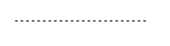

# Connections

This tutorial will walk you through the functionality and the main features of __RadDiagramConnection__.

>note Before proceeding with this topic, it is recommended to get familiar with the [visual structure]() of the __RadDiagram__.
>


## Overview

__RadDiagramConnection__ is basically an object that connects zero, one or two shapes:


You can use its extensive API to configure its source and target points or shapes. You can choose from a list of predefined cap types thus customizing the start and end point of the connection to better fit in your application scenario. You can also control the type of a connection using the __ConnectionType__ property, add a custom content and customize the overall look and feel of the items.

## Configure the Source and Target of a Connection

The __RadDiagramConnection__ class exposes the following properties that allow you to control the start and end points of a connection:

* __StartPoint/EndPoint__ - these properties are of type Telerik.Windows.Diagrams.Core.*Point* and they set or get the start/end point of a connection.
            

* __Source/Target__ - these properties get or set the source/target __RadDiagramShape__ of a connection.
            

* __SourceConnectorPosition/TargetConnectorPosition__ - there are five predefined strings that you can use to define where to position the connectors of the connection:           
            

	* __Auto__ - use it if you want to automatically determine the start/end point of a connection. This option will allow the connection to dynamically determine which shape connector to be used as a start/end point. Based on the end point position, the __SourceConnectorPosition__ will be set to the nearest shape connector. Alternatively, the __TargetConnectorPosition__ will be set to the nearest shape connector, based on the start point position of the connection.
                

	* __Left__ - use it to define the left connector of a shape as the source/target point of the connection
                

	* __Top__ - use it to define the top connector of a shape as the source/target point of the connection
                

	* __Right__ - use it to define the right connector of a shape as the source/target point of the connection
                

	* __Bottom__ - use it to define the bottom connector of a shape as the source/target point of the connection


* __SourceCapType/TargetCapType__ - both properties are an enumeration of type __CapType__ that allow you to choose a cap from a set of predefined Cap types. For more detailed information, please, view the CapTypes section below. 


* __SourceCapSize/TargetCapSize__ - these properties are of type Size and they get or set the size of the __SourceCap/TargetCap__.


## Set Content

You can label a connection by setting its __Content__ property.

 


{{source=..\SamplesCS\Diagram\DiagramItems.cs region=Content}} 
{{source=..\SamplesVB\Diagram\DiagramItems.vb region=Content}} 

````C#
            
connection1.Content = "connection label";

````
````VB.NET
connection1.Content = "connection label"

````

{{endregion}} 


## Customize the Connection Appearance

You can easily customize the visual appearance of the __RadDiagramConnection__ by using the following properties:

* __BackColor__: gets or sets the color that specifies how the __RadDiagramConnection__ is painted.


{{source=..\SamplesCS\Diagram\DiagramItems.cs region=ConnectionBackColor}} 
{{source=..\SamplesVB\Diagram\DiagramItems.vb region=ConnectionBackColor}} 

````C#
            
connection1.BackColor = Color.Red;

````
````VB.NET
connection1.BackColor = Color.Red

````

{{endregion}} 


* __StrokeThickness__: gets or sets the width of the __RadDiagramConnection__ outline.

 

{{source=..\SamplesCS\Diagram\DiagramItems.cs region=StrokeThickness}} 
{{source=..\SamplesVB\Diagram\DiagramItems.vb region=StrokeThickness}} 

````C#
connection1.StrokeThickness = 5;

````
````VB.NET
connection1.StrokeThickness = 5

````

{{endregion}} 


* __ForeColor__: gets or sets the color that specifies how the __RadDiagramConnection__'s text is painted.

 

{{source=..\SamplesCS\Diagram\DiagramItems.cs region=ConnectionForeColor}} 
{{source=..\SamplesVB\Diagram\DiagramItems.vb region=ConnectionForeColor}} 

````C#
            
connection1.ForeColor = Color.Blue;

````
````VB.NET
connection1.ForeColor = Color.Blue

````

{{endregion}} 


* __StrokeDashArray__: gets or sets a collection of Double values that indicate the pattern of dashes and gaps that is used to outline the __RadDiagramConnection__. 

{{source=..\SamplesCS\Diagram\DiagramItems.cs region=StrokeDashArray}} 
{{source=..\SamplesVB\Diagram\DiagramItems.vb region=StrokeDashArray}} 

````C#
connection1.StrokeDashArray = new Telerik.WinControls.UI.Diagrams.DoubleCollection(new List<float> { 2, 2, 2, 2 });

````
````VB.NET
connection1.StrokeDashArray = New Telerik.WinControls.UI.Diagrams.DoubleCollection(New List(Of Single)() From { _
    2, _
    2, _
    2, _
    2 _
})

````

{{endregion}} 




## Connection Edit Mode

You can set the __RadDiagramConnection__ in edit mode by using the __IsInEditMode__ property. By default, when an item enters edit mode, the RadDiagramConnection.__Content__ is displayed inside a TextBox control so that you can change its value.


>note Apart from setting the __IsInEditMode__ property to *true*, you can also enter edit mode by pressing F2 or double-clicking on the connection. For more information please refer to the [Editing]() article.
>


## Connection Bridge

The connection bridge is essentially what you see when two connections collide. __RadDiagram__ allows you to define what kind of bridge to display through the RadDiagram.__ConnectionBridge__ property. It is an enumeration of type __Telerik.Windows.Diagrams.Core.BridgeType__ that exposes the following members:

* __None__ - there is no bridge to visualize the intersection of the connections


* __Bow__- a half circle is displayed to indicate the intersection of the connections


* __Gap__ - a gap is displayed to indicate the intersection of the connections


## Connection Selection State

The following properties allow you to track and control the selection state of a connection:

* __IsSelected__ - gets or sets whether the connection is selected.
            

## Connection ZIndex

You can get or set the z-order rendering behavior of the RadDiagramConnection through the __ZIndex__ property.
        

## Connection Bounds

You can get the bounds of a __RadDiagramConnection__ through the __Bounds__ property. It is of type __Rect__ and it describes the width, height and location of the connection's bounds.
        
