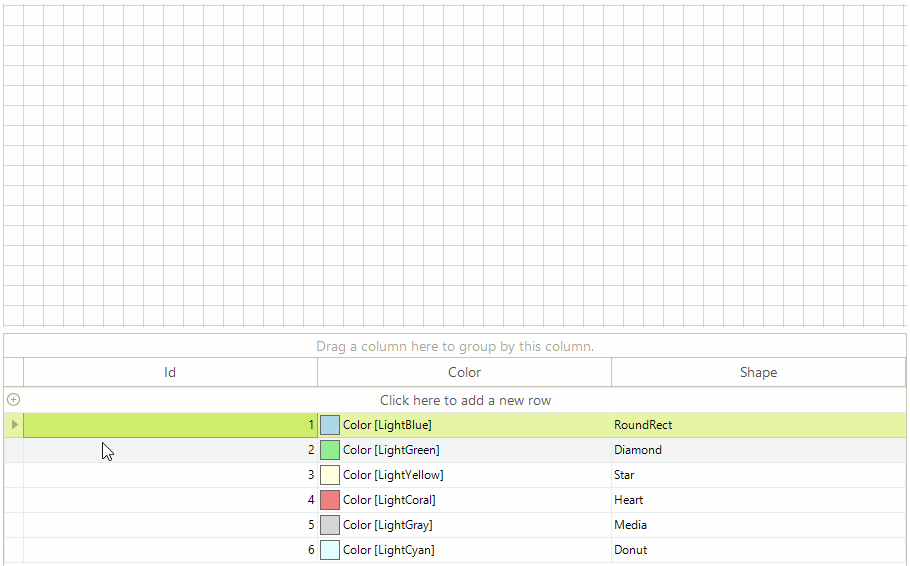

# Drag and Drop from Another Control

This article will demonstrate how you can create shapes in __RadDiagram__ after dragging an object from a separate control, in our case __RadGridView__.

>caption Figure 1: Grid to Diagram Drag and Drop



## Preparing RadGridView for Drag and Drop

The drag and drop behavior in __RadGridView__ is controlled by a service class. We are going to start this service when performing a mouse down operation on a certain row in the grid. In order to execute our custom logic we also need a custom row behavior  class responsible for handling the user actions. We can change the default row behavior and subscribe to the service events in the form`s constuctor.

#### Setup RadGridView

{{source=..\SamplesCS\Diagram\DiagramDragAndDropGrid.cs region=SetupGrid}} 
{{source=..\SamplesVB\Diagram\DiagramDragAndDropGrid.vb region=SetupGrid}}
````C#
public DiagramDragAndDropGrid()
{
    InitializeComponent();
    BaseGridBehavior gridBehavior = this.radGridView1.GridBehavior as BaseGridBehavior;
    gridBehavior.UnregisterBehavior(typeof(GridViewDataRowInfo));
    gridBehavior.RegisterBehavior(typeof(GridViewDataRowInfo), new CustomRowGridBehavior());
    this.radGridView1.DataSource = this.GetData();
    this.radGridView1.AutoSizeColumnsMode = Telerik.WinControls.UI.GridViewAutoSizeColumnsMode.Fill;
    RadGridViewDragDropService svc = this.radGridView1.GridViewElement.GetService<RadGridViewDragDropService>();
    svc.PreviewDragDrop += svc_PreviewDragDrop;
    svc.PreviewDragOver += svc_PreviewDragOver;
    svc.PreviewDragStart += svc_PreviewDragStart;
}
private BindingList<GridModel> GetData()
{
    Color[] colors = new Color[] { Color.LightBlue, Color.LightGreen, Color.LightYellow, Color.LightCoral, Color.LightGray, Color.LightCyan };
    string[] shapes = new string[] { "RoundRect", "Diamond", "Star", "Heart", "Media", "Donut" };
    BindingList<GridModel> data = new BindingList<GridModel>();
    for (int i = 0; i < shapes.Length; i++)
    {
        data.Add(new GridModel
        {
            Id = i + 1,
            Color = colors[i],
            Shape = shapes[i]
        });
    }
    return data;
}

````
````VB.NET
Sub New()
    InitializeComponent()
    Dim gridBehavior As BaseGridBehavior = TryCast(Me.RadGridView1.GridBehavior, BaseGridBehavior)
    gridBehavior.UnregisterBehavior(GetType(GridViewDataRowInfo))
    gridBehavior.RegisterBehavior(GetType(GridViewDataRowInfo), New CustomRowGridBehavior())
    Me.RadGridView1.DataSource = Me.GetData()
    Me.RadGridView1.AutoSizeColumnsMode = Telerik.WinControls.UI.GridViewAutoSizeColumnsMode.Fill
    Dim svc As RadGridViewDragDropService = Me.RadGridView1.GridViewElement.GetService(Of RadGridViewDragDropService)()
    AddHandler svc.PreviewDragDrop, AddressOf svc_PreviewDragDrop
    AddHandler svc.PreviewDragOver, AddressOf svc_PreviewDragOver
    AddHandler svc.PreviewDragStart, AddressOf svc_PreviewDragStart
End Sub
Private Function GetData() As BindingList(Of GridModel)
    Dim colors As Color() = New Color() {Color.LightBlue, Color.LightGreen, Color.LightYellow, Color.LightCoral, Color.LightGray, Color.LightCyan}
    Dim shapes As String() = New String() {"RoundRect", "Diamond", "Star", "Heart", "Media", "Donut"}
    Dim data As New BindingList(Of GridModel)()
    For i As Integer = 0 To shapes.Length - 1
        data.Add(New GridModel() With {
             .Id = i + 1,
             .Color = colors(i),
             .Shape = shapes(i)
        })
    Next
    Return data
End Function

```` 


{{endregion}}

For the purpose of the example we will define a grid model object storing information about the shapes.

#### Grid Helpers

{{source=..\SamplesCS\Diagram\DiagramDragAndDropGrid.cs region=HelperClasses}} 
{{source=..\SamplesVB\Diagram\DiagramDragAndDropGrid.vb region=HelperClasses}}
````C#
public class GridModel
{
    public int Id { get; set; }
    public Color Color { get; set; }
    public string Shape { get; set; }
}
public class CustomRowGridBehavior : GridDataRowBehavior
{
    protected override bool OnMouseDownLeft(MouseEventArgs e)
    {
        GridDataRowElement row = this.GetRowAtPoint(e.Location) as GridDataRowElement;
        if (row != null)
        {
            RadGridViewDragDropService svc = this.GridViewElement.GetService<RadGridViewDragDropService>();
            svc.Start(row);
        }
        return base.OnMouseDownLeft(e);
    }
}

````
````VB.NET
Public Class GridModel
    Public Property Id() As Integer
        Get
            Return m_Id
        End Get
        Set(value As Integer)
            m_Id = value
        End Set
    End Property
    Private m_Id As Integer
    Public Property Color() As Color
        Get
            Return m_Color
        End Get
        Set(value As Color)
            m_Color = value
        End Set
    End Property
    Private m_Color As Color
    Public Property Shape() As String
        Get
            Return m_Shape
        End Get
        Set(value As String)
            m_Shape = value
        End Set
    End Property
    Private m_Shape As String
End Class
Public Class CustomRowGridBehavior
    Inherits GridDataRowBehavior
    Protected Overrides Function OnMouseDownLeft(e As MouseEventArgs) As Boolean
        Dim row As GridDataRowElement = TryCast(Me.GetRowAtPoint(e.Location), GridDataRowElement)
        If row IsNot Nothing Then
            Dim svc As RadGridViewDragDropService = Me.GridViewElement.GetService(Of RadGridViewDragDropService)()
            svc.Start(row)
        End If
        Return MyBase.OnMouseDownLeft(e)
    End Function
End Class

```` 


{{endregion}}

## Handling Events

__RadDiagram__ will accept the dragged data only if it is dropped on the diagram element. The __PreviewDragDrop__ event handler will be responsible for reading the data and transforming it to a shape.

{{source=..\SamplesCS\Diagram\DiagramDragAndDropGrid.cs region=HandleEvents}} 
{{source=..\SamplesVB\Diagram\DiagramDragAndDropGrid.vb region=HandleEvents}}
````C#
private void svc_PreviewDragStart(object sender, PreviewDragStartEventArgs e)
{
    e.CanStart = true;
}
private void svc_PreviewDragOver(object sender, RadDragOverEventArgs e)
{
    if (e.DragInstance is GridDataRowElement)
    {
        e.CanDrop = e.HitTarget is RadDiagramElement;
    }
}
private void svc_PreviewDragDrop(object sender, RadDropEventArgs e)
{
    RadDiagramElement targetElement = e.HitTarget as RadDiagramElement;
    GridDataRowElement draggedRow = e.DragInstance as GridDataRowElement;
    if (draggedRow == null)
    {
        return;
    }
    GridModel data = (GridModel)draggedRow.Data.DataBoundItem;
    RadDiagramShape shape = new RadDiagramShape()
    {
        Text = data.Shape,
        ElementShape = this.GetShapeFromModel(data),
        BackColor = data.Color
    };
    shape.Position = e.DropLocation;
    this.radDiagram1.AddShape(shape);
}
private ElementShape GetShapeFromModel(GridModel data)
{
    ElementShape shape = null;
    switch (data.Shape)
    {
        case "RoundRect":
            shape = new RoundRectShape();
            break;
        case "Diamond":
            shape = new DiamondShape();
            break;
        case "Star":
            shape = new StarShape();
            break;
        case "Heart":
            shape = new HeartShape();
            break;
        case "Media":
            shape = new MediaShape();
            break;
        case "Donut":
            shape = new DonutShape();
            break;
        default:
            shape = new CustomShape();
            break;
    }
    return shape;
}

````
````VB.NET
Private Sub svc_PreviewDragStart(sender As Object, e As PreviewDragStartEventArgs)
    e.CanStart = True
End Sub
Private Sub svc_PreviewDragOver(sender As Object, e As RadDragOverEventArgs)
    If TypeOf e.DragInstance Is GridDataRowElement Then
        e.CanDrop = TypeOf e.HitTarget Is RadDiagramElement
    End If
End Sub
Private Sub svc_PreviewDragDrop(sender As Object, e As RadDropEventArgs)
    Dim targetElement As RadDiagramElement = TryCast(e.HitTarget, RadDiagramElement)
    Dim draggedRow As GridDataRowElement = TryCast(e.DragInstance, GridDataRowElement)
    If draggedRow Is Nothing Then
        Return
    End If
    Dim data As GridModel = DirectCast(draggedRow.Data.DataBoundItem, GridModel)
    Dim shape As New RadDiagramShape() With {
         .Text = data.Shape,
         .ElementShape = Me.GetShapeFromModel(data),
         .BackColor = data.Color
    }
    shape.Position = e.DropLocation
    Me.RadDiagram1.AddShape(shape)
End Sub
Private Function GetShapeFromModel(data As GridModel) As ElementShape
    Dim shape As ElementShape = Nothing
    Select Case data.Shape
        Case "RoundRect"
            shape = New RoundRectShape()
            Exit Select
        Case "Diamond"
            shape = New DiamondShape()
            Exit Select
        Case "Star"
            shape = New StarShape()
            Exit Select
        Case "Heart"
            shape = New HeartShape()
            Exit Select
        Case "Media"
            shape = New MediaShape()
            Exit Select
        Case "Donut"
            shape = New DonutShape()
            Exit Select
        Case Else
            shape = New CustomShape()
            Exit Select
    End Select
    Return shape
End Function
    
'endregion
Class
gion HelperClasses
ic Class GridModel
Public Property Id() As Integer
    Get
        Return m_Id
    End Get
    Set(value As Integer)
        m_Id = value
    End Set
End Property
Private m_Id As Integer
Public Property Color() As Color
    Get
        Return m_Color
    End Get
    Set(value As Color)
        m_Color = value
    End Set
End Property
Private m_Color As Color
Public Property Shape() As String
    Get
        Return m_Shape
    End Get
    Set(value As String)
        m_Shape = value
    End Set
End Property
Private m_Shape As String
Class
ic Class CustomRowGridBehavior
Inherits GridDataRowBehavior
Protected Overrides Function OnMouseDownLeft(e As MouseEventArgs) As Boolean
    Dim row As GridDataRowElement = TryCast(Me.GetRowAtPoint(e.Location), GridDataRowElement)
    If row IsNot Nothing Then
        Dim svc As RadGridViewDragDropService = Me.GridViewElement.GetService(Of RadGridViewDragDropService)()
        svc.Start(row)
    End If
    Return MyBase.OnMouseDownLeft(e)
End Function
Class

```` 


{{endregion}}

# See Also

* [RadGridView]()
* [Populating with Data]()
* [Commands]() 
* [Diagram Events]()
* [Items Events]()