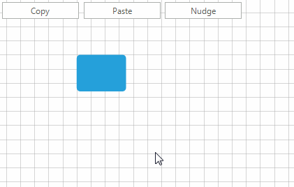

# Commands


__RadDiagram__ provides a powerful set of __RoutedUICommands__ that help you 
        work with your __RadDiagram__ and its items easily and build better MVVM applications.

## RadDiagram Commands

The static __DiagramCommands__ class defines the following __RoutedUICommands__:

* __Align__- Aligns the selected shapes.
            

* __Snap__- Snaps the selected shapes.
            

* __Layout__- Organizes the diagram automatically.
            

* __Copy__- Copies selected diagram items.
            

* __Paste__- Pastes selected diagram items.
            

* __Delete__- Deletes selected diagram items.
            

* __Cut__- Cut selected diagram items.
            

* __Duplicate__- Duplicates selected item/s.
            

* __Undo__- Undoes the last action.
            

* __Redo__- Redoes the last action.
            

* __BringToFront__- Brings to front selected diagram items.
            

* __BringForward__- Brings forward selected diagram items.
            

* __SendToBack__- Sends to back selected diagram items.
            

* __SendBackward__- Sends backward selected diagram items.
            

* __Clear__- Clears the diagram.
            

* __BeginEdit__- Begins editing diagram item.
            

* __CommitEdit__- Commits the edited changes.
            

* __CancelEdit__- Cancels the edited changes.
            

* __SelectAll__- Selects all shapes in the diagram.
            

* __Nudge__- Moves selected item/s in a specific direction. 
              You can pass more specifics about the nudge operation through the __CommandParameter__.
            This parameter can be a single string representing the direction of the nudge:

* __Left__

* __Right__

* __Up__

* __Down__It can also be a string in the form of __"direction; amount"__, the 
                  __'direction'__ being a value from the above list of direction strings. The __'amount'__  options are:
               

* __Small__ - if the RadDiagram.__IsSnapToGridEnabled__ property is set to *true*
                  then this amount would mean that the nudge should happen once to the appointed direction using the SnapX/Y value as a step. The snap settings can
                  be applied in the __RadDiagram__ definition. If the RadDiagram.__IsSnapToGridEnabled__ property is
                  *false*, a *"Small"* amount indicates a step of 5 pixels;
                

* __Large__ - if the RadDiagram.__IsSnapToGridEnabled__ property is set to *true* 
                  then this amount would mean that the nudge should happen once to the appointed direction using 5*SnapX/Y value as a step. 
                  The snap settings can be applied in the __RadDiagram__ definition. If the RadDiagram.__IsSnapToGridEnabled__ property
                  is *false*, a *"Large"* amount indicates a step of 10 pixels;
                

* __any number__ - if you provide a number in the __CommandParameter__, this number would indicate the number of
                  pixels to be used as a step for the Nudge command.
                

* __Group__- Groups the selected items.
            

* __Ungroup__- Ungroups the selected groups.
            

## Using Diagram Commands

Below is shown a sample code snippet how you can use some of the Diagram Commands in an application by using the 
          DiagramElement.__TryExecuteCommand__ method:
        #_[C#] _

	


{{source=..\SamplesCS\Diagram\DiagramItemsManipulation.cs region=CommandsExample}} 
{{source=..\SamplesVB\Diagram\DiagramItemsManipulation.vb region=CommandsExample}} 

````C#
            
        private void radButton1_Click(object sender, EventArgs e)
        {
            this.radDiagram1.DiagramElement.TryExecuteCommand(Telerik.WinControls.UI.Diagrams.DiagramCommands.Copy);
        }
            
        private void radButton2_Click(object sender, EventArgs e)
        {
            this.radDiagram1.DiagramElement.TryExecuteCommand(Telerik.WinControls.UI.Diagrams.DiagramCommands.Paste);
        }
        
        private void radButton3_Click(object sender, EventArgs e)
        {
            this.radDiagram1.DiagramElement.TryExecuteCommand(Telerik.WinControls.UI.Diagrams.DiagramCommands.Nudge, "Left");
        }
````
````VB.NET
    Private Sub RadButton1_Click(sender As Object, e As EventArgs) Handles RadButton1.Click
        Me.RadDiagram1.DiagramElement.TryExecuteCommand(Telerik.WinControls.UI.Diagrams.DiagramCommands.Copy)
    End Sub

    Private Sub RadButton2_Click(sender As Object, e As EventArgs) Handles RadButton2.Click
        Me.RadDiagram1.DiagramElement.TryExecuteCommand(Telerik.WinControls.UI.Diagrams.DiagramCommands.Paste)
    End Sub

    Private Sub RadButton3_Click(sender As Object, e As EventArgs) Handles RadButton3.Click
        Me.RadDiagram1.DiagramElement.TryExecuteCommand(Telerik.WinControls.UI.Diagrams.DiagramCommands.Nudge, "Left")
    End Sub
    '
````

{{endregion}} 



