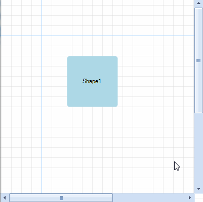
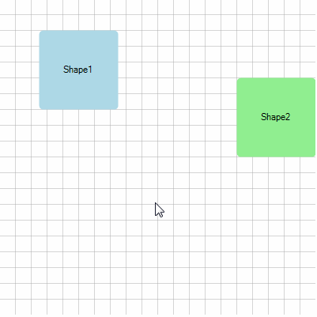

# Pan and Zoom


In __RadDiagram__ you can easily pan, zoom in or out of your current diagramming structure. This article will get you familiar with the pan and zoom implementation within the __RadDiagram__.
    

## Pan

__RadDiagram__ exposes an __IsPanEnabled__ property which defines whether the pan operation is allowed. The default value of the property is *true*. In order to start a panning operation you need to hold down the Ctrl key and drag the view port with the mouse. The pan operation is triggered by a user interaction.
        

You can also activate the Pan [MouseTool]() to start a pan operation simply by dragging the current view port with the mouse. 

{{source=..\SamplesCS\Diagram\DiagramPanZoom.cs region=IsPanEnabled}} 
{{source=..\SamplesVB\Diagram\DiagramPanZoom.vb region=IsPanEnabled}} 

````C#
this.radDiagram1.IsPanEnabled = true;

````
````VB.NET
Me.RadDiagram1.IsPanEnabled = True
'#End Region
'#Region "IsZoomEnabled"
Me.radDiagram1.IsZoomEnabled = True
'#End Region
'#Region "MinMaxZoom"
Telerik.Windows.Diagrams.Core.DiagramConstants.MinimumZoom = 0.5
Telerik.Windows.Diagrams.Core.DiagramConstants.MaximumZoom = 10
'#End Region
'#Region "ZoomIn"
Me.RadDiagram1.DiagramElement.ZoomIn(1.5)

````

{{endregion}} 


>caption Figure.1 Pan



## Pan events

__RadDiagram__ exposes two panning events:

* __PreviewPan__: this event is fired before executing the pan operation. Its event handler receives two arguments:            
            

	* The sender argument that contains the __RadDiagram__ instance that fired the event.

	* A __PositionChangedRoutedEventArgs__ object that provides information regarding the current and the next position of the diagram through the __OldPosition__ and __NewPosition__ properties. This event can be handled to cancel a particular pan operation. For that purpose the PositionChangedRoutedEventArgs.__Handled__ property needs to be set to *true*.

* __Pan__: this event is raised by the __RadDiagram__ to inform that a pan operation has completed. Its event handler receives two arguments:
            

	* The sender argument that contains the __RadDiagram__ instance that fired the event.

	* A __PositionChangedRoutedEventArgs__ object that provides information regarding the current and the next position of the diagram through the __OldPosition__ and __NewPosition__ properties.

>note Please note that if you handle the __PreviewPan__ event, the __Pan__ event will not be fired at all.
>


## Zoom

__RadDiagram__ supports zooming out-of-the-box. The feature is controlled through the RadDiagram. __IsZoomEnabled__ property which default value is *true*. The user can initiate a zoom using the mouse wheel. 

{{source=..\SamplesCS\Diagram\DiagramPanZoom.cs region=IsZoomEnabled}} 
{{source=..\SamplesVB\Diagram\DiagramPanZoom.vb region=IsZoomEnabled}} 

````C#
this.radDiagram1.IsZoomEnabled = true;

````
````VB.NET
Me.radDiagram1.IsZoomEnabled = True
'#End Region
'#Region "MinMaxZoom"
Telerik.Windows.Diagrams.Core.DiagramConstants.MinimumZoom = 0.5
Telerik.Windows.Diagrams.Core.DiagramConstants.MaximumZoom = 10
'#End Region
'#Region "ZoomIn"
Me.RadDiagram1.DiagramElement.ZoomIn(1.5)

````

{{endregion}} 


>caption Figure.2 Zoom



The zoom range is controlled through two __DiagramConstants__:

* __MinimumZoom__:a double value which indicates the minimum zoom level. Its default value is 0.5.
            

* __MaximumZoom__: a double value which indicates the maximum zoom level. Its default value is 5. 

{{source=..\SamplesCS\Diagram\DiagramPanZoom.cs region=MinMaxZoom}} 
{{source=..\SamplesVB\Diagram\DiagramPanZoom.vb region=MinMaxZoom}} 

````C#
Telerik.Windows.Diagrams.Core.DiagramConstants.MinimumZoom = 0.5;
Telerik.Windows.Diagrams.Core.DiagramConstants.MaximumZoom = 10;

````
````VB.NET
Telerik.Windows.Diagrams.Core.DiagramConstants.MinimumZoom = 0.5
Telerik.Windows.Diagrams.Core.DiagramConstants.MaximumZoom = 10
'#End Region
'#Region "ZoomIn"
Me.RadDiagram1.DiagramElement.ZoomIn(1.5)

````

{{endregion}} 
 
The current zoom value in a __RadDiagram__ instance is controlled through the __Zoom__ property. It represents a double value which cannot be null, infinity or NaN. Additionally, this value is coerced to be within the range defined by the __MinimumZoom__ and __MaximumZoom__ constants. The default __Zoom__ value is 1.

>note Please note that in the diagramming framework we talk about "zooming out" when the __Zoom__ value is less than 1. Alternatively, a __Zoom__ value greater than 1 is considered a "zoom in".
>


## Zoom methods

By default, the zoom operation uses an arithmetic progression to increase/decrease the zoom. The common difference used to build the progression is calculated based on a zoom factor. If such a value is not specifically defined, then __RadDiagram__ uses the DiagramConstants.__ZoomScaleFactor__ value as a zoom factor.

If you need to initiate a zoom through code-behind, __RadDiagram__ provides two methods:

* __ZoomIn__: this method performs an incremental zoom in taking into account the previous zoom operations. It can take up to 2 parameters:
            

	* a double value which indicates a zoom factor.

	* a Point value which indicates the coordinates of the point that should be used as a center of the zoom operation. Please note that if you decide to use this parameter, then you have to make sure the coordinates you provide are in the context of the current view port.

>note Please note that both of the parameters described above are optional.
> 

{{source=..\SamplesCS\Diagram\DiagramPanZoom.cs region=ZoomIn}} 
{{source=..\SamplesVB\Diagram\DiagramPanZoom.vb region=ZoomIn}} 

````C#
this.radDiagram1.DiagramElement.ZoomIn(1.5);

````
````VB.NET
Me.RadDiagram1.DiagramElement.ZoomIn(1.5)

````

{{endregion}} 
 
* __ZoomOut__: this method performs an incremental zoom out taking into account the previous zoom operations. It can take up to 2 parameters:
            

	* a double value which indicates a zoom factor.

	* a Point value which indicates the coordinates of the point that should be used as a center of the zoom operation. Please note that if you decide to use this parameter, then you have to make sure the coordinates you provide are in the context of the current view port.

>note Please note that both of the parameters described above are optional.
> 

{{source=..\SamplesCS\Diagram\DiagramPanZoom.cs region=ZoomOut}} 
{{source=..\SamplesVB\Diagram\DiagramPanZoom.vb region=ZoomOut}} 

````C#
this.radDiagram1.DiagramElement.ZoomOut(3.5);

````
````VB.NET
Me.RadDiagram1.DiagramElement.ZoomOut(3.5)

````

{{endregion}} 


## Zoom events

__RadDiagram__ exposes two zooming events:

* __PreviewZoom__: this event is fired before executing the zoom operation. Its event handler receives two arguments:
            

	* The sender argument that contains the __RadDiagram__ instance that fired the event.

	* A __DiagramZoomEventArgs__ object that provides information regarding:

		* __Zoom__: a double value representing the previous zoom value.

		* __TargetZoom__: a double value that gets or sets the result zoom. By default, this property contains the coerced new zoom value. Please note that if you decide to change that value, it will be coerced first and then applied on the diagramming instance.
                    

		* __ZoomPoint__: a Point value representing the center point of the zoom operation.
                    

		* __IsAnimationRunning__: a boolean value indicating whether a zoom animation is currently running. This event can be handled to cancel a particular zoom operation. For that purpose the DiagramZoomEventArgs. __Handled__ property needs to be set to *true*.
                    

* __ZoomChanged__:  this event is raised by the __RadDiagram__ to inform that a zoom operation has completed. Its event handler receives two arguments:
            

	* The sender argument that contains the __RadDiagram__ instance that fired the event.
                

	* A __RadRoutedPropertyChangedEventArgs__ object that provides information regarding the old and the new value of the diagram zoom through the __OldValue__ and __NewValue__ properties.
                

>note Please note that if you handle the __PreviewZoom__ event, the __ZoomChanged__ event will not be fired at all.
>

