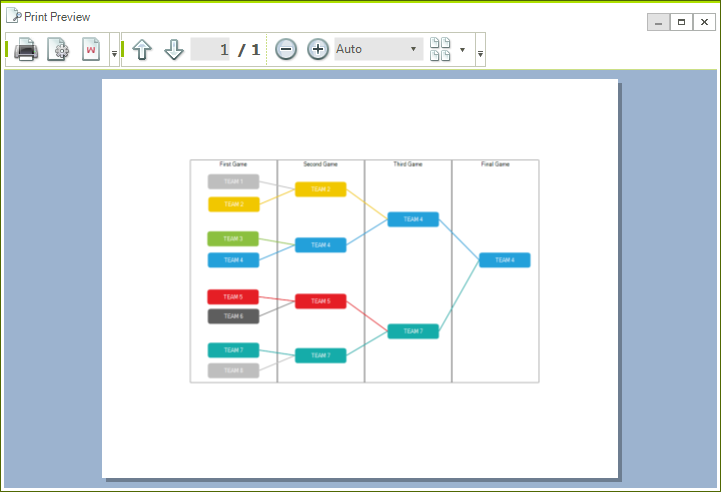
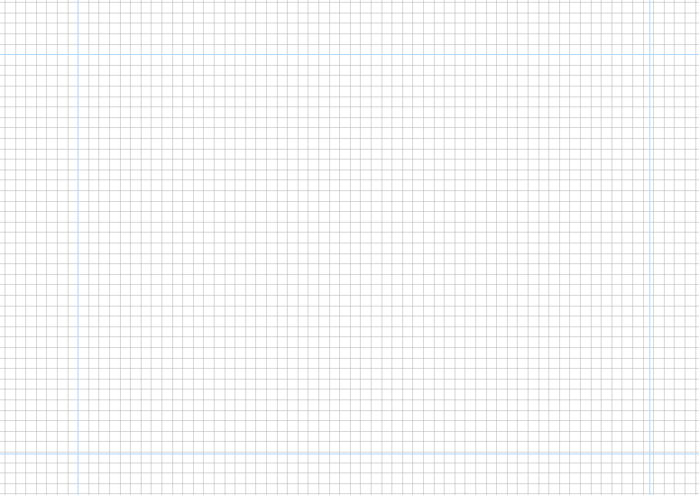
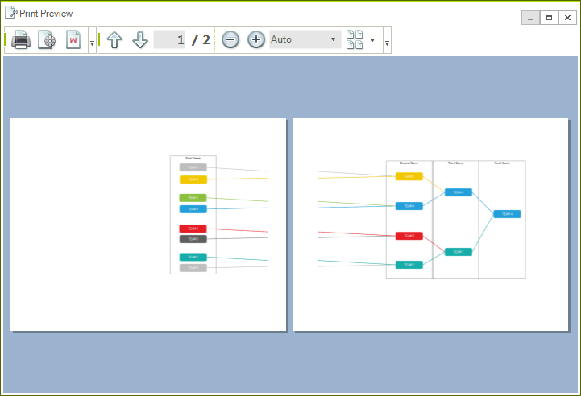

# Printing Support


__RadDiagram__ provides options to print its content by using a [RadPrintDocument]().
      

## RadDiagram Print Support

__RadDiagram__ has two public methods available for printing - __Print()__ and __PrintPreview()__. The first method will directly send a print job to the default printer with the settings currently saved in the __PrintStyle__ property. This method has one overload available which can show a system PrintDialog with the available printers and their options. 

{{source=..\SamplesCS\Diagram\DiagramItemsManipulation.cs region=Print}} 
{{source=..\SamplesVB\Diagram\DiagramItemsManipulation.vb region=Print}} 

````C#
            
this.radDiagram1.Print();
this.radDiagram1.Print(true);

````
````VB.NET
Me.RadDiagram1.Print()
Me.RadDiagram1.Print(True)

````

{{endregion}}  

The other available method is __PrintPreview()__, which opens  [RadPrintPreviewDialog]().   


{{source=..\SamplesCS\Diagram\DiagramItemsManipulation.cs region=PrintPreview}} 
{{source=..\SamplesVB\Diagram\DiagramItemsManipulation.vb region=PrintPreview}} 

````C#
            
this.radDiagram1.PrintPreview();

````
````VB.NET
Me.RadDiagram1.PrintPreview()

````

{{endregion}} 


>caption Fig.1 RadDiagram.PrintPreview



__RadDiagram__ supports pages preview canvas. The default look and size of the page preview canvas is demonstrated in the next snapshot:
        
>caption Fig.2 The PagesPreview canvas in a zoomed RadDiagram



In order to modify it, you can change some or all of the following properties:

* __LineStroke__ - this property is of type *Brush* and it specifies how the PagesPreview canvas outline is painted.
            

* __LineStrokeDashArray__ - this property gets or sets a collection of *Double* values that indicate the pattern of dashes and gaps that is used to outline the DiagramElement.__BackgroundPageGrid__.
            

* __LineStrokeThickness__ - this property is of type double and it gets or sets the thickness of the DiagramElement.__BackgroundPageGrid__.
            

* __PageSize__ - controls the size of the DiagramElement.__BackgroundPageGrid__.
            

>note By default, the __PageSize__ property is set to *Size(1092, 763)* . Note that the default printer may have different page size applied.
>


If you place shapes on different pages, these pages will be printed as well:


