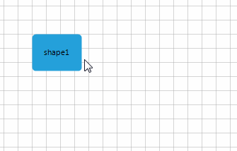
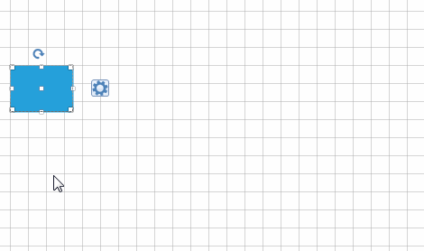

# Information Adorner

__RadDiagram__ shows information tool-tips that appear below the manipulation adorner when you resize, rotate or drag a shape or group of shapes and connections.
      
__RadDiagram__ uses the __ItemInformationAdorner__ to visualize information regarding the position, size and rotation angle of its shapes.  

{{source=..\SamplesCS\Diagram\DiagramItemsManipulation.cs region=EnableInformationAdorner}} 
{{source=..\SamplesVB\Diagram\DiagramItemsManipulation.vb region=EnableInformationAdorner}} 

````C#
this.radDiagram1.IsInformationAdornerVisible = true;

````
````VB.NET
Me.RadDiagram1.IsInformationAdornerVisible = True

````

{{endregion}} 


Fig.1 visualizes the X and Y component of the current position of the shape when moving. It also visualizes the angle that the shape is rotated to and the current Width and Height of the corresponding shape when resizing.
>caption Fig.1 Information Adorner



## Custom ItemInformationAdorner 

__ItemInformationAdorner__ can be customized in order to display additional elements, e.g. a button. To achieve it, you should create a derivative of the __Telerik.WinControls.UI.Diagrams.Primitives.ItemInformationAdorner__ class and override its __CreateChildElements__ method. Here is demonstrated a sample code snippet: 

{{source=..\SamplesCS\Diagram\DiagramItemsManipulation.cs region=CustomItemInformationAdorner}} 
{{source=..\SamplesVB\Diagram\DiagramItemsManipulation.vb region=CustomItemInformationAdorner}} 

````C#
    
class MyItemInformationAdorner : Telerik.WinControls.UI.Diagrams.Primitives.ItemInformationAdorner
{
    public MyItemInformationAdorner(RadDiagramElement diagram)
    {
        this.Diagram = diagram;
    }
        
    protected override void CreateChildElements()
    {
        base.CreateChildElements();
        RadButtonElement button = new RadButtonElement() { Text = "Click me!", AutoSize = true, TextAlignment = ContentAlignment.MiddleRight };
        this.InformationTipPanel.Children.First().Visibility = ElementVisibility.Collapsed;
        this.InformationTipPanel.Children.Add(button);
        button.ButtonFillElement.BackColor = System.Drawing.Color.Red;
        button.ButtonFillElement.GradientStyle = GradientStyles.Solid;
        button.Click += button_Click;
    }
    void button_Click(object sender, EventArgs e)
    {
        MessageBox.Show("Hello");
    }
}

````
````VB.NET
Class MyItemInformationAdorner
Inherits Telerik.WinControls.UI.Diagrams.Primitives.ItemInformationAdorner
    Public Sub New(diagram As RadDiagramElement)
        Me.Diagram = diagram
    End Sub
 
    Protected Overrides Sub CreateChildElements()
        MyBase.CreateChildElements()
        Dim button As New RadButtonElement() With { _
            .Text = "Click me!", _
            .AutoSize = True, _
            .TextAlignment = ContentAlignment.MiddleRight _
        }
        Me.InformationTipPanel.Children.First().Visibility = ElementVisibility.Collapsed
        Me.InformationTipPanel.Children.Add(Button)
        Button.ButtonFillElement.BackColor = System.Drawing.Color.Red
        Button.ButtonFillElement.GradientStyle = GradientStyles.Solid
        AddHandler Button.Click, AddressOf button_Click
    End Sub
    Private Sub button_Click(sender As Object, e As EventArgs)
        MessageBox.Show("Hello")
    End Sub
End Class

````

{{endregion}} 


Now, you should apply the custom __ItemInformationAdorner__ to __DiagramElement__: 

{{source=..\SamplesCS\Diagram\DiagramItemsManipulation.cs region=AssignCustomItemInformationAdorner}} 
{{source=..\SamplesVB\Diagram\DiagramItemsManipulation.vb region=AssignCustomItemInformationAdorner}} 

````C#
this.radDiagram1.DiagramElement.ItemInformationAdorner = new MyItemInformationAdorner(this.radDiagram1.DiagramElement);
Telerik.WinControls.UI.Diagrams.Primitives.ItemInformationAdorner item = this.radDiagram1.DiagramElement.ItemInformationAdorner;
item.Width = 100;
item.Height = 20;

````
````VB.NET
Me.RadDiagram1.DiagramElement.ItemInformationAdorner = New MyItemInformationAdorner(Me.RadDiagram1.DiagramElement)
Dim item As Telerik.WinControls.UI.Diagrams.Primitives.ItemInformationAdorner = Me.RadDiagram1.DiagramElement.ItemInformationAdorner
item.Width = 100
item.Height = 20

````

{{endregion}} 


>caption Fig.2 Custom Information Adorner



# See Also

* [RibbonUI]()	
* [Settings Pane]()	
* [Toolbox]()