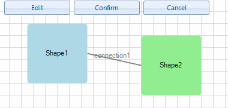

# Editing


__RadDiagram__ gives you the ability to edit the content of its items. 
      You can double-click items in order to edit them or use 
      [RadDiagramCommand]().

## Enable/Disable Editing

By default, the __RadDiagramItems__ are enabled for editing. In order to disable this functionality,
        you can use the __IsEditable__ property:
>caption Fig1. IsEditable

#_[C#] Setting the IsEditable property_

	


{{source=..\SamplesCS\Diagram\DiagramItemsManipulation.cs region=IsEditable}} 
{{source=..\SamplesVB\Diagram\DiagramItemsManipulation.vb region=IsEditable}} 

````C#
            
            this.radDiagram1.IsEditable = true;
````
````VB.NET
        Me.RadDiagram1.IsEditable = True
        '
````

{{endregion}} 


## Start Editing By Using Keyboard

Once the edit behavior is enabled, you can start the editing process by selecting the item and pressing the F2 key.
        

## Controlling Editing in Code Behind

In order to start/end editing a __RadDiagramItem__, you can set __IsInEditMode__ property to
          *true*/*false*.
        

__RadDiagramItem__ also provides four editing events:

* __PreviewBeginEdit__: fires when a __RadDiagramItem__ is about to be edited. It is cancelable.
            

* __BeginEdit__: fires when a __RadDiagramItem__ has just entered in edit mode.
            

* __PreviewEndEdit__: fires when a __RadDiagramItem__ is about to leave the edit mode. It is cancelable.
            

* __EndEdit__: fires when a __RadDiagramItem__ has just left the edit mode.
            

## Edit using Commands

__RadDiagram__ provides three predefined commands for editing the selected item - __BeginEdit__,
          __CommitEdit__ and __CancelEdit__.
>caption Fig2. Editing by commands

#_[C#] Edit commands_

	


{{source=..\SamplesCS\Diagram\DiagramItemsManipulation.cs region=EditCommands}} 
{{source=..\SamplesVB\Diagram\DiagramItemsManipulation.vb region=EditCommands}} 

````C#
            
        private void radButtonEdit_Click(object sender, EventArgs e)
        {
            this.radDiagram1.DiagramElement.TryExecuteCommand(Telerik.WinControls.UI.Diagrams.DiagramCommands.BeginEdit);
        }
            
        private void radButtonConfirm_Click(object sender, EventArgs e)
        {
            this.radDiagram1.DiagramElement.TryExecuteCommand(Telerik.WinControls.UI.Diagrams.DiagramCommands.CommitEdit);
        }

        private void radButtonCancel_Click(object sender, EventArgs e)
        {
            this.radDiagram1.DiagramElement.TryExecuteCommand(Telerik.WinControls.UI.Diagrams.DiagramCommands.CancelEdit);
        }
````
````VB.NET
    Private Sub RadButtonEdit_Click(sender As Object, e As EventArgs) Handles RadButtonEdit.Click
        Me.RadDiagram1.DiagramElement.TryExecuteCommand(Telerik.WinControls.UI.Diagrams.DiagramCommands.BeginEdit)
    End Sub

    Private Sub RadButtonConfirm_Click(sender As Object, e As EventArgs) Handles RadButtonConfirm.Click
        Me.RadDiagram1.DiagramElement.TryExecuteCommand(Telerik.WinControls.UI.Diagrams.DiagramCommands.CommitEdit)
    End Sub

    Private Sub RadButtonCancel_Click(sender As Object, e As EventArgs) Handles RadButtonCancel.Click
        Me.RadDiagram1.DiagramElement.TryExecuteCommand(Telerik.WinControls.UI.Diagrams.DiagramCommands.CancelEdit)
    End Sub
    '
````

{{endregion}} 


