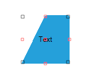

# Rotation


__RadDiagram__ gives you the ability to rotate shapes by dragging their Rotation Thumb or by changing their __RotationAngle__ property.

## Enable/Disable rotation

By default, the __RadDiagram__ is enabled for rotation manipulation. In order to disable this functionality, you can set the __IsRotationEnabled__ property to *false*.

 

{{source=..\SamplesCS\Diagram\DiagramItemsManipulation.cs region=EnableRotation}} 
{{source=..\SamplesVB\Diagram\DiagramItemsManipulation.vb region=EnableRotation}} 

````C#
            
this.radDiagram1.IsRotationEnabled = false;

````
````VB.NET
Me.RadDiagram1.IsRotationEnabled = False

````

{{endregion}} 

 
## Rotation Angle

You can rotate shapes by using their __RotationAngle__ property: 

 

{{source=..\SamplesCS\Diagram\DiagramItemsManipulation.cs region=RotationAngle}} 
{{source=..\SamplesVB\Diagram\DiagramItemsManipulation.vb region=RotationAngle}} 

````C#
            
RadDiagramShape sourceShape = new RadDiagramShape()
{
    Text = "Text",
    BackColor = System.Drawing.Color.LightBlue,
    ElementShape = new TabVsShape(),
};
sourceShape.RotationAngle = 45;

````
````VB.NET
Dim sourceShape As New RadDiagramShape() With { _
    .Text = "Text", _
    .BackColor = System.Drawing.Color.LightBlue, _
    .ElementShape = New TabVsShape() _
}
sourceShape.RotationAngle = 45

````

{{endregion}} 


