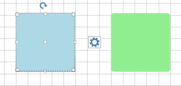
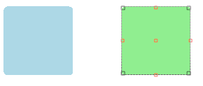

# Selection


__RadDiagram__ gives you the ability to select __RadDiagramItems__ in code behind, interactively or by invoking [RadDiagramCommand]().

The following tutorial will show you how to select items, work with different selection modes and set up selection commands and events.

## Selection modes

__RadDiagram__ has four different __Selection Modes__ which determine the way a user performs selection:

* __Single__ - the user can select only one item. This is the default __SelectionMode__'s value.
            

* __None__ - the user cannot select any items.
            

* __Extended__ - the user can select/deselect multiple items using the combinations (Ctrl Key+ Mouse Left Button) or (Ctr + Key A). 
            

* __Multiple__ - the user can select/deselect multiple items using only left button or the combinations (Ctrl Key+ Mouse Left Button) and (Ctr + Key A).
            

In order to change the way the Selection Adorner Rectangle behaves, you can use the __RectSelectionMode__ property:

* __Full__ - the user selects item(s) only when the selection rectangle covers it(them) completely.
            

* __Partial__ - the user selects all items that are completely or partially covered by the selection rectangle.


## Selection in code behind

In order to select items programmatically, you only need to set their __IsSelected__ property to *true*:

 

{{source=..\SamplesCS\Diagram\DiagramItemsManipulation.cs region=IsSelected}} 
{{source=..\SamplesVB\Diagram\DiagramItemsManipulation.vb region=IsSelected}} 

````C#
            
RadDiagramShape shape1 = new RadDiagramShape()
{
    Text = "",
    IsSelected = true,
    ElementShape = new RoundRectShape(5),
    BackColor = System.Drawing.Color.LightBlue
};
shape1.Position = new Telerik.Windows.Diagrams.Core.Point(10, 10);
radDiagram1.AddShape(shape1);
            
RadDiagramShape shape2 = new RadDiagramShape()
{
    Text = "",
    ElementShape = new RoundRectShape(5),
    BackColor = System.Drawing.Color.LightGreen
};
shape2.Position = new Telerik.Windows.Diagrams.Core.Point(180, 10);
radDiagram1.AddShape(shape2);

````
````VB.NET
Dim shape1 As New RadDiagramShape() With { _
    .Text = "", _
    .IsSelected = True, _
    .ElementShape = New RoundRectShape(5), _
    .BackColor = System.Drawing.Color.LightBlue _
}
shape1.Position = New Telerik.Windows.Diagrams.Core.Point(10, 10)
RadDiagram1.AddShape(shape1)
Dim shape2 As New RadDiagramShape() With { _
    .Text = "", _
    .ElementShape = New RoundRectShape(5), _
    .BackColor = System.Drawing.Color.LightGreen _
}
shape2.Position = New Telerik.Windows.Diagrams.Core.Point(180, 10)
RadDiagram1.AddShape(shape2)

````

{{endregion}} 
 

When multiple items are selected, they are automatically added in one Selection Adorner: 

 


{{source=..\SamplesCS\Diagram\DiagramItemsManipulation.cs region=MultipleSelection}} 
{{source=..\SamplesVB\Diagram\DiagramItemsManipulation.vb region=MultipleSelection}} 

````C#
            
RadDiagramShape shape1 = new RadDiagramShape()
{
    Text = "",
    IsSelected = true,
    ElementShape = new RoundRectShape(5),
    BackColor = System.Drawing.Color.LightBlue
};
shape1.Position = new Telerik.Windows.Diagrams.Core.Point(10, 10);
radDiagram1.AddShape(shape1);
            
RadDiagramShape shape2 = new RadDiagramShape()
{
    Text = "",
    IsSelected = true,
    ElementShape = new RoundRectShape(5),
    BackColor = System.Drawing.Color.LightGreen
};
shape2.Position = new Telerik.Windows.Diagrams.Core.Point(180, 10);
radDiagram1.AddShape(shape2);

````
````VB.NET
Dim shape1 As New RadDiagramShape() With { _
    .Text = "", _
    .IsSelected = True, _
    .ElementShape = New RoundRectShape(5), _
    .BackColor = System.Drawing.Color.LightBlue _
}
shape1.Position = New Telerik.Windows.Diagrams.Core.Point(10, 10)
RadDiagram1.AddShape(shape1)
Dim shape2 As New RadDiagramShape() With { _
    .Text = "", _
    .IsSelected = True, _
    .ElementShape = New RoundRectShape(5), _
    .BackColor = System.Drawing.Color.LightGreen _
}
shape2.Position = New Telerik.Windows.Diagrams.Core.Point(180, 10)
RadDiagram1.AddShape(shape2)

````

{{endregion}} 


You may also want to use the __SelectedIndex__ or the __SelectedItem__ property of the __RadDiagram__:

 

{{source=..\SamplesCS\Diagram\DiagramItemsManipulation.cs region=SelectedIndex}} 
{{source=..\SamplesVB\Diagram\DiagramItemsManipulation.vb region=SelectedIndex}} 

````C#
            
this.radDiagram1.SelectedIndex = 1;

````
````VB.NET
Me.RadDiagram1.SelectedIndex = 1

````

{{endregion}} 


## Select All

You are able to select all __RadDiagramItems__ interactively (by Mouse or by pressing Ctrl + A), programmatically (via the __SelectAll__ method), set the __IsSelected__ property to every Shape and Connection. Below is demonstrated how you can use the __SelectAll__ command: 

{{source=..\SamplesCS\Diagram\DiagramItemsManipulation.cs region=SelectAllCommand}} 
{{source=..\SamplesVB\Diagram\DiagramItemsManipulation.vb region=SelectAllCommand}} 

````C#
            
this.radDiagram1.DiagramElement.TryExecuteCommand(DiagramCommands.SelectAll, "");

````
````VB.NET
Me.RadDiagram1.DiagramElement.TryExecuteCommand(DiagramCommands.SelectAll, "")

````

{{endregion}} 
 
## Selections events

__RadDiagram__ provides the following selection events:
        

* __SelectionChanged__ - fires when a selection operations has just been performed.
            

* __SelectionBoundsChanged__ - fires when the SelectionRectangle's bounds have just been changed.
            
