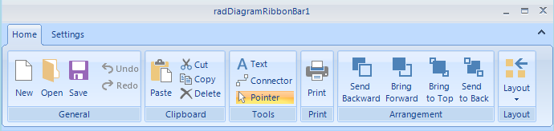
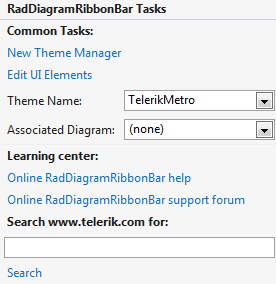

# RibbonUI

__RadDiagramRibbonBar__ is a ribbon control that has been wired to work with the API that  __RadDiagram__ exposes.
      

## Using RadDiagramRibbonBar

__RadDiagramRibbonBar__ can be found in the Toolbox of Visual Studio, if you have installed the controls automatically. In order to use it, drag an instance of the __RadDiagramRibbonBar__ in the designer area and drop it. Then, you can set the associated __RadDiagram__ by either using the smart tag or setting the __AssociatedDiagram__ property.

__RadDiagramRibbonBar__ introduces UI for saving and loading predefined diagramming layouts. Additionally, you can manipulate the ZOrder of the shapes and perform clipboard operations.
        
