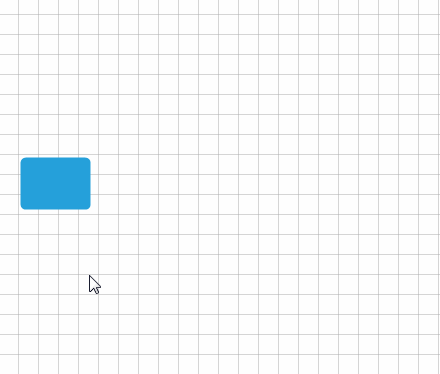
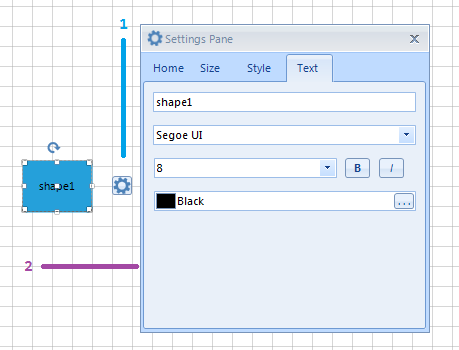
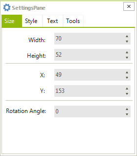
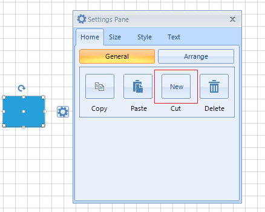

# Settings Pane


This article will get you familiar with the __SettingsPane__ that is part of __RadDiagram__.
      

## SettingsPane Overview

The __SettingsPane__ control allows the users to examine and modify the settings of the diagramming items at run-time. 
 

{{source=..\SamplesCS\Diagram\DiagramItemsManipulation.cs region=SettingsPane}} 
{{source=..\SamplesVB\Diagram\DiagramItemsManipulation.vb region=SettingsPane}} 

````C#
            
this.radDiagram1.IsSettingsPaneEnabled = true;

````
````VB.NET
Me.RadDiagram1.IsSettingsPaneEnabled = True

````

{{endregion}} 


>caption Fig.1 SettingsPane



The __SettingsPane__ control is a standalone control that can be displayed as the content of any ContentControl. Its main purpose is to provide you with a ready-to-use view that contains the most common features and settings of a single __RadDiagramItem__ (Shape or Connection). In most Diagramming examples you will find the __SettingsPane__ applied as an AdditionalContent on the diagramming surface. This way the control is displayed next to a focused __RadDiagramItem__ thus allowing users to dynamically change the look and feel of the item. 
        
>caption Fig.2



1. ItemInformationAdorner

1. RadDiagramSettingsPane

In order to display the DiagramElement.__SettingsPane__ in your application, you should click the AdditionalContent of the __ItemInformationAdorner__ which can be accessed as below: 

{{source=..\SamplesCS\Diagram\DiagramItemsManipulation.cs region=AdditionalContent}} 
{{source=..\SamplesVB\Diagram\DiagramItemsManipulation.vb region=AdditionalContent}} 

````C#
    
RadButtonElement additionalContent = Telerik.WinControls.UI.Diagrams.Primitives.ItemInformationAdorner.GetAdditionalContent(
    this.radDiagram1.DiagramElement.ItemInformationAdorner) as RadButtonElement;

````
````VB.NET
Dim additionalContent As RadButtonElement = TryCast(Telerik.WinControls.UI.Diagrams.Primitives.ItemInformationAdorner.GetAdditionalContent( _
Me.RadDiagram1.DiagramElement.ItemInformationAdorner), RadButtonElement)

````

{{endregion}} 


## Customization

The __SettingsPane__ has a default view that can be used out-of-the-box in scenarios where you only need to display the common settings of a __RadDiagramItem__. However, you can also customize the content of the pane to represent more specific information. These are the basic tasks you might need to implement while customizing your SettingsPane instance:

* __Change the tab headers__- in order to change the headers of the tabs in the default __SettingsPane__, you can change the value of their localization strings. Please take a look at the [Localization]() article to find the localization string of each tab displayed inside the __SettingsPane__.
            

* __Add and remove tabs__ - in order to add or remove tabs from the default __SettingsPane__,  you need to add or remove a __RadPageViewPage__ to or from the DiagramElement.SettingsPane.RadPageView.__Pages__  as this is the control that represents the content of the __SettingsPane__. 

{{source=..\SamplesCS\Diagram\DiagramItemsManipulation.cs region=AddRemoveTabs}} 
{{source=..\SamplesVB\Diagram\DiagramItemsManipulation.vb region=AddRemoveTabs}} 

````C#
            
this.radDiagram1.DiagramElement.SettingsPane.RadPageView.Pages.Remove(this.radDiagram1.DiagramElement.SettingsPane.RadPageViewPageHome);
RadPageViewPage toolsPage = new RadPageViewPage();
toolsPage.Text = "Tools";
this.radDiagram1.DiagramElement.SettingsPane.RadPageView.Pages.Add(toolsPage);

````
````VB.NET
Me.RadDiagram1.DiagramElement.SettingsPane.RadPageView.Pages.Remove(Me.RadDiagram1.DiagramElement.SettingsPane.RadPageViewPageHome)
Dim toolsPage As New RadPageViewPage()
toolsPage.Text = "Tools"
Me.RadDiagram1.DiagramElement.SettingsPane.RadPageView.Pages.Add(toolsPage)

````

{{endregion}} 


>caption Fig.3



* __Edit the content of an existing tab__ - the content of each of the four default __SettingsPane__ tabs – Home, Size, Style, Text, is represented by a different __RadPageViewPage__:
            

* __RadPageViewPageHome__ - representing the content of the Home tab
                

* __RadPageViewPageSize__ - representing the content of the Size tab
                

* __RadPageViewPageStyle__ - representing the content of the Style tab
                

* __RadPageViewPageText__ - representing the content of the Text tab
                

>note You have access to each control in every of the default content pages. Hence, you can add, remove, edit controls:
> 

{{source=..\SamplesCS\Diagram\DiagramItemsManipulation.cs region=EditTabs}} 
{{source=..\SamplesVB\Diagram\DiagramItemsManipulation.vb region=EditTabs}} 

````C#
            
RadButton myButton = new RadButton();
myButton.Text = "New";
myButton.Size = this.radDiagram1.DiagramElement.SettingsPane.RadButtonCut.Size;
myButton.Location = this.radDiagram1.DiagramElement.SettingsPane.RadButtonCut.Location;
this.radDiagram1.DiagramElement.SettingsPane.PanelCopyCutPaste.Controls.Add(myButton);        
this.radDiagram1.DiagramElement.SettingsPane.RadButtonCut.Visible = false;

````
````VB.NET
 
Dim myButton As New RadButton()
myButton.Text = "New"
myButton.Size = Me.RadDiagram1.DiagramElement.SettingsPane.RadButtonCut.Size
myButton.Location = Me.RadDiagram1.DiagramElement.SettingsPane.RadButtonCut.Location
Me.RadDiagram1.DiagramElement.SettingsPane.PanelCopyCutPaste.Controls.Add(myButton)
Me.RadDiagram1.DiagramElement.SettingsPane.RadButtonCut.Visible = False

````

{{endregion}} 


>caption Fig.4



## Events

__RadDiagram__ exposes two events that come in handy while working with the default __SettingsPane__:

* __PreviewAdditionalContentActivated__- this event is raised by a RadDiagram to inform layouts that the additional content is going to be activated. The event handler receives two arguments:
            

	* The __sender__ argument contains the __RadDiagramElement__. This argument is of type object, but can be cast to the __RadDiagramElement__ type.
                

	* An __AdditionalContentActivatedEventArgs__ object, that gives you access to a __ContextItems__ collection. This collection of __IDiagramItem__ objects represents the items that have activated the additional content. In most cases it contains a single item - the __RadDiagramItem__ that has activated the __SettingsPane__.

>note Please note that you can handle this event in order to disable the __SettingsPane__ from displaying on certain __RadDiagramItems__ .
>


* __AdditionalContentActivated__ - this event is raised by a __RadDiagram__ to inform layouts that the additional content has been activated. The event handler receives two arguments:
            

	* The __sender__ argument contains the __RadDiagramElement__. This argument is of type object, but can be cast to the __RadDiagramElement__ type.
                

	* An __AdditionalContentActivatedEventArgs__ object, that gives you access to a __ContextItems__ collection. This collection of __IDiagramItem__ objects represents the items that have activated the additional content. In most cases it contains a single item - the __RadDiagramItem__ that has activated the __SettingsPane__.
                
