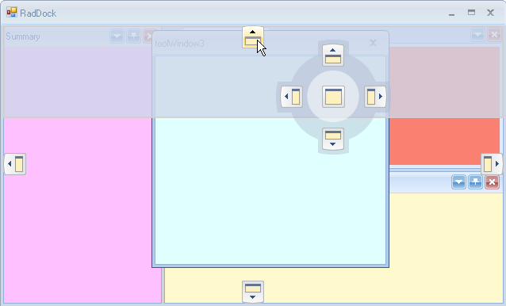
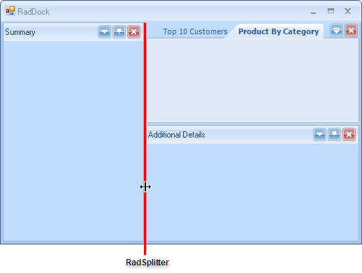
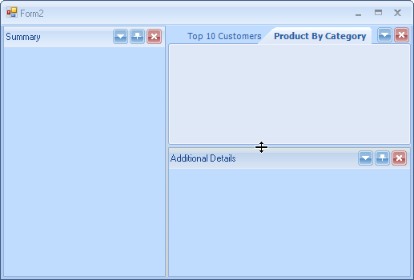
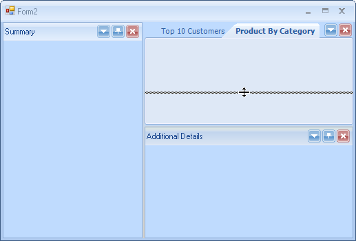
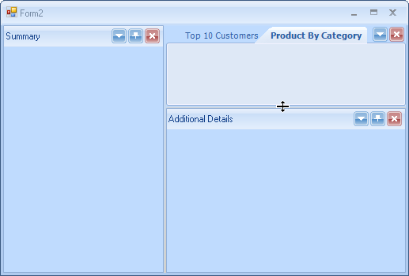
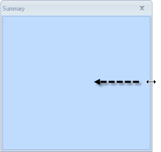
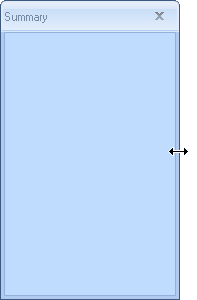

# Arranging DockWindows

A ToolTabStrip container can include one or more __ToolWindows__. You can drag __ToolWindows__ in the following ways:

* Within a ToolTabStrip.

* From one ToolTabStrip to another existing ToolTabStrip. 

* From one ToolTabStrip to a new ToolTabStrip. 

* From a ToolTabStrip on a form to a floating ToolTabStrip. 

* From a floating ToolTabStrip to a docked ToolTabStrip. 

To move a __ToolWindow__, drag its title bar from the source location to the new target (or host) container. The [Docking Assistant]() allows you to place the __ToolWindow__ in a specific relationship to the other panels.

In addition to moving __ToolWindows__ in different ToolTabStrip containers, you can use the context menu or "pin" icon in the DockPanel title bar to make window auto-hidden. This mode collapses the window against an edge of the RadDock. Another option is to move a ToolWindow to a container with tabbed documents. Both of these options:

* Save critical space on the end user screen 

* Allow more information to be presented at run time. 

* Allow the end user to customize their work space.

## Resizing Panels

To resize a ToolTabStrip/DocumentTabStrip container, click the splitter bar between two adjacent docking containers and drag the splitter to the desired location. The __ToolWindows__ and docking containers will automatically resize themselves to fit the space available to them, subject to any minimum or maximum size limits set at design time. You can find the splitter bar between docking containers as shown in the screen shot below.

To begin resizing move your mouse over the splitter area until the splitter mouse icon appears (the icon is a line with upward and downward pointing arrows).

Hold the left mouse down and drag the splitter to a new location.

To complete the resize, release the mouse button, dropping the splitter bar in its new location. The panels to either side of the splitter will be resized in relation to the new splitter position.

## Resize Floating Containers

To resize a floating docking container, drag the edges of the floating window. __ToolWindow__ within the container can be resized in the same manner as within any other docking container.

 

