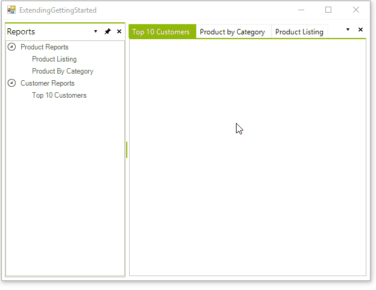
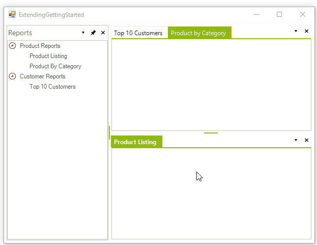

# Arranging DockWindows

A ToolTabStrip container can include one or more __ToolWindows__. You can drag __ToolWindows__ in the following ways:

* Within a ToolTabStrip.

* From one ToolTabStrip to another existing ToolTabStrip. 

* From one ToolTabStrip to a new ToolTabStrip. 

* From a ToolTabStrip on a form to a floating ToolTabStrip. 

* From a floating ToolTabStrip to a docked ToolTabStrip. 

To move a __ToolWindow__, drag its title bar from the source location to the new target (or host) container. The [Docking Assistant]() allows you to place the __ToolWindow__ in a specific relationship to the other panels.

In addition to moving __ToolWindows__ in different ToolTabStrip containers, you can use the context menu or `Pin` icon in the DockPanel title bar to make window auto-hidden. This mode collapses the window against an edge of the __RadDock__. Another option is to move a ToolWindow to a container with tabbed documents. Both of these options:

* Save critical space on the end user screen 

* Allow more information to be presented at run time. 

* Allow the end user to customize their work space.

## Resizing Panels

To resize a ToolTabStrip/DocumentTabStrip container, click the splitter bar between two adjacent docking containers and drag the splitter to the desired location. The __ToolWindows__ and docking containers will automatically resize themselves to fit the space available to them, subject to any minimum or maximum size limits set at design time. You can find the splitter bar between docking containers as shown in the below image.

# See Also

* [Getting Started]()
* [Using the CommandManager]()     
* [Using the ContextMenuService]()
* [Using the DragDropService]() 
* [Document Manager]()   
* [Understanding RadDock]()