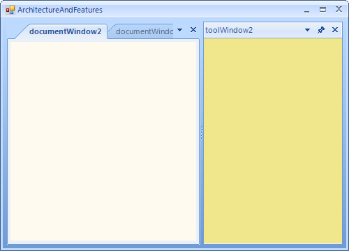
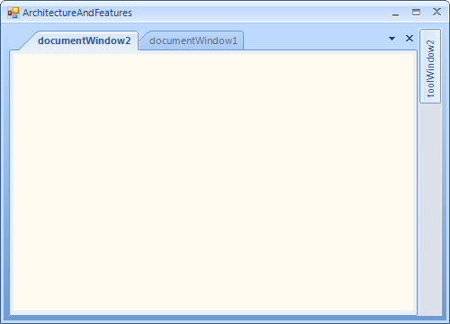
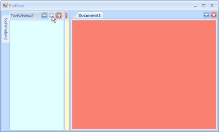

# Auto-Hiding Windows

## Auto-Hide a DockPanel

Un-pin the __ToolWindow__ by clicking the pushpin icon in the title bar. This will cause the __ToolWindow__ to auto-hide at the edge of the __RadDock__ to which it belongs. The screen shots below show before and after un-pinning the panel.

|||
|----|----|
|||

## Showing and Pinning a Hidden DockPanel

Hover the mouse over the tab at the edge of the __RadDock__ that displays the __ToolWindow__ title. This will cause the __ToolWindow__ to slide out over the other panels. As long as the mouse cursor is over the tab or the panel itself, the panel will stay visible. Moving the mouse away from the tab and panel will cause the panel to collapse again to its un-pinned state. To dock the panel, click the "pin" button to pin the panel in place.

|||
|----|----|
|||
 

## Understanding AutoHidePosition

When you unpin a ToolTabStrip with ToolWindows, these windows will collapse against a specific side - Left, Top, Right or Bottom. By default when you dock a ToolWindow in RadDock, the ToolTabStrip container of this ToolWindow has its AutoHidePosition set to Auto. The side to which a ToolWindow will collapse depends on the docked position of the ToolTabStrip in relation to the main DocumentContainer. Let's put it simple:

* If you dock a [ToolWindow to the left](), this window will collapse to the left when it is in auto-hidden mode. 
            

* If you dock a [ToolWindow giving another ToolWindow as a target](), let's say WindowBottomRight to WindowBottom, WindowBottomRight window will collapse to bottom, because the target ToolWindow (WindowBottom) is docked to Bottom in RadDock.

However, this is just the default behavior. If you set the AutoHidePosition to a specific value, the ToolWindow will not collapse against its default side, but it will collapse against the direction you have specified. For example, by default a ToolWindow may collapse to Bottom, but if you set the __AutoHidePosition__ of the ToolTabStrip container to Top, this ToolWindow will collapse to the Top. ([Example: Building an advanced layout at runtime]())

 
## Setting the Size of auto-hidden windows

When a ToolWindow is auto-hidden, it has a default size of (200, 200). However, if you initially set a different size by the __AutoHideSize__ property, your ToolWindow will have a different size when it goes in auto-hidden mode. If a ToolWindow is auto-hidden to Top, Bottom, the Height of this size will be taken into consideration. If a ToolWindow is auto-hidden to Left, Right, the Width of this size will be taken into consideration. If the user resizes an auto-hidden window, the __AutoHideSize__ property will a new value and the programmatically set value will be lost. 
 
>note RadDock memorizes the size of an Auto-hide window set by the user at runtime. I.e. when a user sets a ToolWindow to Auto-hide, then resizes the Auto-hide window by a mouse drag and drop operation, then docks and then sets the ToolWindow back to Auto-hide, the new Auto-hide window will have the size set by the user's mouse drag and drop operation.
>

