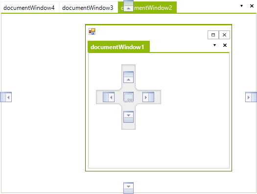
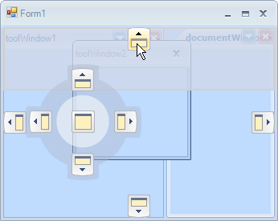
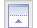
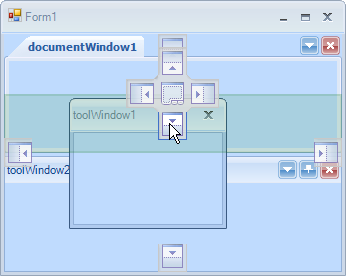

# DockingGuidesTemplate

RadDock comes with two predefined docking guides templates:

* Visual Studio 2008 

* Visual Studio 2010 

By default, RadDock uses the VS2010 template. In order to use the VS2008 template, you can set it as shown below:

#### __[C#] __

{{region VS2008}}
	            
	            this.radDock1.DockingGuidesTemplate = PredefinedDockingGuidesTemplate.VS2008;
	            
	{{endregion}}

#### __[VB.NET] __

{{region VS2008}}
	
	        Me.RadDock1.DockingGuidesTemplate = PredefinedDockingGuidesTemplate.VS2008
	
	{{endregion}}

## Creating a custom docking guides template

RadDock gives you the ability to create and use your own __DockingGuidesTemplates.__The following example explains what is contained in a DockingGuidesTemplate and how it should be set up.
        

For our custom DockingGuidesTemplate we will use the following images (used in VS2008 template):

<table><tr><td>

<b>Left</b></td><td>

<b>Top</b></td><td>

<b>Right</b></td><td>

<b>Bottom</b></td><td>

<b>Fill</b></td></tr><tr><td>

<b>Left Hot</b></td><td>

<b>Top Hot</b></td><td>

<b>Right Hot</b></td><td>

<b>Bottom Hot</b></td><td>

<b>Fill Hot</b></td></tr><tr><td>

<b>Center Background</b></td><td></td><td></td><td></td><td></td></tr></table>

We should first create a DockingGuidesTemplate object and then set the images and their locations on the Center Background image. RadDock will define its hot mouse areas on the CenterBackground image depending on the images' locations that we set. The left, top, right and bottom images are reused for the outer guides (outside the center "compass"):

#### __[C#] __

{{region Template}}
	
	        DockingGuidesTemplate template;
	       
	        void Form1_Load(object sender, EventArgs e)
	        {
	            template = new DockingGuidesTemplate();
	             
	            template.DockingHintBackColor = Color.FromArgb(30, Color.Green);
	            template.DockingHintBorderColor = Color.FromArgb(30, Color.DarkGreen);
	            
	            template.LeftImage.Image = Properties.Resources.Left;
	            template.TopImage.Image = Properties.Resources.Top;
	            template.RightImage.Image = Properties.Resources.Right;
	            template.BottomImage.Image = Properties.Resources.Bottom;
	            template.FillImage.Image = Properties.Resources.Fill;
	            
	            template.LeftImage.HotImage = Properties.Resources.LeftHot;
	            template.TopImage.HotImage = Properties.Resources.TopHot;
	            template.RightImage.HotImage = Properties.Resources.RightHot;
	            template.BottomImage.HotImage = Properties.Resources.BottomHot;
	            template.FillImage.HotImage = Properties.Resources.FillHot;
	            
	            template.CenterBackgroundImage.Image = Properties.Resources.Center;
	            
	            template.LeftImage.LocationOnCenterGuide = new Point(0, 28);
	            template.TopImage.LocationOnCenterGuide = new Point(28, 0);
	            template.RightImage.LocationOnCenterGuide = new Point(65, 28);
	            template.BottomImage.LocationOnCenterGuide = new Point(28, 65);
	            template.FillImage.LocationOnCenterGuide = new Point(28, 28);
	        
	            this.radDock1.DockingGuidesTemplate = template;
	        }
	        
	{{endregion}}

#### __[VB.NET] __

{{region Template}}
	    Private template As DockingGuidesTemplate
	
	    Private Sub Form1_Load(sender As Object, e As EventArgs)
	        template = New DockingGuidesTemplate()
	
	        template.DockingHintBackColor = Color.FromArgb(30, Color.Green)
	        template.DockingHintBorderColor = Color.FromArgb(30, Color.DarkGreen)
	
	        template.LeftImage.Image = Resources.Left
	        template.TopImage.Image = Resources.Top
	        template.RightImage.Image = Resources.Right
	        template.BottomImage.Image = Resources.Bottom
	        template.FillImage.Image = Resources.Fill
	
	        template.LeftImage.HotImage = Resources.LeftHot
	        template.TopImage.HotImage = Resources.TopHot
	        template.RightImage.HotImage = Resources.RightHot
	        template.BottomImage.HotImage = Resources.BottomHot
	        template.FillImage.HotImage = Resources.FillHot
	
	        template.CenterBackgroundImage.Image = Resources.Center
	
	        template.LeftImage.LocationOnCenterGuide = New Point(0, 28)
	        template.TopImage.LocationOnCenterGuide = New Point(28, 0)
	        template.RightImage.LocationOnCenterGuide = New Point(65, 28)
	        template.BottomImage.LocationOnCenterGuide = New Point(28, 65)
	        template.FillImage.LocationOnCenterGuide = New Point(28, 28)
	
	        Me.RadDock1.DockingGuidesTemplate = template
	    End Sub
	{{endregion}}

As you can see in the code snippet, we are setting the __DockingHintBackColor__ and __DockingHintBorderColor__ properties which determine the colors of the docking hint area:
        

The result is shown on the figure below
