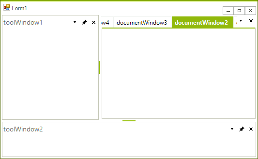
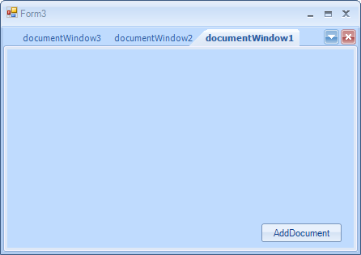

# Document Manager

The __DocumentManager__ object manages all DockWindows that are parented in the [main DocumentCountainer]() of RadDock. A Document (a window which is parented in a DocumentContainer) is either a DocumentWindow instance or a ToolWindow, that has its current DockState set to DockState.TabbedDocument. The DocumentManager exposes several important properties which will allow you to easily customize the way Documents behave in the MainDocumentContainer.

## ActiveDocument

This property allows you to get the currently active document among the documents in a RadDock instance. This property is not equal to the ActiveWindow of RadDock, because the currently active window in RadDock can be a ToolWindow, but still there will be one document that is active among the rest of the documents. For example in the screenshot below the ActiveWindow of RadDock is ToolWindow3, but the ActiveDocument of DocumentManager is DocumentWindow2:

#### __[C#]__

{{region activeWindows}}
	            DockWindow activeDocument = this.radDock1.DocumentManager.ActiveDocument; //documentWindow2
	            DockWindow activeWindow = this.radDock1.ActiveWindow; //toolWindow2
	{{endregion}}

#### __[VB.NET]__

{{region activeWindows}}
	        Dim activeDocument As DockWindow = Me.RadDock1.DocumentManager.ActiveDocument 'documentWindow2
	        Dim activeWindow As DockWindow = Me.RadDock1.ActiveWindow 'toolWindow2
	{{endregion}}

## BoldActiveDocument

Determines whether the currently active document's Text will be displayed in bold Font in its corresponding TabItem. The ActiveDocument in the screenshot below is DocumentWindow2, but its text is not bold due to setting the __BoldActiveDocument__ to *false*:

#### __[C#]__

{{region boldActive}}
	            this.radDock1.DocumentManager.BoldActiveDocument = false;
	{{endregion}}

#### __[VB.NET]__

{{region boldActive}}
	        Me.RadDock1.DocumentManager.BoldActiveDocument = False
	{{endregion}}

## DocumentInsertOrder

Gets or sets the insert order to be used when adding new documents. By default the insert order is set to InFront and the behavior resembles the behavior of VisualStudio. The screenshot below shows what happens after three clicks on the "Add Document" button when __DocumentInsertOrder__ is set to *Default* or *InFront*:

#### __[C#]__

{{region insertOrderInFront}}
	            this.radDock1.DocumentManager.DocumentInsertOrder = DockWindowInsertOrder.InFront;
	{{endregion}}

#### __[VB.NET]__

{{region insertOrderInFront}}
	        Me.RadDock1.DocumentManager.DocumentInsertOrder = DockWindowInsertOrder.InFront
	{{endregion}}

The other available option for this property is *ToBack.* The behavior of DocumentTabStrip in this case resembles the behavior of most web browsers. The screenshot below demonstrates what happens after three clicks on the "AddDocument" button:

#### __[C#]__

{{region insertOrderToBack}}
	            this.radDock1.DocumentManager.DocumentInsertOrder = DockWindowInsertOrder.ToBack;
	{{endregion}}

#### __[VB.NET]__

{{region insertOrderToBack}}
	        Me.RadDock1.DocumentManager.DocumentInsertOrder = DockWindowInsertOrder.ToBack
	{{endregion}}

 
      
