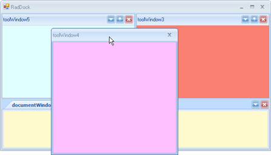
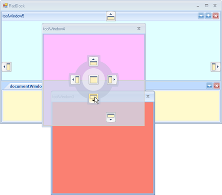
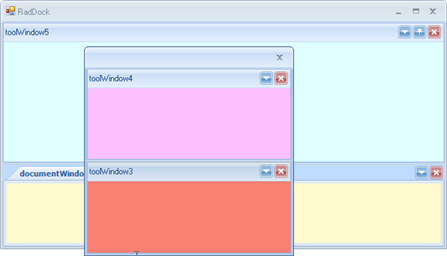
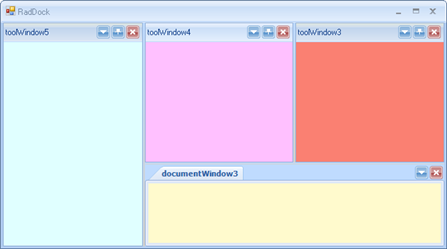
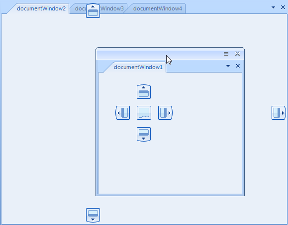
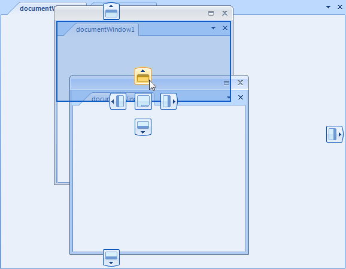

# Floating Windows
 

__ToolWindows__ can reside in docked or floating docking containers. Floating containers are still controlled by the __RadDock__.
      

## Floating a ToolWindow

There are multiple ways to float a __ToolWindow__:
        

* Drag the __ToolWindow__ out of the docked container area to an existing floating container.
            

* Drag the __ToolWindow__ to any area within the __DockingAssistant__ other than a drop target icon, the __RadDock__ will create a new floating container with the __ToolWindow__ in it.
            

* Right click the __ToolWindow__ title bar and select __Floating__ from the context menu.
            

* Double-click the title bar. 

The screenshots below show DockPanel "Panel 2" being dragged outside of any container and the floating container being created automatically.
 
|||
|----|----|
|||

## Moving a ToolWindow to an Existing Floating Window

You can drag __DockPanels__ to an existing floating container. Select left, right, top, or bottom drop targets to create a split-cell layout, just as you would with a docked container. In the screen shot below "Panel 3" is dragged to the existing floating container for "Panel 2" and dropped onto the downward arrow of the Docking Assistant compass.
  
|||
|----|----|
|||

## Unfloating a ToolWindow

To "un-float" a __ToolWindow__, drag the title bar to a docked container, or double-click the title bar.
        

## Moving a ToolWindow to a New Docking Container

If you use the drop target icons in the [DockingAssistant]() outer zone, the __RadDock__ will create a new docking container. The __ToolWindow__ that was in a floating container will fill the new docked container. In the screenshot below "ToolWindow5" is dragged from below the right of ToolWindow3" and dropped on the left outer zone of the DockingAssistant compass.
        
|||
|----|----|
|||

## Moving a Floating ToolWindow to an Existing Container

If you use the drop target icons in the inner zone different than the fill option, the __RadDock__ will insert the __ToolWindow__ that was in the floating container into an new docked container. Then, it will rearrange other docking containers within that container to accommodate the new docking container, subject to any minimum or maximum size restrictions. In the screenshot below, "Panel 2" occupies the upper right portion of the screen.  A floating panel "Panel 3" is dropped on the inner compass left arrow.


## Floating a document window

Document windows can also reside in a floating window. To make a document window float, drag its tab outside of any docking container. This will create a floating window with the document inside it.



## Moving a document window to an existing floating window

You can drag document windows to an existing floating container. Select left, right, top, or bottom drop targets to create a split-cell layout or select the fill target to create a tab for the document in the existing document container.



## Changing the floating behavior

To enable the Visual Studio 2008-like docking behavior, set the SingleScreen property to true. Enabling this property will prevent document windows from floating and from docking inside existing floating windows.
        

{{source=..\SamplesCS\Dock\ArchitectureAndFeatures.cs region=floatingTabsMode}} 
{{source=..\SamplesVB\Dock\ArchitectureAndFeatures.vb region=floatingTabsMode}} 

````C#
            this.radDock1.SingleScreen = true;
````
````VB.NET
        Me.RadDock1.SingleScreen = True
        '
````

{{endregion}} 
 
# See Also

 * [Customizing Floating Windows]()
