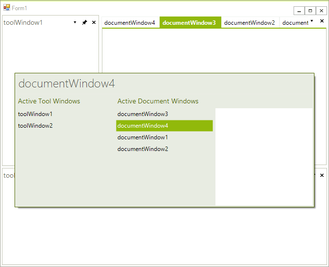

# Quick Navigator

## 

Use the __RadDock__built-in pop-up __QuickNavigator__ to set the focus to any __DockWindow or ToolWindow__. Press __Ctrl-Tab__ to open the navigation selector. Leave the __Ctrl__ button depressed and press the __Tab__ button to scroll through the names of the open __DockWindows__. If your current active __DockWindow__ is __DocumentWindow__, pressing the __Tab__ will scroll only through __DocumentWindows__; if the current active __DockWindow__ is __ToolWindow__, pressing the __Tab__ will scroll only through ToolWindows. You can jump from __DocumentWindows__ to __ToolWindows__ and vise versa by using the mouse or by using the arrow keys.

