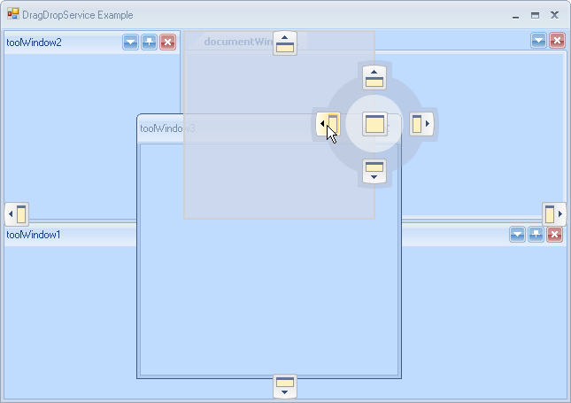
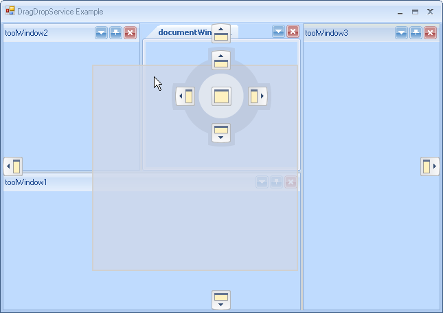

# Using the DragDropService

The new docking framework introduces service-based semantic, which allows for granular and pluggable functionality per RadDock instance. Entire drag-and-drop functionality is handled by the registered `DragDropService` instance, which simply receives drag requests and instantiates the appropriate operation. The service is responsible for drop target hit-testing, displaying docking guides and docking hints as well as for processing user input while dragging is in progress.

## Canceling Drag-and-drop operation

A running drag-and-drop operation (DDO) may be easily canceled by either pressing `Esc` or manually, by calling the following method:

#### Canceling Drag-and-drop operation 
 

{{source=..\SamplesCS\Dock\ArchitectureAndFeatures.cs region=cancellingService}} 
{{source=..\SamplesVB\Dock\ArchitectureAndFeatures.vb region=cancellingService}} 

````C#
DragDropService service = this.radDock1.GetService<DragDropService>();
service.Stop(false);

````
````VB.NET
Dim service As DragDropService = Me.RadDock1.GetService(Of DragDropService)()
service.Stop(False)

````

{{endregion}} 
 
The Boolean parameter determines whether the operation should be committed (applied) or not.

## Drag-and-drop Modes

The service can operate in two modes: `Immediate` and `Preview`. The `Immediate` mode is the default one and it means that when a drag-and-drop operation is instantiated, the dragged window will be immediately detached from its current DockTabStrip and will become floating. On the contrary, in `Preview` mode the `DockWindow` will not be detached but rather a semi-translucent rectangle will be displayed, indicating the floating position it would take if the operation is committed. The major benefit of this new mode is that the operation is completely cancelable. The `Preview` mode is currently used by the framework at design-time.
 
You can switch between *Preview* and *Immediate* modes by setting the __DragDropMode__ property of RadDock:

#### Setting DragDropMode 
 
{{source=..\SamplesCS\Dock\ArchitectureAndFeatures.cs region=dragDropMode}} 
{{source=..\SamplesVB\Dock\ArchitectureAndFeatures.vb region=dragDropMode}} 

````C#
this.radDock1.DragDropMode = DragDropMode.Preview;

````
````VB.NET
Me.RadDock1.DragDropMode = DragDropMode.Preview

````

{{endregion}} 
 
## AllowedDockStates

The service may be told which dock states are allowed to be hit-tested. For example we may exclude any floating window from hit-testing by simply specifying the following:

#### Setting AllowedStates 

{{source=..\SamplesCS\Dock\ArchitectureAndFeatures.cs region=dragDropAllowedStates}} 
{{source=..\SamplesVB\Dock\ArchitectureAndFeatures.vb region=dragDropAllowedStates}} 

````C#
DragDropService service = this.radDock1.GetService<DragDropService>();
service.AllowedStates &= ~AllowedDockState.Floating;

````
````VB.NET
Dim service As DragDropService = Me.RadDock1.GetService(Of DragDropService)()
service.AllowedStates = service.AllowedStates And Not AllowedDockState.Floating

````

{{endregion}} 
 
## Extending Service’s Behavior by Handling Events

* __Starting:__ Notifies that the service is about to start. The drag context is passed as an event argument, which allows listeners to examine it and optionally cancel undesired operation.

* __Started:__ Notifies for a successfully started DDO.

* __Stopping:__ Notifies that the service is about to stop. The Commit parameter is passed as an event argument, which allows listeners to examine it and to modify it or to prevent the service from stopping.

* __Stopped:__ Notifies that the service is successfully stopped.

* __Dragging:__ Notifies for a drag pass, performed upon each mouse move. Allows listeners to stop the DDO under some circumstances.

* __PreviewDropTarget:__ Allows listeners to examine and/or optionally modify the currently hit-tested drop target. For example this may be used to exclude certain panels from being hit-tested.

* __PreviewDockPosition:__ Allows listeners to examine and optionally modify the allowed dock position for the current drag operation. For example, here is right place to allow dock only bottom for a specific drop target.

* __PreviewHitTest:__ Allows for preview and/or modification of the generated hit-test result.

The following example demonstrates how to allow only `DockPosition.Bottom` for the `MainDocumentContainer`:


#### Handling DragDropService events 

{{source=..\SamplesCS\Dock\ArchitectureAndFeatures.cs region=initDragDropEvents}} 
{{source=..\SamplesVB\Dock\ArchitectureAndFeatures.vb region=initDragDropEvents}} 

````C#
private void InitDragDropEvents()
{
    DragDropService service = this.radDock1.GetService<DragDropService>();
    service.PreviewDockPosition += new DragDropDockPositionEventHandler(service_PreviewDockPosition);
}
      
private void service_PreviewDockPosition(object sender, DragDropDockPositionEventArgs e)
{
    if (e.DropTarget == this.radDock1.MainDocumentContainer)
    {
        e.AllowedDockPosition = AllowedDockPosition.Bottom;
    }
}

````
````VB.NET
Private Sub InitDragDropEvents()
    Dim service As DragDropService = Me.RadDock1.GetService(Of DragDropService)()
    AddHandler service.PreviewDockPosition, AddressOf service_PreviewDockPosition
End Sub
Private Sub service_PreviewDockPosition(ByVal sender As Object, ByVal e As DragDropDockPositionEventArgs)
    If e.DropTarget Is Me.RadDock1.MainDocumentContainer Then
        e.AllowedDockPosition = AllowedDockPosition.Bottom
    End If
End Sub

````

{{endregion}} 
 
>caption Figure 1: Only `DockPosition.Bottom` is allowed.



## Allowed Dock Manager Edges

The service may be told which edges of the owning RadDock instance are allowed for dock operation. The following example demonstrates how to set only left and right edges as allowed:

#### Setting AllowedDockManagerEdges 

{{source=..\SamplesCS\Dock\ArchitectureAndFeatures.cs region=initDragDropProperties}} 
{{source=..\SamplesVB\Dock\ArchitectureAndFeatures.vb region=initDragDropProperties}} 

````C#
private void InitDragDropProperties()
{
    DragDropService service = this.radDock1.GetService<DragDropService>();
    service.AllowedDockManagerEdges = AllowedDockPosition.Left | AllowedDockPosition.Right;
}

````
````VB.NET
Private Sub InitDragDropProperties()
    Dim service As DragDropService = Me.RadDock1.GetService(Of DragDropService)()
    service.AllowedDockManagerEdges = AllowedDockPosition.Left Or AllowedDockPosition.Right
End Sub

````

{{endregion}} 

>caption Figure 2: Only `DockPosition.Left` and `DockPosition.Right` are available.



