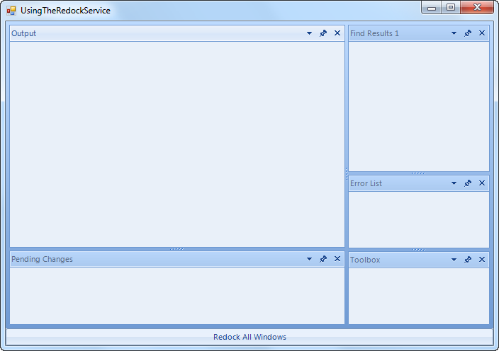
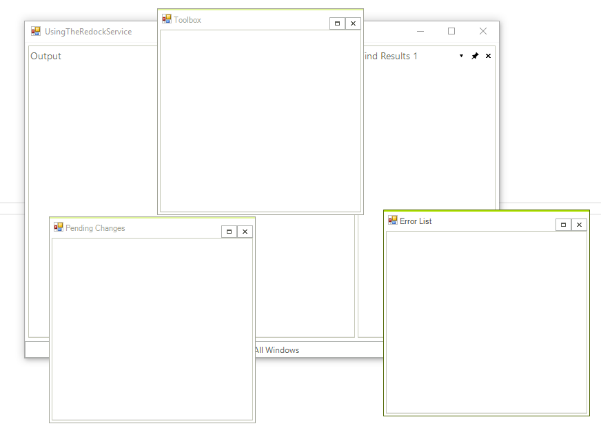

# Using the RedockService


RedockService comes in handy when you want to save the dock state of your 
      DockWindows and restore this state later.

## Using the RedockService

Let's take a look at the following scenario: 
        
        


1. 

We have a RadDock instance
        containing several docked ToolWindows as shown below:        
        



1. 


  
The end-user decides to float some of the ToolWindows:
   



1. 


  

  Now comes the time when the user wants to redock the floating ToolWindows. However,
  the user does not only want to dock the ToolWindows, he/she want to achieve the layout that he/she 
  had at the beginning. For that purpose, we can have a button or a menu item on the Click of which we
  get the RedockService and return the floating windows to their original docked state by calling the
  RestoreMethod of the service. When the user
  clicks that button, he/she will get the layout below, which as you can see is the same as the layout that we 
  had at the beginning:
  
      	#_[C#]_

	


{{source=..\SamplesCS\Dock\UsingTheRedockService.cs region=redockService}} 
{{source=..\SamplesVB\Dock\UsingTheRedockService.vb region=redockService}} 

````C#
        void radButton1_Click(object sender, EventArgs e)
        {
            RedockService service = this.radDock1.GetService<RedockService>();
            foreach (DockWindow window in this.radDock1.DockWindows)
            {
                if (window.DockState == DockState.Floating)
                {
                    service.RestoreState(window, DockState.Docked, true);
                }
            }
        }
````
````VB.NET
    Private Sub radButton1_Click(ByVal sender As Object, ByVal e As EventArgs)
        Dim service As RedockService = Me.RadDock1.GetService(Of RedockService)()
        For Each window As DockWindow In Me.RadDock1.DockWindows
            If window.DockState = DockState.Floating Then
                service.RestoreState(window, DockState.Docked, True)
            End If
        Next window
    End Sub
    '
````

{{endregion}} 


# See Also
