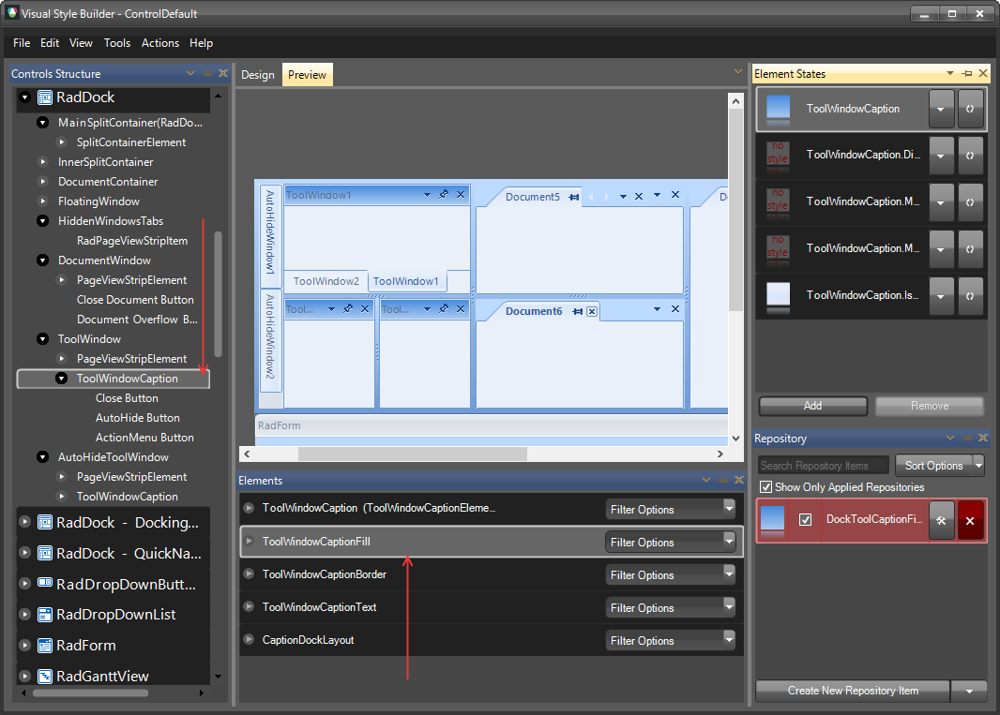
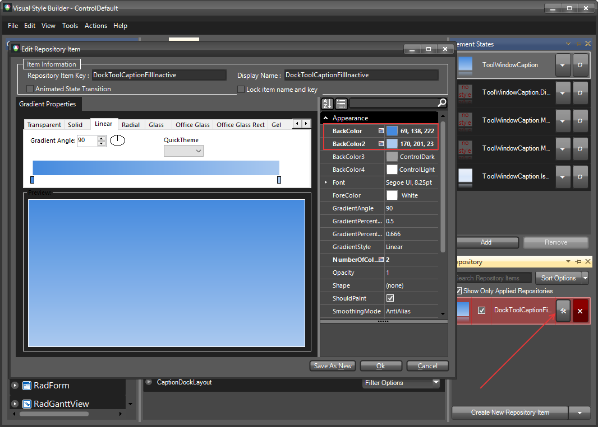

1. Open [VisualStyleBuilder]().

1. [Export the built-in themes] (). in a specific folder by selecting *File >> Export Built-in Themes*.

1. Load a desired theme from the just exported files by selecting *File >> Open Package*

1. Navigate to __RadDock__ in `Controls Structure` on the left side. Then, expand to and select __ToolWindoCaption__. In the `Elements` window select __ToolWindowCaptionFill__.

    

1. Modify the applied fill repository item.
    

1. Save the theme by selecting *File >> Save As*.

1. Now, you can apply your custom theme to __RadDock__ by using the approach demonstrated in the following link: [Using custom themes]()
