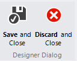
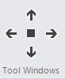
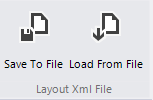

# Advanced Layout Designer

This designer allows you to build your layout ad design-time. You can arrange the windows the same way as at-runtime.

  

The table below shows what you can do with the buttons in the title bar:

| ButtonGroup | Description |
| ---- | ---- |
|| This button allows you to close the designer. You can save or discard any changes.|
|| This buttons allow you to add a ToolWindow at any desired position|
|| This group allow you to add DocumentWindows. You can clear all document windows as well.|
| | With this group you can save the layout to a file. You can load a predefined layouts as well.|
|| You can remove ToolWindows by clicking the red button in the windows list.|
| | The main area shows the current layout. Here you can arrange the windows by simply dragging them to the desired position. | 
