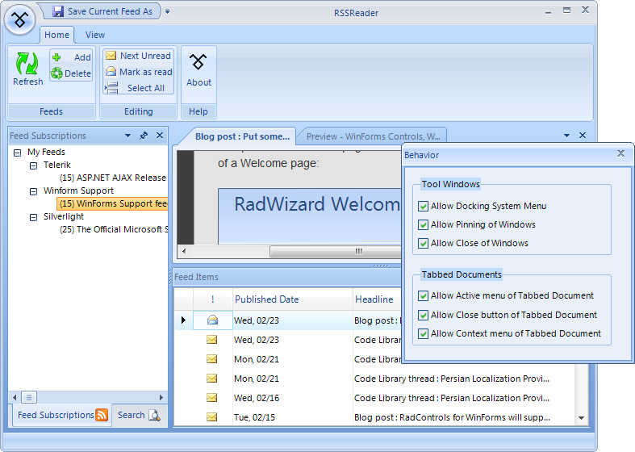

# Dock
 
## 

RadDock helps you manage multiple windows in your application with a docking system similar to Microsoft Visual Studio. RadDock can contain both tool and tabbed document style windows. RadDock also includes fully interactive design-time layout management.
        

* The RadDock control provides a container that holds dockable windows. This container can fill the entire client area of a Windows Form, or can be limited to any rectangular area you choose to manage.
            

* Tool windows can be dragged outside their containers ("floating"), dragged to other containers, collapsed against the side of the RadDock and transformed to tabbed documents. Tool windows are supported by the ToolWindow control. You can place other controls (either Telerik UI for WinForms controls or standard Windows Forms controls) within a ToolWindow.
            

* Tabbed documents can be switched between, floated, resized, dragged, to arrange in various configurations and closed. Tabbed documents are supported by the DocumentWindow control. You can place other controls (either Telerik UI for WinForms controls or standard Windows Forms controls) within a DocumentWnidow.
            

* The RadDock Advanced Layout Designer gives you fully interactive design-time control over the number, position, and properties of DockWindows within a RadDock.
            

* RadDock collects and uses the information about the state of each DockWindow - FloatingSize, FloatingLocation, AutoHideSize, Previous position, AutoHidePostion, etc. dynamically.
            

* RadDock offers an access to the active window.

* There are CloseAction and AutoDispose properties which allow control over the window’s Close behavior, as well as over memory management of the SplitPanel and DockWindow objects.
            

* Different sizing modes (Auto, Relative, Absolute, Fill) virtually any layout scenario can be easily achieved. The user has complete control over sizing and layout behavior.
            

* RadSplitContainer composes a RadSplitContainerLayoutStrategy, which handles any layout request for this container. If the available size modes are not enough to fit into a layout scenario, then the entire layout strategy may be easily replaced/extended with a custom one.
            

* RadDock stores all sizing information per panel in a separate object allows for easy transition from one state to another and vice-versa without loosing the sizing information for each state.
            

* “Load Layout” allows for restoring previous scene at 100% - a layout persistence operation should now only serialize/deserialize the sizing info of each panel in order to completely store/restore its position on a split container.
            

* Re-dock support (transition to previous docked or floating state of Dock Windows) has been completely revisited for the new RadDock implementation. A service-based semantic is introduced, which saves a window’s state just before any dock operation is about to occur, and this state can easily be restored later on, upon user request (such as double-clicking a window’s caption area). This allows for exact transition to previous state - floating to docked and vice-versa. Even more, if an application requires completely custom redock semantic, it may be easily replaced by registering a custom service, which handles internal Save/Restore requests, made by the framework.
            

This sample RSS Reader implements RadDock and several other Telerik controls. Docked tool windows contain "Feed Subscriptions" and "Feed Items". A floating tool window contains the "Behavior" options. At bottom left, the "Output" tool window is shown collapsed against the bottom edge. The lower right side of the application displays tabbed documents containing articles.

Features of RadDock include:

* Tool windows (DockPanels) can be floating, docked, pinned, unpinned and tabbed.
            

* Horizontal or vertical splits between groups of DockPanels.

* Full drag and drop support including the docking compass and docking hints for visual feedback

* Tool windows can be "AutoHidden" (collapsed) or pinned open.   

* Fully interactive design-time layout management.

* Ctrl+Tab support for navigating between DockWindows.

* Tabbed documents (DocumentWindows) can be dragged and rearranged within the tabbed document container.

* Automatic MDI Support. As MDI children are added to a parent form the MDI children are added to the RadDock as tabbed documents.

* Support for custom tool window and custom tabbed documents. These objects are like standard UserControl and Form objects in the designer but add docking support for free. 
            

* Support for saving and loading panel layout.

| RELATED VIDEOS |  |
| ------ | ------ |
|The new and improved RadDock for WinForms has landed and this is your opportunity to get a first look. Join Developer Evangelist John Kellar as he shows you how quickly you can get up and running with the new version of RadDock. John will cover the new features so you know what to expect and how you can use RadDock in your applications once it is officially released. (Runtime: 32:54) [ Introducing the new RadDock for WinForms ](http://www.telerik.com/videos/winforms/introducing-the-new-raddock-for-winforms)|In this video, you will learn how to get started with the run-time and design-time features in the new RadDock for WinForms. You will see the rich RadDock run-time features in action and you will see how easy it is to get started with RadDock in Visual Studio. You will also be introduced to the new Advanced Layout Designer for RadDock, a design-time tool that makes it easy to customize your RadDock layouts. (Runtime: 09:42) [ Getting Started with RadDock for WinForms ](http://www.telerik.com/videos/winforms/getting-started-with-raddock-for-winforms)|
