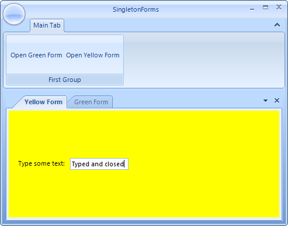

# Docking Singleton Forms
 
A typical scenario for an application showing many forms is to allow the end-users to get each type of form displayed only once. In addition, if the end-user tries to close a form it should become hidden instead of really closed and disposed, because this allows the developer to easily save the state (entered data) of the 'closed' forms. In this article we are going to demonstrate how you can implement that type of behavior with forms and __RadDock__.
        

>note The forms used in this article are standard forms that do not follow the real singleton pattern. The word 'singleton' in the approach is used only to describe the behavior of the form from the end-user's point of view.
>
 
## Docking 'Singleton' forms in RadDock

Let's assume that we have a __RadRibbonForm__ with two buttons each of which opens a specific type of form that lies in RadDock. Let's call these forms `YellowForm` and `GreenForm`. If a form of particular type is already opened, clicking the button that has opened it will not open any new forms of the same type. If the end-user closes the form after filling-in some data, clicking the 'show' button for this form will open the form with the data filled-in.



Here is how to do that:

1\. For each of the types of forms that we create, we should create a corresponding DocumentWindow/ToolWindow that serves as a container. Initially, global variables for the DocumentWindows/ToolWindows should be defined without creating new objects. 

{{source=..\SamplesCS\Dock\SingletonForms.cs region=fields}} 
{{source=..\SamplesVB\Dock\SingletonForms.vb region=fields}} 

````C#
DocumentWindow greenDockWindow;
DocumentWindow yellowDockWindow;

````
````VB.NET
Private greenDockWindow As DocumentWindow
Private yellowDockWindow As DocumentWindow

````

{{endregion}} 
 

2\. Upon clicking a button for opening a specific type of form, we should check if an object of the appropriate DocumentWindow exists. If it does not exist, this means that a form of the type that matches the DocumentWindow has never been created, so we need to create such a form together with the DocumentWindow. Note that we set the __CloseAction__ of the DocumentWindow to  *Hide*. When the end-user closes the DocumentWindow, it actually becomes hidden rather than closed and disposed. This allows us to use the same instance later. After creating the form and the window, we should dock the form in the window - this will allow us to control the form together with the DocumentWindow that hosts it using the globally defined DocumentWindow variables. Finally, we should just show the DocumentWindow. If the DocumentWindow has already been created the previous time we pressed the 'show' button, we should just show it: 

{{source=..\SamplesCS\Dock\SingletonForms.cs region=clickHandlers}} 
{{source=..\SamplesVB\Dock\SingletonForms.vb region=clickHandlers}} 

````C#
private void btnOpenGreenForm_Click(object sender, EventArgs e)
{
    if (greenDockWindow == null)
    {
        greenDockWindow = new DocumentWindow();
        greenDockWindow.Text = "Green Form";
        greenDockWindow.CloseAction = DockWindowCloseAction.Hide;
        GreenForm gForm = new GreenForm();
        gForm.FormBorderStyle = System.Windows.Forms.FormBorderStyle.None;
        gForm.TopLevel = false;
        gForm.Dock = DockStyle.Fill;
        greenDockWindow.Controls.Add(gForm);
        this.radDock1.AddDocument(greenDockWindow);
        gForm.Show();
    }
    else
    {
        greenDockWindow.Show();
    }
    this.radDock1.ActiveWindow = greenDockWindow;
}
private void btnOpenYellowForm_Click(object sender, EventArgs e)
{
    if (yellowDockWindow == null)
    {
        yellowDockWindow = new DocumentWindow();
        yellowDockWindow.Text = "Yellow Form";
        yellowDockWindow.CloseAction = DockWindowCloseAction.Hide;
        YellowForm yForm = new YellowForm();
        yForm.FormBorderStyle = System.Windows.Forms.FormBorderStyle.None;
        yForm.TopLevel = false;
        yForm.Dock = DockStyle.Fill;
        yellowDockWindow.Controls.Add(yForm);
        this.radDock1.AddDocument(yellowDockWindow);
        yForm.Show();
    }
    else
    {
        yellowDockWindow.Show();
    }
    this.radDock1.ActiveWindow = yellowDockWindow;
}

````
````VB.NET
Private Sub btnOpenGreenForm_Click(ByVal sender As Object, ByVal e As EventArgs)
    If greenDockWindow Is Nothing Then
        greenDockWindow = New DocumentWindow()
        greenDockWindow.Text = "Green Form"
        greenDockWindow.CloseAction = DockWindowCloseAction.Hide
        Dim gForm As New GreenForm()
        gForm.FormBorderStyle = System.Windows.Forms.FormBorderStyle.None
        gForm.TopLevel = False
        gForm.Dock = DockStyle.Fill
        greenDockWindow.Controls.Add(gForm)
        Me.RadDock1.AddDocument(greenDockWindow)
        gForm.Show()
    Else
        greenDockWindow.Show()
    End If
    Me.RadDock1.ActiveWindow = greenDockWindow
End Sub
Private Sub btnOpenYellowForm_Click(ByVal sender As Object, ByVal e As EventArgs)
    If yellowDockWindow Is Nothing Then
        yellowDockWindow = New DocumentWindow()
        yellowDockWindow.Text = "Yellow Form"
        yellowDockWindow.CloseAction = DockWindowCloseAction.Hide
        Dim yForm As New YellowForm()
        yForm.FormBorderStyle = System.Windows.Forms.FormBorderStyle.None
        yForm.TopLevel = False
        yForm.Dock = DockStyle.Fill
        yellowDockWindow.Controls.Add(yForm)
        Me.RadDock1.AddDocument(yellowDockWindow)
        yForm.Show()
    Else
        yellowDockWindow.Show()
    End If
    Me.RadDock1.ActiveWindow = yellowDockWindow
End Sub

````

{{endregion}} 


