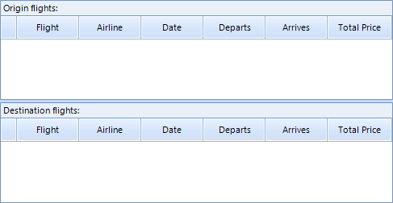
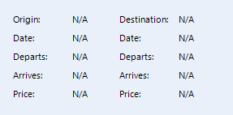
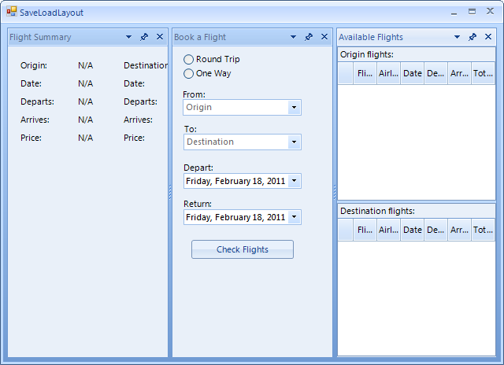
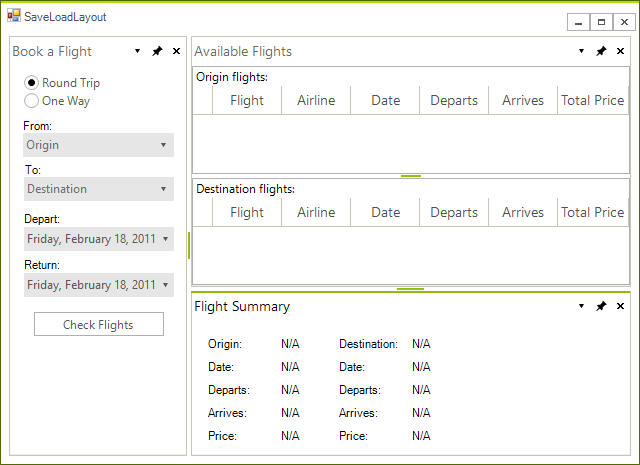
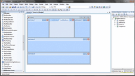

# Tutorial: Saving and Loading Layout and Content

 
As stated in [this documentation article]() RadDock can save and then load the layout of its DockWindows. However, this mechanism does not save the content of these windows. The purpose of this article is to demonstrate what approach you should follow when you want to restore not only the layout of the DockWindows, but their content as well.
      

## Example: Saving and Loading layout and content

1\. Usually, each DockWindow contains a set of controls. To make the task of saving and loading the content easier, let's put this content in UserControls, for example:






*Three UserControls containing different controls.*

2\. Then, let's define the path to the xml file where we will save our layout: 

{{source=..\SamplesCS\Dock\SaveLoadLayout.cs region=paths}} 
{{source=..\SamplesVB\Dock\SaveLoadLayout.vb region=paths}} 

````C#
private string dockLayoutPath = Application.StartupPath + "\\dock.xml";

````
````VB.NET
Private dockLayoutPath As String = Application.StartupPath & "\dock.xml"

````

{{endregion}} 
 
3\. At the Load event of our form we will check if the xml file with the saved layout exists. If the file exists at the specified location, we will load the layout as shown in the next paragraphs. If it does not exists, we will create a generic layout in RadDock loading our user controls: 

{{source=..\SamplesCS\Dock\SaveLoadLayout.cs region=formLoad}} 
{{source=..\SamplesVB\Dock\SaveLoadLayout.vb region=formLoad}} 

````C#
private void MainForm_Load(object sender, EventArgs e)
{
    if (!File.Exists(dockLayoutPath))
    {
        InitializeLayout();
    }
    else
    {
        this.radDock1.LoadFromXml(dockLayoutPath);
        LoadContent();
    }
}
private void InitializeLayout()
{
    this.radDock1.MainDocumentContainerVisible = false;
    HostWindow afW = this.radDock1.DockControl(new AvailableFlights(), DockPosition.Left);
    afW.Text = "Available Flights";
    HostWindow bfW = this.radDock1.DockControl(new BookFlight(), DockPosition.Left);
    bfW.Text = "Book a Flight";
    HostWindow fsW = this.radDock1.DockControl(new FlightsSummary(), DockPosition.Left);
    fsW.Text = "Flight Summary";
}

````
````VB.NET
Private Sub MainForm_Load(ByVal sender As Object, ByVal e As EventArgs)
    If Not File.Exists(dockLayoutPath) Then
        InitializeLayout()
    Else
        Me.RadDock1.LoadFromXml(dockLayoutPath)
        LoadContent()
    End If
End Sub
Private Sub InitializeLayout()
    Me.RadDock1.MainDocumentContainerVisible = False
    Dim afW As HostWindow = Me.RadDock1.DockControl(New AvailableFlights(), DockPosition.Left)
    afW.Text = "Available Flights"
    Dim bfW As HostWindow = Me.RadDock1.DockControl(New BookFlight(), DockPosition.Left)
    bfW.Text = "Book a Flight"
    Dim fsW As HostWindow = Me.RadDock1.DockControl(New FlightsSummary(), DockPosition.Left)
    fsW.Text = "Flight Summary"
End Sub

````

{{endregion}} 

Please note that the names of the types of the UserControls are important, because these names will actually give the names of the HostWindows that will be created to host the UserControls. The names of the HostWindows will be later used during the process of loading the content.



4\. Let's now arrange the dock window in a more user friendly way:



5\. Now close the form containing RadDock. The FormClosing event handler is a convenient place to save our layout: 

{{source=..\SamplesCS\Dock\SaveLoadLayout.cs region=formClosing}} 
{{source=..\SamplesVB\Dock\SaveLoadLayout.vb region=formClosing}} 

````C#
private void MainForm_FormClosing(object sender, FormClosingEventArgs e)
{
    this.radDock1.SaveToXml(dockLayoutPath);
}

````
````VB.NET
Private Sub MainForm_FormClosing(ByVal sender As Object, ByVal e As FormClosingEventArgs)
    Me.RadDock1.SaveToXml(dockLayoutPath)
End Sub

````

{{endregion}} 
 
6\. Reopen the form. Since the xml file defined at paragraph two now exists, our layout and content will be loaded with the help of the following methods:
            

* LoadFromXml - this method will create HostWindows and will arrange them according to the information saved in the xml file.
                

* LoadContent - this is our custom method which loads the content in the created HostWindows. Note that the different user controls are loaded in the appropriate HostWindows depending on the names of these windows. 

{{source=..\SamplesCS\Dock\SaveLoadLayout.cs region=loadContent}} 
{{source=..\SamplesVB\Dock\SaveLoadLayout.vb region=loadContent}} 

````C#
private void LoadContent()
{
    for (int i = 0; i < this.radDock1.DockWindows.Count; i++)
    {
        HostWindow hw = this.radDock1.DockWindows[i] as HostWindow;
        if (hw != null)
        {
            if (hw.Name.StartsWith("Available"))
            {
                hw.LoadContent(new AvailableFlights());
                hw.Text = "Available Flights";
            }
            if (hw.Name.StartsWith("Book"))
            {
                hw.LoadContent(new BookFlight());
                hw.Text = "Book a Flight";
            }
            if (hw.Name.StartsWith("Flight"))
            {
                hw.LoadContent(new FlightsSummary());
                hw.Text = "Flight Summary";
            }
        }
    }
}

````
````VB.NET
Private Sub LoadContent()
    For i As Integer = 0 To Me.RadDock1.DockWindows.Count - 1
        Dim hw As HostWindow = TryCast(Me.RadDock1.DockWindows(i), HostWindow)
        If hw IsNot Nothing Then
            If hw.Name.StartsWith("Available") Then
                hw.LoadContent(New AvailableFlights())
                hw.Text = "Available Flights"
            End If
            If hw.Name.StartsWith("Book") Then
                hw.LoadContent(New BookFlight())
                hw.Text = "Book a Flight"
            End If
            If hw.Name.StartsWith("Flight") Then
                hw.LoadContent(New FlightsSummary())
                hw.Text = "Flight Summary"
            End If
        End If
    Next i
End Sub

````

{{endregion}} 
 
As a result we get the layout shown on the screenshot below:


| RELATED VIDEOS |  |
| ------ | ------ |
|[Saving and Loading RadDock for WinForms Layouts](http://www.telerik.com/videos/winforms/saving-and-loading-raddock-for-winforms-layouts) In this video, you will learn how to use the simple XML serialization features of RadDock for WinForms to easily save and load RadDock layouts. (Runtime: 07:03)||
