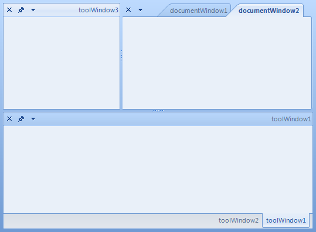

# Right-to-left support
 
You can present the content of your dock instance in a right-to-left direction by setting the __RightToLeft__ property to *Yes*: 

{{source=..\SamplesCS\Dock\CustomDockProvider.cs region=rtl}} 
{{source=..\SamplesVB\Dock\CustomDockProvider.vb region=rtl}} 

````C#
radDock1.RightToLeft = System.Windows.Forms.RightToLeft.Yes;

````
````VB.NET
Me.radDock1.RightToLeft = System.Windows.Forms.RightToLeft.Yes

````

{{endregion}} 




# See Also

* [winforms/dock/localization/localization]()