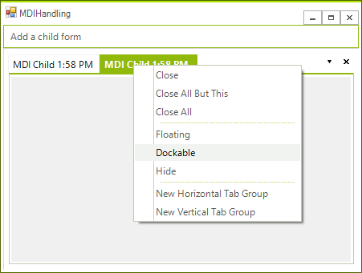

# Automatic MDI Form Handling

RadDock has the capability of automatically finding and attaching Multiple Document Interface (MDI) child forms as tabbed documents. Since RadDock takes control over the MDI children, these children are not added to the parent form's MdiChildren collection, but they are added to the RadDock.MdiChildren collection instead.

To configure your MDI application to use this feature:

1. First designate which form that will act as MDI container.  Set the parent form __IsMdiContainer__ property to true. This can be done at design time or in code (see code example below).
          

1. Drop a __RadDock__ onto the parent form and set the __AutoDetectMdiChildForms__ property to true. You may also want to set the __RadDock.Dock__ property to __Fill__ to get the best use of space on the form.
          

#### __[C#] Configuring the Parent Form__

{{source=..\SamplesCS\Dock\MDIHandling1.cs region=initialization}}
	        private void Form1_Load(object sender, EventArgs e)
	        {
	            this.IsMdiContainer = true;
	            this.radDock1.AutoDetectMdiChildren = true;
	        }
	{{endregion}}

#### __[VB.NET] Configuring the Parent Form__

{{source=..\SamplesVB\Dock\MDIHandling1.vb region=initialization}}
	    Private Sub Form1_Load(ByVal sender As System.Object, ByVal e As System.EventArgs) Handles MyBase.Load
	        Me.IsMdiContainer = True
	        Me.RadDock1.AutoDetectMdiChildren = True
	    End Sub
	{{endregion}}

1. Add a form to the project that will serve the role of child form. No properties, methods or event handlers need to be set for this form, except that you may want to add some content that will be visible when the child forms are displayed as tabbed documents.

1. Add code to the parent form to create the child form and assign it an MDI parent:

#### __[C#]__

{{source=..\SamplesCS\Dock\MDIHandling1.cs region=creatingChildForm}}
	        private void radMenuItem1_Click(object sender, EventArgs e)
	        {
	            Form childForm = new Form();
	            childForm.Text = "MDI Child " + DateTime.Now.ToShortTimeString();
	            childForm.MdiParent = this;
	            childForm.Show();
	        }
	{{endregion}}

#### __[VB.NET]__

{{source=..\SamplesVB\Dock\MDIHandling1.vb region=creatingChildForm}}
	    Private Sub RadMenuItem1_Click(ByVal sender As System.Object, ByVal e As System.EventArgs) Handles RadMenuItem1.Click
	        Dim childForm As New Form()
	        childForm.Text = "MDI Child " & DateTime.Now.ToShortTimeString()
	        childForm.MdiParent = Me
	        childForm.Show()
	    End Sub
	{{endregion}}

## MdiChildrenDockType

This property allows you to determine the default type of the DockWindows that will be created for the MDI children forms. By default these DockWindows are DocumentWindows. 

However, you can set the default type to ToolWindow:

#### __[C#] Setting the default DockWindow type for MDI children forms__

{{source=..\SamplesCS\Dock\MDIHandling1.cs region=mdiChildrenDockType}}
	            this.radDock1.MdiChildrenDockType = DockType.ToolWindow;
	{{endregion}}

#### __[VB.NET] Setting the default DockWindow type for MDI children forms__

{{source=..\SamplesVB\Dock\MDIHandling1.vb region=mdiChildrenDockType}}
	        Me.RadDock1.MdiChildrenDockType = DockType.ToolWindow
	{{endregion}}

When initially created, these ToolWindows look like DocumentWindows. This is just because their state is Tabbed Document. However, their real identity is ToolWindow - i.e. these windows can be docked, auto-hidden and floated. 

## Closing a window containing an MDI child form

When closing a DockWindow that has been automatically created to host an MDI form, we should be aware
        of the exact order the closing events are fired in. Note that in addition to the closing events of the
        DockWindow we are also getting the closing events of the hosted form fired and the order is:
      

* __FormClosing__ of the hosted MDI child form
            

* __FormClosed__ of the hosted MDI child form
            

* __DockWindowClosing__ of the DockWindow that hosts the MDI child form
            

* __DockWindowClosed__ of the DockWindow that hosts the MDI child form
            

This chain of events allows you to encapsulate all your business logic in the respective forms. For example,
        you may have to show a message box asking the user to confirm the closing operation and the best place for this will
        be the FormClosing event of the form. If the FormClosing event is canceled, none of the windows (the DockWindow and the 
        child MDI form) will be closed.      
        

## Cancel the main form closing

The __CloseAllWindows__ returns bool value which indicates if the operation is successful (it will return true if all child windows are closed).
        This is allowing you to keep the main form opened if some of the MDI children cannot be closed for the moment. You can use the method as follows:      
        

#### __[C#]__

{{source=..\SamplesCS\Dock\MDIHandling1.cs region=closing}}
	        protected override void OnClosing(CancelEventArgs e)
	        {
	            bool canClose = radDock1.CloseAllWindows();
	            e.Cancel = !canClose;
	
	            base.OnClosing(e);
	
	        }
	{{endregion}}

#### __[VB.NET]__

{{source=..\SamplesVB\Dock\MDIHandling1.vb region=closing}}
	    Protected Overrides Sub OnClosing(ByVal e As CancelEventArgs)
	        Dim canClose As Boolean = RadDock1.CloseAllWindows()
	        e.Cancel = Not canClose
	
	        MyBase.OnClosing(e)
	
	    End Sub
	    '#End Region
	End Class

## Using Singleton forms in MDI scenario with RadDock

A popular scenario for many applications is the use of singleton forms, where the end-user
		can show one type of form once only and where closing the form would mean just hiding it which saves its 
		state for further showing and manipulation.
		
		This scenario is popular in context of MDI as well. However, the architecture and chain of events in RadDock
		do not allow such a feature in the MDI case. Therefore, if you have such a requirement for your application,
		you need to remove the MDI functionality from it and use the standard approach of docking of controls/forms.
		
		One of the benefits that come with this approach concerns the overhead of the MDI approach. 
		On one hand, you have the .NET MdiClient created and attached to the main 
		form and on the other hand, you have our RadDock that snoops on the notifications from the MDI Client. 
		If it captures new Forms added, it internally creates HostWindows, adds the Forms to the HostWindows, 
		and adds HostWindows to the MainDocumentContainer.
		
		For more information about the non-MDI approach, please refer to 
		  [this article]()
