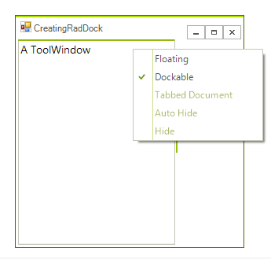

# AllowedDockStates
 
__AllowedDockState__ property gives you the ability to determine the available dock states per ToolWindow. There are several options for this properties which can be combined by bitwise operations, for example:

#### Setting AllowedDockState property 
{{source=..\SamplesCS\Dock\CreatingRadDock.cs region=allowedDockState}} 
{{source=..\SamplesVB\Dock\CreatingRadDock.vb region=allowedDockState}} 

````C#
toolWindow1.AllowedDockState = AllowedDockState.Docked | AllowedDockState.Floating;

````
````VB.NET
toolWindow1.AllowedDockState = AllowedDockState.Docked Or AllowedDockState.Floating

````

{{endregion}} 
 
This automatically will remove the caption buttons that may be responsible for an unwanted state, for example closed. In addition, the unwanted menu items from the context menu will be disabled:



The following setting will disable the Floating option:

#### Setting the AllowedDockState property 

{{source=..\SamplesCS\Dock\CreatingRadDock.cs region=notFloating}} 
{{source=..\SamplesVB\Dock\CreatingRadDock.vb region=notFloating}} 

````C#
toolWindow1.AllowedDockState = ~AllowedDockState.Floating;

````
````VB.NET
toolWindow1.AllowedDockState = Not AllowedDockState.Floating

````

{{endregion}} 


