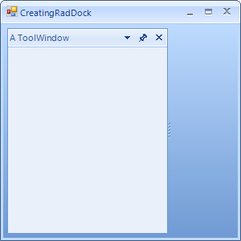

# Creating a RadDock at Runtime

## 

To create a __RadDock__in code, construct a __RadDock__, set properties and add to the controls collection of the form. The example below creates a __RadDock__, adds it to the form and docks a single __ToolWindow__to it. See [DockWindows]() for more information on instantiating __DockWindow__ at runtime.

#### __[C#] Creating a simple RadDock instance__

{{source=..\SamplesCS\Dock\CreatingRadDock.cs region=creatingDock}}
	            RadDock radDock1 = new RadDock();
	            radDock1.Dock = DockStyle.Fill;
	            this.Controls.Add(radDock1);
	            ToolWindow toolWindow1 = new ToolWindow();
	            toolWindow1.Text = "A ToolWindow";
	            radDock1.DockWindow(toolWindow1, DockPosition.Left);
	{{endregion}}

#### __[VB.NET] Creating a simple RadDock instance__

{{source=..\SamplesVB\Dock\CreatingRadDock.vb region=creatingDock}}
	        Dim radDock1 As RadDock = New RadDock()
	        radDock1.Dock = DockStyle.Fill
	        Me.Controls.Add(radDock1)
	        Dim toolWindow1 As ToolWindow = New ToolWindow()
	        toolWindow1.Text = "A ToolWindow"
	        radDock1.DockWindow(toolWindow1, DockPosition.Left)
	{{endregion}}

