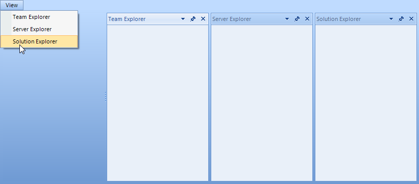

# Creating ToolWindow and DocumentWindow at Runtime
 
## Creating ToolWindow at Runtime

To create a new __ToolWindow__, construct a __ToolWindow__ instance, set properties and call the __DockWindow()__ method, passing a reference to the __ToolWindow__ and a __DockPosition__ enumeration value.

#### Creating a ToolWindow 

{{source=..\SamplesCS\Dock\CreatingWindows.cs region=creatingToolWindow}} 
{{source=..\SamplesVB\Dock\CreatingWindows.vb region=creatingToolWindow}} 

````C#
ToolWindow windowTop = new ToolWindow();
windowTop.Text = "Window Top";
this.radDock1.DockWindow(windowTop, DockPosition.Top);

````
````VB.NET
   
Dim windowTop As ToolWindow = New ToolWindow()
windowTop.Text = "Window Top"
Me.RadDock1.DockWindow(windowTop, DockPosition.Top)

````

{{endregion}} 
 
## Creating DocumentWindow at Runtime

To create a __DocumentWindow__, construct an instance of __DocumentWindow__, assign properties and call the __AddDocument__ method, passing the __DocumentWindow__ instance.

#### Creating a DocumentWindow 

{{source=..\SamplesCS\Dock\CreatingWindows.cs region=creatingDocumentWindow}} 
{{source=..\SamplesVB\Dock\CreatingWindows.vb region=creatingDocumentWindow}} 

````C#
DocumentWindow documentTop = new DocumentWindow();
documentTop.Text = "New Document";
this.radDock1.AddDocument(documentTop);

````
````VB.NET
Dim documentTop As DocumentWindow = New DocumentWindow()
documentTop.Text = "New Document"
Me.RadDock1.AddDocument(documentTop)

````

{{endregion}} 

 
## Example: Creating Multiple ToolWindow and DocumentWindow at Runtime

The following example creates multiple panels and document panes at runtime.


#### Creating ToolWindows and DocumentWindows 

{{source=..\SamplesCS\Dock\CreatingWindows.cs region=winInitialization}} 
{{source=..\SamplesVB\Dock\CreatingWindows.vb region=winInitialization}} 

````C#
ToolWindow windowLeft = new ToolWindow();
windowLeft.Text = "Window Left";
this.radDock1.DockWindow(windowLeft, DockPosition.Left);
ToolWindow windowBottom = new ToolWindow();
windowBottom.Text = "Window Bottom";
this.radDock1.DockWindow(windowBottom, DockPosition.Bottom);
ToolWindow windowBottomRight = new ToolWindow();
windowBottomRight.Text = "Window Bottom Right";
this.radDock1.DockWindow(windowBottomRight, windowBottom, DockPosition.Right);
DocumentWindow document1 = new DocumentWindow();
document1.Text = "Document 1";
this.radDock1.AddDocument(document1);
DocumentWindow document2 = new DocumentWindow();
document2.Text = "Document 2";
this.radDock1.AddDocument(document2);
DocumentWindow document3 = new DocumentWindow();
document3.Text = "Document 3";
this.radDock1.AddDocument(document3);

````
````VB.NET
Dim windowLeft As ToolWindow = New ToolWindow()
windowLeft.Text = "Window Left"
Me.RadDock1.DockWindow(windowLeft, DockPosition.Top)
Dim windowBottom As ToolWindow = New ToolWindow()
windowBottom.Text = "Window Bottom"
Me.RadDock1.DockWindow(windowBottom, DockPosition.Bottom)
Dim windowBottomRight As ToolWindow = New ToolWindow()
windowBottomRight.Text = "Window Bottom Right"
Me.RadDock1.DockWindow(windowBottomRight, windowBottom, DockPosition.Right)
Dim document1 As DocumentWindow = New DocumentWindow()
document1.Text = "Document 1"
Me.RadDock1.AddDocument(document1)
Dim document2 As DocumentWindow = New DocumentWindow()
document2.Text = "Document 2"
Me.RadDock1.AddDocument(document2)
Dim document3 As DocumentWindow = New DocumentWindow()
document3.Text = "Document 3"
Me.RadDock1.AddDocument(document3)

````

{{endregion}}  

## Creating and docking multiple windows in a single strip

There are cases in which you might prefer docking two or more windows to the right edge of __RadDock__ only, so that these right-edged windows are tabbed in a single container. For example, let’s say that we have `Team Explorer`, `Solution Explorer` and `Server Explorer` windows and they are all initially closed. We also have a menu that allows us to open these windows, and after clicking all the corresponding menu items we want to get this picture:


The bellow code shows how you can create each one of the windows:

{{source=..\SamplesCS\Dock\How-To\DockingWindowsToRight.cs region=wrongApproach}} 
{{source=..\SamplesVB\Dock\How-To\DockingWindowsToRight.vb region=wrongApproach}} 

````C#
private void menuItemTeamExplorer_Click1(object sender, EventArgs e)
{
    TeamExplorerUserControl teuc = new TeamExplorerUserControl();
    DockPosition dockTo = DockPosition.Right;
    HostWindow hw = this.radDock1.DockControl(teuc, dockTo);
    hw.Text = "Team Explorer";
}
private void menuItemServerExplorer_Click1(object sender, EventArgs e)
{
    ServerExplorerUserControl seuc = new ServerExplorerUserControl();
    DockPosition dockTo = DockPosition.Right;
    HostWindow hw = this.radDock1.DockControl(seuc, dockTo);
    hw.Text = "Server Explorer";
}
private void menuItemSolutionExplorer_Click1(object sender, EventArgs e)
{
    SolutionExplorerUserControl seuc = new SolutionExplorerUserControl();
    DockPosition dockTo = DockPosition.Right;
    HostWindow hw = this.radDock1.DockControl(seuc, dockTo);
    hw.Text = "Solution Explorer";
}

````
````VB.NET
Private Sub menuItemTeamExplorer_Click1(ByVal sender As Object, ByVal e As EventArgs)
    Dim teuc As New TeamExplorerUserControl()
    Dim dockTo As DockPosition = DockPosition.Right
    Dim hw As HostWindow = Me.RadDock1.DockControl(teuc, dockTo)
    hw.Text = "Team Explorer"
End Sub
Private Sub menuItemServerExplorer_Click1(ByVal sender As Object, ByVal e As EventArgs)
    Dim seuc As New ServerExplorerUserControl()
    Dim dockTo As DockPosition = DockPosition.Right
    Dim hw As HostWindow = Me.RadDock1.DockControl(seuc, dockTo)
    hw.Text = "Server Explorer"
End Sub
Private Sub menuItemSolutionExplorer_Click1(ByVal sender As Object, ByVal e As EventArgs)
    Dim seuc As New SolutionExplorerUserControl()
    Dim dockTo As DockPosition = DockPosition.Right
    Dim hw As HostWindow = Me.RadDock1.DockControl(seuc, dockTo)
    hw.Text = "Solution Explorer"
End Sub

````

{{endregion}}  
However, this API docks the windows to right of RadDock, not taking into consideration other right-docked windows:



So, we need to follow another approach. What we need to do is to globally define a `ToolTabStrip` variable that would be set the first time a window is right-docked. Then, the next time we dock a window, we will do it in the context of the already created ToolTabStrip. Here is what should be done in code on click of the menu items:


{{source=..\SamplesCS\Dock\How-To\DockingWindowsToRight.cs region=menuItemsClick}} 
{{source=..\SamplesVB\Dock\How-To\DockingWindowsToRight.vb region=menuItemsClick}} 

````C#
ToolTabStrip rightHandStrip = null;
private void menuItemTeamExplorer_Click(object sender, EventArgs e)
{
    TeamExplorerUserControl teuc = new TeamExplorerUserControl();
    ToolWindow teucW = new ToolWindow();
    teucW.Controls.Add(teuc);
    teucW.Text = "Team Explorer";
    if (rightHandStrip == null)
    {
        this.radDock1.DockWindow(teucW, DockPosition.Right);
        rightHandStrip = (ToolTabStrip)teucW.Parent;
    }
    else
    {
        this.radDock1.DockWindow(teucW, rightHandStrip, DockPosition.Fill);
    }
}
private void menuItemServerExplorer_Click(object sender, EventArgs e)
{
    ServerExplorerUserControl seuc = new ServerExplorerUserControl();
    ToolWindow seucW = new ToolWindow();
    seucW.Controls.Add(seuc);
    seucW.Text = "Server Explorer";
    if (rightHandStrip == null)
    {
        this.radDock1.DockWindow(seucW, DockPosition.Right);
        rightHandStrip = (ToolTabStrip)seucW.Parent;
    }
    else
    {
        this.radDock1.DockWindow(seucW, rightHandStrip, DockPosition.Fill);
    }
}
private void menuItemSolutionExplorer_Click(object sender, EventArgs e)
{
    SolutionExplorerUserControl seuc = new SolutionExplorerUserControl();
    ToolWindow seucW = new ToolWindow();
    seucW.Controls.Add(seuc);
    seucW.Text = "Solution Explorer";
    if (rightHandStrip == null)
    {
        this.radDock1.DockWindow(seucW, DockPosition.Right);
        rightHandStrip = (ToolTabStrip)seucW.Parent;
    }
    else
    {
        this.radDock1.DockWindow(seucW, rightHandStrip, DockPosition.Fill);
    }
}

````
````VB.NET
Private rightHandStrip As ToolTabStrip = Nothing
Private Sub menuItemTeamExplorer_Click(ByVal sender As Object, ByVal e As EventArgs)
    Dim teuc As New TeamExplorerUserControl()
    Dim teucW As New ToolWindow()
    teucW.Controls.Add(teuc)
    teucW.Text = "Team Explorer"
    If rightHandStrip Is Nothing Then
        Me.RadDock1.DockWindow(teucW, DockPosition.Right)
        rightHandStrip = CType(teucW.Parent, ToolTabStrip)
    Else
        Me.RadDock1.DockWindow(teucW, rightHandStrip, DockPosition.Fill)
    End If
End Sub
Private Sub menuItemServerExplorer_Click(ByVal sender As Object, ByVal e As EventArgs)
    Dim seuc As New ServerExplorerUserControl()
    Dim seucW As New ToolWindow()
    seucW.Controls.Add(seuc)
    seucW.Text = "Server Explorer"
    If rightHandStrip Is Nothing Then
        Me.RadDock1.DockWindow(seucW, DockPosition.Right)
        rightHandStrip = CType(seucW.Parent, ToolTabStrip)
    Else
        Me.RadDock1.DockWindow(seucW, rightHandStrip, DockPosition.Fill)
    End If
End Sub
Private Sub menuItemSolutionExplorer_Click(ByVal sender As Object, ByVal e As EventArgs)
    Dim seuc As New SolutionExplorerUserControl()
    Dim seucW As New ToolWindow()
    seucW.Controls.Add(seuc)
    seucW.Text = "Solution Explorer"
    If rightHandStrip Is Nothing Then
        Me.RadDock1.DockWindow(seucW, DockPosition.Right)
        rightHandStrip = CType(seucW.Parent, ToolTabStrip)
    Else
        Me.RadDock1.DockWindow(seucW, rightHandStrip, DockPosition.Fill)
    End If
End Sub

````

{{endregion}} 

# See Also

* [AllowedDockStates]()
* [Creating a RadDock at Runtime]()
* [Accessing DockWindows]()
* [Customizing Floating Windows]()
* [Customizing TabStrip Items]()
* [Building an Advanced Layout at Runtime]()
* [RadDock Properties and Methods]()
* [Removing ToolWindow and DocumentWindow at Runtime]()
* [Tabs and Captions]()
* [ToolWindow and DocumentWindow Properties and Methods]()
* [Tracking the ActiveWindow]()
