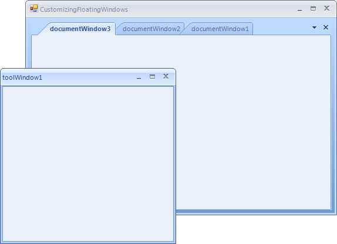
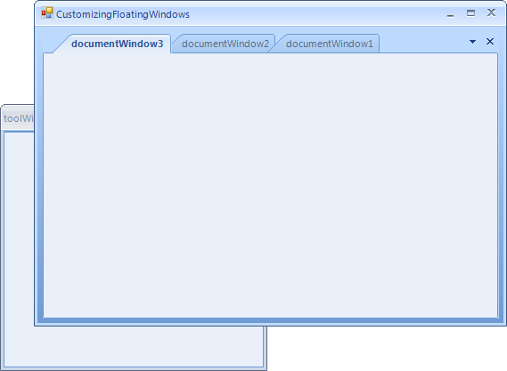

# Customizing Floating Windows

FloatingWindows provide a useful way of reordering pieces of content on your screen.
      By default, FloatingWindows only appear with their close button enabled, and
      on top of the RadDock that manages them. The following paragraphs demonstrate
      how this behavior can be changed. In all cases you need to handle the
      __FloatingWindowCreated__
      event which is fired after the end-user starts dragging a ToolWindow to float it.
      At this point the FloatingWindow is created and it is just about to be shown. This
      is the moment when you can plug in and modify the window your way.
      

## 
        Enabling Minimize and Maximize buttons
      

In order to enable the Maximize and Minimize buttons for a FloatingWindow,
          you have to handle the FloatingWindowCreated event and set the MinimizeBox, MaximizeBox
          and FormBorderStyle properties of the FloatingWindow the following way:
        

#### __[C#]__

{{source=..\SamplesCS\Dock\CustomizingFloatingWindows.cs region=buttons}}
	        void radDock1_FloatingWindowCreated1(object sender, Telerik.WinControls.UI.Docking.FloatingWindowEventArgs e)
	        {
	            e.Window.MaximizeBox = true;
	            e.Window.MinimizeBox = true;
	            e.Window.FormBorderStyle = System.Windows.Forms.FormBorderStyle.Sizable;
	        }
	{{endregion}}

#### __[VB.NET]__

{{source=..\SamplesVB\Dock\CustomizingFloatingWindows.vb region=buttons}}
	    Private Sub radDock1_FloatingWindowCreated1(ByVal sender As Object, ByVal e As Telerik.WinControls.UI.Docking.FloatingWindowEventArgs)
	        e.Window.MaximizeBox = True
	        e.Window.MinimizeBox = True
	        e.Window.FormBorderStyle = System.Windows.Forms.FormBorderStyle.Sizable
	    End Sub
	    '#End Region
	
	    '#Region "showBehind"
	    Private Sub radDock1_FloatingWindowCreated2(ByVal sender As Object, ByVal e As Telerik.WinControls.UI.Docking.FloatingWindowEventArgs)
	        Dim customWindow As New CustomFloatingWindow(Me.RadDock1)
	        e.Window = customWindow
	    End Sub
	    '#End Region
	
	    '#Region "themeName"
	    Private Sub radDock1_FloatingWindowCreated3(ByVal sender As Object, ByVal e As Telerik.WinControls.UI.Docking.FloatingWindowEventArgs)
	        e.Window.ThemeName = "TelerikMetroBlue"
	    End Sub
	    '#End Region
	End Class

The result is:
        

## 
        Allowing the FloatingWindow to be under the main form
      

Sometimes, you may want to prevent the FloatingWindow from being always on top
          of the form that contains the RadDock manager. In order to do that, you need to
          extend the FloatingWindow class and use an instance of the extended type.
     
          In the extended FloatingWindow type, we need to override the OnActivated method, and after
          the base implementation takes place, we should remove the window from the collection
          of owned forms that the main form has:
        

#### __[C#]__

{{source=..\SamplesCS\Dock\CustomFloatingWindow.cs region=customFloatingWindow}}
	    public class CustomFloatingWindow : FloatingWindow
	    {
	        public CustomFloatingWindow(RadDock dockManager)
	            : base(dockManager)
	        {
	        }
	
	        protected override void OnActivated(EventArgs e)
	        {
	            base.OnActivated(e);
	
	            Form dockForm = this.DockManager.FindForm();
	            if (dockForm != null)
	            {
	                dockForm.RemoveOwnedForm(this);
	            }
	        }
	    }
	{{endregion}}

#### __[VB.NET]__

{{source=..\SamplesVB\Dock\CustomFloatingWindow.vb region=customFloatingWindow}}
	Public Class CustomFloatingWindow
	    Inherits FloatingWindow
	    Public Sub New(ByVal dockManager As RadDock)
	        MyBase.New(dockManager)
	    End Sub
	
	    Protected Overrides Sub OnActivated(ByVal e As EventArgs)
	        MyBase.OnActivated(e)
	
	        Dim dockForm As Form = Me.DockManager.FindForm()
	        If dockForm IsNot Nothing Then
	            dockForm.RemoveOwnedForm(Me)
	        End If
	    End Sub
	End Class
	{{endregion}}

Finally, we have to pass an instance of the custom FloatingWindow to the event arguments
          of the FloatingWindowCreated event:
        

#### __[C#]__

{{source=..\SamplesCS\Dock\CustomizingFloatingWindows.cs region=showBehind}}
	        void radDock1_FloatingWindowCreated2(object sender, Telerik.WinControls.UI.Docking.FloatingWindowEventArgs e)
	        {
	            CustomFloatingWindow customWindow = new CustomFloatingWindow(this.radDock1);
	            e.Window = customWindow;
	        }
	{{endregion}}

#### __[VB.NET]__

{{source=..\SamplesVB\Dock\CustomizingFloatingWindows.vb region=showBehind}}
	    Private Sub radDock1_FloatingWindowCreated2(ByVal sender As Object, ByVal e As Telerik.WinControls.UI.Docking.FloatingWindowEventArgs)
	        Dim customWindow As New CustomFloatingWindow(Me.RadDock1)
	        e.Window = customWindow
	    End Sub
	    '#End Region
	
	    '#Region "themeName"
	    Private Sub radDock1_FloatingWindowCreated3(ByVal sender As Object, ByVal e As Telerik.WinControls.UI.Docking.FloatingWindowEventArgs)
	        e.Window.ThemeName = "TelerikMetroBlue"
	    End Sub
	    '#End Region
	End Class

Here is the result. As you can see, the form that contains the RadDock manager can
          cover the FloatingWindow:
          

## 
        Setting the theme of a FloatingWindow
      

FloatingWindow is a descendant class of RadForm. As such, FloatingWindow has the
          ThemeName property that you can set in the FloatingWindowCreated event in order to change
          its theme:
       

#### __[C#]__

{{source=..\SamplesCS\Dock\CustomizingFloatingWindows.cs region=themeName}}
	        void radDock1_FloatingWindowCreated3(object sender, Telerik.WinControls.UI.Docking.FloatingWindowEventArgs e)
	        {
	            e.Window.ThemeName = "TelerikMetroBlue";
	        }
	{{endregion}}

#### __[VB.NET]__

{{source=..\SamplesVB\Dock\CustomizingFloatingWindows.vb region=themeName}}
	    Private Sub radDock1_FloatingWindowCreated3(ByVal sender As Object, ByVal e As Telerik.WinControls.UI.Docking.FloatingWindowEventArgs)
	        e.Window.ThemeName = "TelerikMetroBlue"
	    End Sub
	    '#End Region
	End Class

