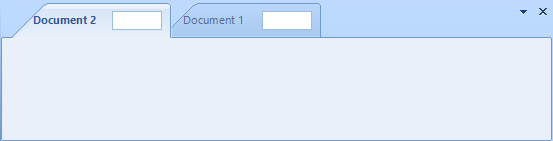
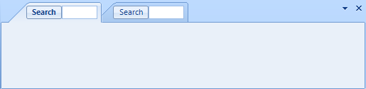
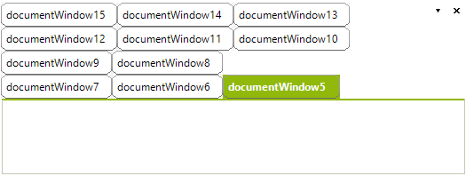

# Customizing TabStrip Items
 
This article demonstrates how you can customize or replace the TabStrip items.

##  Using the TabStripItemCreating event
      

The above examples are using the __TabStripItemCreating__ event. This event cannot be accessed via the RadDock instance. You can subscribe to the event by using the static __RadDockEvents__ class. You should do that before the `InitializeComponent` method call: 

{{source=..\SamplesCS\Dock\CustomizingTabStripItems.cs region=subscribe}} 
{{source=..\SamplesVB\Dock\CustomizingTabStripItems.vb region=subscribe}} 

````C#
public CustomizingTabStripItems()
{
    RadDockEvents.TabStripItemCreating += RadDockEvents_TabStripItemCreating;
    InitializeComponent();
}

````
````VB.NET
Public Sub New()
    AddHandler RadDockEvents.TabStripItemCreating, AddressOf RadDockEvents_TabStripItemCreating
    InitializeComponent()
End Sub

````

{{endregion}} 

 
Please note that when such static events are used it is mandatory to unsubscribe from the event. If you do not do that the form would not be disposed properly: 

{{source=..\SamplesCS\Dock\CustomizingTabStripItems.cs region=closed}} 
{{source=..\SamplesVB\Dock\CustomizingTabStripItems.vb region=closed}} 

````C#
protected override void OnClosed(EventArgs e)
{
    RadDockEvents.TabStripItemCreating -= RadDockEvents_TabStripItemCreating;
    base.OnClosed(e);
}

````
````VB.NET
Protected Overrides Sub OnClosed(ByVal e As EventArgs)
    RemoveHandler RadDockEvents.TabStripItemCreating, AddressOf RadDockEvents_TabStripItemCreating
    MyBase.OnClosed(e)
End Sub

````

{{endregion}} 

 
## Adding element to the TabStrip item

The `TabStripItemCreating` event can be used for adding any kind of RadElements to the TabStrip. For example the following code adds text box to each TabStrip item: 

{{source=..\SamplesCS\Dock\CustomizingTabStripItems.cs region=element}} 
{{source=..\SamplesVB\Dock\CustomizingTabStripItems.vb region=element}} 

````C#
void RadDockEvents_TabStripItemCreating1(object sender, TabStripItemCreatingEventArgs args)
{
    RadTextBoxControlElement textbox = new RadTextBoxControlElement();
    textbox.Margin = new System.Windows.Forms.Padding(80, 5, 5, 5);
    textbox.MinSize = new System.Drawing.Size(50, 0);
    args.TabItem.Children.Add(textbox);
}

````
````VB.NET
Private Sub RadDockEvents_TabStripItemCreating1(ByVal sender As Object, ByVal args As TabStripItemCreatingEventArgs)
    Dim textbox As New RadTextBoxControlElement()
    textbox.Margin = New System.Windows.Forms.Padding(80, 5, 5, 5)
    textbox.MinSize = New System.Drawing.Size(50, 0)
    args.TabItem.Children.Add(textbox)
End Sub

````

{{endregion}} 
 
The tabs will look like this:



## Replacing the entire TabStrip element.

The TabStripItemCreating event can be used for replacing the entire element as well. First you need to create a TabStripItem class descendant 

{{source=..\SamplesCS\Dock\CustomizingTabStripItems.cs region=Item}} 
{{source=..\SamplesVB\Dock\CustomizingTabStripItems.vb region=Item}} 

````C#
class MyTabStripItem : TabStripItem
{
    public MyTabStripItem(TabPanel panel)
        : base(panel)
    { }
    protected override void CreateChildElements()
    {
        base.CreateChildElements();
        this.Children.Add(CreateCustomElement());
    }
    RadElement CreateCustomElement()
    {
        StackLayoutElement element = new StackLayoutElement();
        element.Orientation = Orientation.Horizontal;
        element.StretchHorizontally = true;
        element.MinSize = new System.Drawing.Size(100, 0);
        RadButtonElement button = new RadButtonElement();
        button.Text = "Search";
        element.Children.Add(button);
        RadTextBoxControlElement textbox = new RadTextBoxControlElement();
        element.Children.Add(textbox);
        element.Margin = new Padding(5, 2, 2, 2);
        this.DrawText = false;
        this.Padding = new Padding(40, 5, 40, 5);
        return element;
    }
    protected override Type ThemeEffectiveType
    {
        get
        {
            return typeof(TabStripItem);
        }
    }
}

````
````VB.NET
Friend Class MyTabStripItem
    Inherits TabStripItem
    Public Sub New(ByVal panel As TabPanel)
        MyBase.New(panel)
    End Sub
    Protected Overrides Sub CreateChildElements()
        MyBase.CreateChildElements()
        Me.Children.Add(CreateCustomElement())
    End Sub
    Private Function CreateCustomElement() As RadElement
        Dim element As New StackLayoutElement()
        element.Orientation = Orientation.Horizontal
        element.StretchHorizontally = True
        element.MinSize = New System.Drawing.Size(100, 0)
        Dim button As New RadButtonElement()
        button.Text = "Search"
        element.Children.Add(button)
        Dim textbox As New RadTextBoxControlElement()
        element.Children.Add(textbox)
        element.Margin = New Padding(5, 2, 2, 2)
        Me.DrawText = False
        Me.Padding = New Padding(40, 5, 40, 5)
        Return element
    End Function
    Protected Overrides ReadOnly Property ThemeEffectiveType() As Type
        Get
            Return GetType(TabStripItem)
        End Get
    End Property
End Class

````

{{endregion}} 
 

Then you can just replace the default item: 

{{source=..\SamplesCS\Dock\CustomizingTabStripItems.cs region=replace}} 
{{source=..\SamplesVB\Dock\CustomizingTabStripItems.vb region=replace}} 

````C#
void RadDockEvents_TabStripItemCreating(object sender, TabStripItemCreatingEventArgs args)
{
    args.TabItem = new MyTabStripItem(args.TabItem.TabPanel);
}

````
````VB.NET
Private Sub RadDockEvents_TabStripItemCreating(ByVal sender As Object, ByVal args As TabStripItemCreatingEventArgs)
    args.TabItem = New MyTabStripItem(args.TabItem.TabPanel)
End Sub

````

{{endregion}} 
 

The tabs will look like in the following image:


## DocumentTabStrip Multi Line Row Layout with a Custom Tab Shape
      

The tab items of the __DocumentWindows__ in __RadDock__ have a predefined shape applied (*TabVsShape*). The following example will demonstrate how the default layout can be modified so the tabs are displayed in a multi row layout and how a custom shape can be applied to the tab items. For the purpose we have to subscribe to the static __TabStripItemCreating__ event (where we will change the __Shape__ property) and access the __DocumentTabStrip__ in order to set the desired __StripViewItemFitMode__.
        

>note Since the __TabStripItemCreating__ event is static the event subscription have to be defined before the call to the InitializeComponent method.
> 

{{source=..\SamplesCS\Dock\CustomizingTabStripItems.cs region=MultiLineRowLayoutInit}} 
{{source=..\SamplesVB\Dock\CustomizingTabStripItems.vb region=MultiLineRowLayoutInit}} 

````C#
public void CustomizingTabStripItemsForm()
{
    RadDockEvents.TabStripItemCreating += RadDockEvents_TabStripItemCreating;
    InitializeComponent();
    DocumentContainer container = this.documentContainer1;
    DocumentTabStrip tabStrip = container.Controls[0] as DocumentTabStrip;
    if (tabStrip != null)
    {
        tabStrip.TabStripElement.ItemFitMode = StripViewItemFitMode.MultiLine;
    }
}
void RadDockEvents_TabStripItemCreating(object sender, TabStripItemCreatingEventArgs args)
{
    args.TabItem.Shape = new ChamferedRectShape();
    args.TabItem.Padding = new System.Windows.Forms.Padding(4, 4, 7, 4);
}

````
````VB.NET
Public Sub New()
    AddHandler RadDockEvents.TabStripItemCreating, AddressOf RadDockEvents_TabStripItemCreating
    InitializeComponent()
    Dim container As DocumentContainer = Me.documentContainer1
    Dim tabStrip As DocumentTabStrip = TryCast(container.Controls(0), DocumentTabStrip)
    If tabStrip IsNot Nothing Then
        tabStrip.TabStripElement.ItemFitMode = StripViewItemFitMode.MultiLine
    End If
End Sub
Private Sub RadDockEvents_TabStripItemCreating(ByVal sender As Object, ByVal args As TabStripItemCreatingEventArgs)
    args.TabItem.Shape = New ChamferedRectShape()
    args.TabItem.Padding = New System.Windows.Forms.Padding(4, 4, 7, 4)
End Sub

````

{{endregion}}  

>note Because we are subscribing to a static event, we need to take care of the unscibription as well. Otherwise the form would not be disposed properly.
> 

{{source=..\SamplesCS\Dock\CustomizingTabStripItems.cs region=closed}} 
{{source=..\SamplesVB\Dock\CustomizingTabStripItems.vb region=closed}} 

````C#
protected override void OnClosed(EventArgs e)
{
    RadDockEvents.TabStripItemCreating -= RadDockEvents_TabStripItemCreating;
    base.OnClosed(e);
}

````
````VB.NET
Protected Overrides Sub OnClosed(ByVal e As EventArgs)
    RemoveHandler RadDockEvents.TabStripItemCreating, AddressOf RadDockEvents_TabStripItemCreating
    MyBase.OnClosed(e)
End Sub

````

{{endregion}}  

Here is the outcome of the code above:


