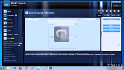
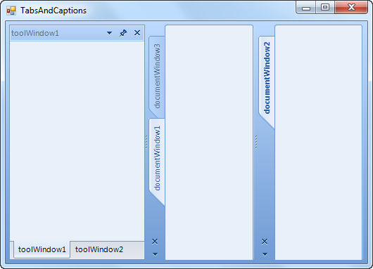
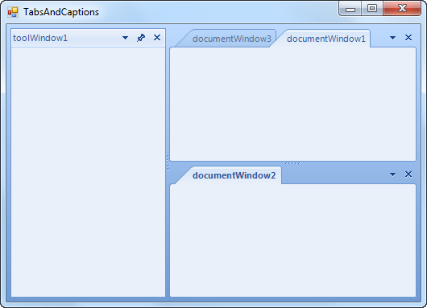
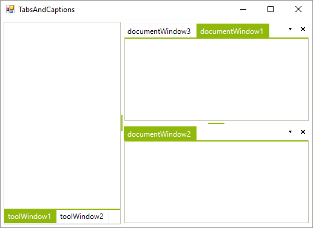
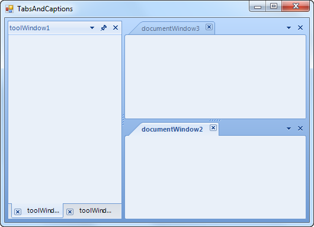

# Tabs and Captions

<table><th><tr><td>

RELATED VIDEOS</td><td></td></tr></th><tr><td>

[RadDock Tab Alignment/Visibility and Automation](http://tv.telerik.com/watch/winforms/raddock/raddock-tab-alignmentvisibility-automation)

In this video, you will learn about some of the new features provided in the Q3 2009 release of the RadDock.
              These features include tab alignment and visibility as well as drag and drop automation.
            </td><td></td></tr></table>

## 

RadDock exposes several properties which allow you to have full control over the visibility and the position of tabs/captions:

* __DocumentTabAlignment__ - This property defines the position of the tabs for all DocumentTabStrip instances in RadDock:
            

#### __[C#] Setting DocumentTabsAlignment to Left__

{{source=..\SamplesCS\Dock\TabsAndCaptions.cs region=documentTabsAlignment}}
	            this.radDock1.DocumentTabsAlignment = TabStripAlignment.Left;
	{{endregion}}

#### __[VB.NET] Setting DocumentTabsAlignment to Left__

{{source=..\SamplesVB\Dock\TabsAndCaptions.vb region=documentTabsAlignment}}
	        Me.RadDock1.DocumentTabsAlignment = TabStripAlignment.Left
	{{endregion}}

* __DocumentTabsVisible__ - This property allows the user to hide/show all document tabs:
            

#### __[C#] Hiding the document tabs__

{{source=..\SamplesCS\Dock\TabsAndCaptions.cs region=documentTabsVisible}}
	            this.radDock1.DocumentTabsVisible = false;
	{{endregion}}

#### __[VB.NET] Hiding the document tabs__

{{source=..\SamplesVB\Dock\TabsAndCaptions.vb region=documentTabsVisible}}
	        Me.RadDock1.DocumentTabsVisible = False
	{{endregion}}

* __ToolTabAlignment__ - This property defines the position of the tabs for all ToolTabStrip instances in RadDock:
            

#### __[C#] Setting the ToolTabsAlignment to Right__

{{source=..\SamplesCS\Dock\TabsAndCaptions.cs region=toolTabsAlignment}}
	            this.radDock1.ToolTabsAlignment = TabStripAlignment.Right;
	{{endregion}}

#### __[VB.NET] Setting the ToolTabsAlignment to Right__

{{source=..\SamplesVB\Dock\TabsAndCaptions.vb region=toolTabsAlignment}}
	        Me.RadDock1.ToolTabsAlignment = TabStripAlignment.Right
	{{endregion}}

* __ToolTabsVisible__ - This property allow the user to hide/show all tool tabs:

#### __[C#] Hiding the tool tabs__

{{source=..\SamplesCS\Dock\TabsAndCaptions.cs region=toolTabsVisible}}
	            this.radDock1.ToolTabsVisible = false;
	{{endregion}}

#### __[VB.NET] Hiding the tool tabs__

{{source=..\SamplesVB\Dock\TabsAndCaptions.vb region=toolTabsVisible}}
	        Me.RadDock1.ToolTabsVisible = False
	{{endregion}}

* __CaptionVisible__ - This property allows the user to hide the caption of a single ToolTabStrip:
            

#### __[C#] Hiding the caption of ToolTabStrip__

{{source=..\SamplesCS\Dock\TabsAndCaptions.cs region=captionVisible}}
	            this.toolTabStrip1.CaptionVisible = false;
	{{endregion}}

#### __[VB.NET] Hiding the caption of ToolTabStrip__

{{source=..\SamplesVB\Dock\TabsAndCaptions.vb region=captionVisible}}
	        Me.ToolTabStrip1.CaptionVisible = False
	{{endregion}}

* __ShowToolCloseButton and ShowDocumentCloseButton__ - ShowToolCloseButton/ShowDocumentCloseButton display close buttons in the ToolWindow/DocumentWindow tabs:
            

#### __[C#] Showing close buttons__

{{source=..\SamplesCS\Dock\TabsAndCaptions.cs region=showToolCloseButton}}
	            this.radDock1.ShowToolCloseButton = true;
	            this.radDock1.ShowDocumentCloseButton = true;
	{{endregion}}

#### __[VB.NET] Showing close buttons__

{{source=..\SamplesVB\Dock\TabsAndCaptions.vb region=showToolCloseButton}}
	        Me.RadDock1.ShowToolCloseButton = True
	        Me.RadDock1.ShowDocumentCloseButton = True
	{{endregion}}

