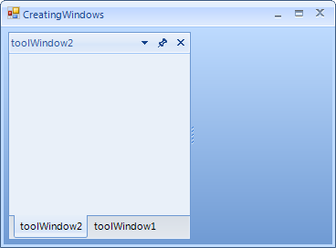

# ToolWindow and DocumentWindow Properties and Methods
 
## Properties

__ToolWindow__ and __DocumentWindow__ both implement the same interfaces, such as __IDockWindow__ and have a common set of properties even though their runtime behavior differs.

* __AllowedDockState:__ Specifies the allowed dock states for a __DockWindow__.
            

* __DockState:__ Specifies the current state of the __DockWindow__. You can set __DockState__ to __Docked__, __Floating__, __AutoHide__, __Hidden__, __TabbedDocument__.
            

* __DockType:__ This read-only property contains one of the __Telerik.WinControls.Dock.DockType__ enumeration members __ToolWindow__ (for ToolWindow) or __Document__ (for DocumentWindow).
            

* __Name:__ This property uniquely identifies each dock panel or tabbed document. Use this property when saving and restoring content. See [Loading and Saving Layouts]() for more information.
            

* __Image:__ Used to assign an image that displays in the tab for the __ToolWindow__ or __DocumentWindow__. 
 

* __Text:__ Specifies the text to display in the caption bar at the top of the __ToolWindow__ and on the tab at the bottom of the __ToolWindow__.
            

## Methods

* __Close:__ Closes a ToolWindow or a DocumentWindow. The ToolWindow/DocumentWindow can be just hidden or directly disposed. This depends on its default behavior and the __CloseAction__ property. For additional information refer to [Removing ToolWindow and DocumentWindow at Runtime]().

* __Show:__ Shows a hidden ToolWindow or DocumentWindow.

* __DockTo(DockWindow window, DockPosition dockPosition):__ Docks a window with another window in the same container. The example below docks "Bottom Window" to the container of "Top Window".

    

#### Using DockTo() 

{{source=..\SamplesCS\Dock\CreatingWindows.cs region=usingDockTo}} 
{{source=..\SamplesVB\Dock\CreatingWindows.vb region=usingDockTo}} 

````C#
toolWindow2.DockTo(toolWindow1, DockPosition.Fill);

````
````VB.NET
toolWindow2.DockTo(ToolWindow1, DockPosition.Fill)

````

{{endregion}} 


