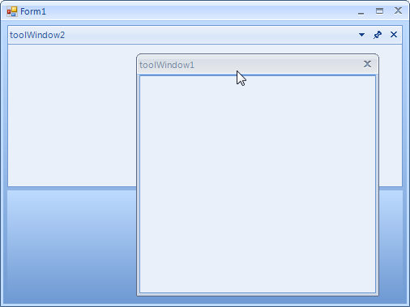

# Tracking the ActiveWindow

In certain scenarios you may need to track the moment the ActiveWindow of RadDock is being changed. For this purpose
        RadDock exposes two events:
      

* __ActiveWindowChanging__

* __ActiveWindowChanged__

## ActiveWindowChanging

__AcitveWindowChanging__ is fired when the active window is about to be changed, but it is still not changed.
          This allows you to cancel the active window changing operation. Depending on the scenario, you may need
          to understand which the currently active window is and which is the window that is about to become active.
          For this purpose, the event arguments of ActiveWindowChanging expose two useful properties:
        

* __NewWindow__: returns the dock window that is about to become active.
            

* __OldWindow__: returns the currently active window.
            

In the picture below the currently active window is toolWindow2. Activating toolWindow1 will cause ActiveWindowChanging to fire,
          and we can expect NewWindow to return toolWindow1 and OldWindow to return toolWindow2.
        

## ActiveWindowChanged

__AcitveWindowChanged__ is fired after the active window is changed. Its arguments provide one property:
        

* __DockWindow__: returns the activated window.
            

Considering the same scenario, where the currently active window is toolWindow2, activating the toolWindow1 will first fire
          ActiveWindowChanging and if it is not canceled, ActiveWindowChanged will be fired. There, the DockWindow property
          from the event arguments will return toolWindow1. In this case, you may also use RadDock.ActiveWindow that will also
          return toolWindow1.
        
