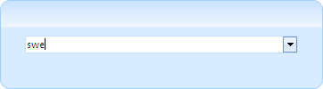
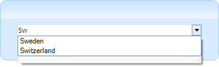
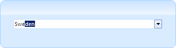
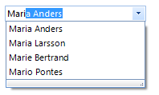

# Auto-complete
 
__RadDropDownList__ provides flexible auto-completion options that suggest and  append text from choices in the list as the user types. 
      

## AutoCompleteMode

The RadDropDownList.__AutoCompleteMode__ property controls auto-complete behavior and can be set to *None, Suggest,Append* and *SuggestAppend*:
         

>note All auto-complete modes depend on the value of the boolean __CaseSensitive__ property.
>


* __None__: Nothing happens when a user begins to type into the text box portion of the control. If the user types the whole text of an item and presses Enter, the item is selected. 



#### AutoCompleteMode.None 
 
{{source=..\SamplesCS\DropDownListControl\DropDownList\DropDownList1.cs region=autoCNone}} 
{{source=..\SamplesVB\DropDownListControl\DropDownList\DropDownList1.vb region=autoCNone}} 

````C#
            
this.radDropDownList1.AutoCompleteMode = AutoCompleteMode.None;

````
````VB.NET
Me.radDropDownList1.AutoCompleteMode = AutoCompleteMode.None

````

{{endregion}} 
 
* __Suggest__: As the user types an entry into the text box, the drop-down portion of the control is shown, and the displayed items are filtered according to the entered text



#### AutoCompleteMode.Suggest 

{{source=..\SamplesCS\DropDownListControl\DropDownList\DropDownList1.cs region=autoCSuggest}} 
{{source=..\SamplesVB\DropDownListControl\DropDownList\DropDownList1.vb region=autoCSuggest}} 

````C#
            
this.radDropDownList1.AutoCompleteMode = AutoCompleteMode.Suggest;

````
````VB.NET
Me.radDropDownList1.AutoCompleteMode = AutoCompleteMode.Suggest

````

{{endregion}} 
 

* __Append__: As the user types, the next item in the list that matches the user input is automatically appended to the characters the user has already typed. The drop-down list is not shown without the user clicking the arrow.



#### AutoCompleteMode.Append 

{{source=..\SamplesCS\DropDownListControl\DropDownList\DropDownList1.cs region=autoCAppend}} 
{{source=..\SamplesVB\DropDownListControl\DropDownList\DropDownList1.vb region=autoCAppend}} 

````C#
            
this.radDropDownList1.AutoCompleteMode = AutoCompleteMode.Append;

````
````VB.NET
Me.radDropDownList1.AutoCompleteMode = AutoCompleteMode.Append

````

{{endregion}} 
 
* __SuggestAppend__: Similar to the Append setting, but the drop-down list is shown and the suggested item is highlighted.



#### AutoCompleteMode.SuggestAppend 

{{source=..\SamplesCS\DropDownListControl\DropDownList\DropDownList1.cs region=autoCSuggestAppend}} 
{{source=..\SamplesVB\DropDownListControl\DropDownList\DropDownList1.vb region=autoCSuggestAppend}} 

````C#
            
this.radDropDownList1.AutoCompleteMode = AutoCompleteMode.SuggestAppend;

````
````VB.NET
Me.radDropDownList1.AutoCompleteMode = AutoCompleteMode.SuggestAppend

````

{{endregion}} 
 
## Auto-complete helpers

\* __AutoCompleteSuggestHelper__: it is created when the __AutoCompleteMode__ property is set to AutoCompleteMode.*Suggest* or AutoCompleteMode.*SuggestAppend*. You can find below the __AutoCompleteSuggestHelper__'s properties:
            

* __SuggestMode__: determines whether the items are auto-completed considering whether the text starts with or contains the searched text.
                
>caption Fig.5 SuggestMode.Contains


#### SuggestMode.Contains 

{{source=..\SamplesCS\DropDownListControl\DropDownList\DropDownList1.cs region=autoCsuggestMode}} 
{{source=..\SamplesVB\DropDownListControl\DropDownList\DropDownList1.vb region=autoCsuggestMode}} 

````C#
this.radDropDownList1.DropDownListElement.AutoCompleteSuggest.SuggestMode = Telerik.WinControls.UI.SuggestMode.Contains;

````
````VB.NET
Me.radDropDownList1.DropDownListElement.AutoCompleteSuggest.SuggestMode = Telerik.WinControls.UI.SuggestMode.Contains

````

{{endregion}} 
 

* __AutoCompleteDataSource__: specifies the data structure to be bound.
                

* __AutoCompleteDisplayMember__: specifies the particular field in the data source which will be used from the items in __AutoCompleteSuggestHelper__  for their Text.
                

\* __AutoCompleteAppendHelper__:  it is created when the __AutoCompleteMode__ property is set to AutoCompleteMode.*Append* or AutoCompleteMode.*SuggestAppend*. The __LimitToList__ property controls whether the user is blocked to enter invalid string in the editable part.

#### Limit the user to enter only valid values 

{{source=..\SamplesCS\DropDownListControl\DropDownList\DropDownList1.cs region=autoClimitToList}} 
{{source=..\SamplesVB\DropDownListControl\DropDownList\DropDownList1.vb region=autoClimitToList}} 

````C#
this.radDropDownList1.DropDownListElement.AutoCompleteAppend.LimitToList = true;

````
````VB.NET
Me.radDropDownList1.DropDownListElement.AutoCompleteAppend.LimitToList = True

````

{{endregion}} 
 
## Customize auto-complete helpers

By default, the items displayed in the __AutoCompleteSuggestHelper__’s pop-up are sorted alphabetically. The following example demonstrates how to manipulate the sort order considering the item’s Text.__Length__ property:

>caption Fig.6 Custom comparer


#### Custom comparer 

{{source=..\SamplesCS\DropDownListControl\DropDownList\DropDownList1.cs region=CustomComparer}} 
{{source=..\SamplesVB\DropDownListControl\DropDownList\DropDownList1.vb region=CustomComparer}} 

````C#
    
public void ApplyComparer()
{ 
    this.radDropDownList1.AutoCompleteMode = AutoCompleteMode.Suggest;        
    this.radDropDownList1.DropDownListElement.AutoCompleteSuggest = new CustomAutoCompleteSuggestHelper(this.radDropDownList1.DropDownListElement);
    this.radDropDownList1.DropDownListElement.AutoCompleteSuggest.SuggestMode = SuggestMode.Contains;
}
    
public class CustomAutoCompleteSuggestHelper : AutoCompleteSuggestHelper
{
    public CustomAutoCompleteSuggestHelper(RadDropDownListElement owner) : base(owner)
    {
    }
        
    public override void ApplyFilterToDropDown(string filter)
    {
        base.ApplyFilterToDropDown(filter);
        this.DropDownList.ListElement.DataLayer.DataView.Comparer = new CustomComparer();
    }
}
    
public class CustomComparer: IComparer<RadListDataItem>
{
    public int Compare(RadListDataItem x, RadListDataItem y)
    {
        return x.Text.Length.CompareTo(y.Text.Length);
    }
}

````
````VB.NET
Public Sub ApplyComparer()
    Me.radDropDownList1.AutoCompleteMode = AutoCompleteMode.Suggest
    Me.radDropDownList1.DropDownListElement.AutoCompleteSuggest = New CustomAutoCompleteSuggestHelper(Me.radDropDownList1.DropDownListElement)
    Me.radDropDownList1.DropDownListElement.AutoCompleteSuggest.SuggestMode = SuggestMode.Contains
End Sub
Public Class CustomAutoCompleteSuggestHelper
Inherits AutoCompleteSuggestHelper
    Public Sub New(owner As RadDropDownListElement)
        MyBase.New(owner)
    End Sub
    Public Overrides Sub ApplyFilterToDropDown(filter As String)
        MyBase.ApplyFilterToDropDown(filter)
        Me.DropDownList.ListElement.DataLayer.DataView.Comparer = New CustomComparer()
    End Sub
End Class
Public Class CustomComparer
Implements IComparer(Of RadListDataItem)
    Public Function [Compare](x As RadListDataItem, y As RadListDataItem) As Integer Implements IComparer(Of RadListDataItem).[Compare]
        Return x.Text.Length.CompareTo(y.Text.Length)
    End Function
End Class

````

{{endregion}} 


