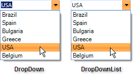

# DropDownStyle


## 

The RadDropDownList __DropDownStyle__ property determines if the text area at the top of the control can be edited. A setting of *DropDown* (the default) allows editing and the *DropDownList* setting shows the text area as read-only.

#_[C#] Setting DropDownStyle_

	


{{source=..\SamplesCS\DropDownListControl\DropDownList\DropDownList1.cs region=dropDownStyle}} 
{{source=..\SamplesVB\DropDownListControl\DropDownList\DropDownList1.vb region=dropDownStyle}} 

````C#
            
            this.radDropDownList1.DropDownStyle = Telerik.WinControls.RadDropDownStyle.DropDown;
            this.radDropDownList1.DropDownStyle = Telerik.WinControls.RadDropDownStyle.DropDownList;
````
````VB.NET
        Me.radDropDownList1.DropDownStyle = Telerik.WinControls.RadDropDownStyle.DropDown
        Me.radDropDownList1.DropDownStyle = Telerik.WinControls.RadDropDownStyle.DropDownList
        '
````

{{endregion}} 


