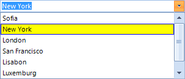
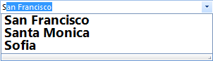

# Formatting Items


## Formatting drop down list items

Items appearance in __RadDropDownList__ can be customized by
          making use of the __VisualListItemFormatting__ event. The
          following example, demonstrates how you can change the color of an item which
          is being selected
        

>note By using this event to customize the items appearance, you should always provide an else clause,
            where you reset the appearance settings which you have introduced. This is necessary since
            RadDropDownList uses data virtualization, which might lead to unpredicted appearance results when
            items are being reused.
>
#_[C#] Customize selected item appearance_

	


{{source=..\SamplesCS\DropDownListControl\DropDownList\DropDownListCustomizeItems.cs region=CustomizeItems}} 
{{source=..\SamplesVB\DropDownListControl\DropDownList\DropDownListCustomizeItems.vb region=CustomizeItems}} 

````C#

        private void radDropDownList1_VisualListItemFormatting(object sender, VisualItemFormattingEventArgs args)
        {
            if (args.VisualItem.Selected)
            {
                args.VisualItem.NumberOfColors = 1;
                args.VisualItem.BackColor = Color.Yellow;
                args.VisualItem.BorderColor = Color.Blue;
            }
            else
            {
                args.VisualItem.ResetValue(LightVisualElement.NumberOfColorsProperty, Telerik.WinControls.ValueResetFlags.Local);
                args.VisualItem.ResetValue(LightVisualElement.BackColorProperty, Telerik.WinControls.ValueResetFlags.Local);
                args.VisualItem.ResetValue(LightVisualElement.BorderColorProperty, Telerik.WinControls.ValueResetFlags.Local);
            }
        }
````
````VB.NET
    Private Sub radDropDownList1_VisualListItemFormatting(sender As Object, args As VisualItemFormattingEventArgs)
        If args.VisualItem.Selected Then
            args.VisualItem.NumberOfColors = 1
            args.VisualItem.BackColor = Color.Yellow
            args.VisualItem.BorderColor = Color.Blue
        Else
            args.VisualItem.ResetValue(LightVisualElement.NumberOfColorsProperty, Telerik.WinControls.ValueResetFlags.Local)
            args.VisualItem.ResetValue(LightVisualElement.BackColorProperty, Telerik.WinControls.ValueResetFlags.Local)
            args.VisualItem.ResetValue(LightVisualElement.BorderColorProperty, Telerik.WinControls.ValueResetFlags.Local)
        End If
    End Sub
    '
````

{{endregion}} 


## Customizing auto-complete dropdown appearance

In order to customize the auto complete popup, you should subscribe to the __VisualItemFormatting__
          event of the __AutoCompleteSuggestHelper__. The following code snippet demonstrates
          how to change the font of the auto complete drop down items:
        #_[C#] Subscribe to the VisualItemFormatting event of the auto complete popup_

	

#_[VB.NET] Subscribe to the VisualItemFormatting event of the auto complete popup_

	


The following code snippet, will demonstrate how to change the Font of all items in the
          auto complete drop down.
        #_[C#] Customize auto complete items appearance_

	


{{source=..\SamplesCS\DropDownListControl\DropDownList\DropDownListCustomizeItems.cs region=SubscribeToAutoCompleteSuggestVisualItemFormattingEvent}} 
{{source=..\SamplesVB\DropDownListControl\DropDownList\DropDownListCustomizeItems.vb region=SubscribeToAutoCompleteSuggestVisualItemFormattingEvent}} 

{{source=..\SamplesCS\DropDownListControl\DropDownList\DropDownListCustomizeItems.cs region=CustomizeAutoCompleteDropDown}} 
{{source=..\SamplesVB\DropDownListControl\DropDownList\DropDownListCustomizeItems.vb region=CustomizeAutoCompleteDropDown}} 

````C#

        Font myFont = new Font("Segoe UI", 14, FontStyle.Bold);

        private void ListElement_VisualItemFormatting(object sender, VisualItemFormattingEventArgs args)
        {
            args.VisualItem.Font = myFont;
        }
````
````VB.NET

    Private myFont As New Font("Segoe UI", 14, FontStyle.Bold)

    Private Sub ListElement_VisualItemFormatting(sender As Object, args As VisualItemFormattingEventArgs)
        args.VisualItem.Font = myFont
    End Sub

#End Region


    '#region CustomizeItems
    Private Sub radDropDownList1_VisualListItemFormatting(sender As Object, args As VisualItemFormattingEventArgs)
        If args.VisualItem.Selected Then
            args.VisualItem.NumberOfColors = 1
            args.VisualItem.BackColor = Color.Yellow
            args.VisualItem.BorderColor = Color.Blue
        Else
            args.VisualItem.ResetValue(LightVisualElement.NumberOfColorsProperty, Telerik.WinControls.ValueResetFlags.Local)
            args.VisualItem.ResetValue(LightVisualElement.BackColorProperty, Telerik.WinControls.ValueResetFlags.Local)
            args.VisualItem.ResetValue(LightVisualElement.BorderColorProperty, Telerik.WinControls.ValueResetFlags.Local)
        End If
    End Sub
    '
````

{{endregion}} 


>note Here we do not reset the style because we do want the Font for all items to be changed not only
            on certain one.
>

