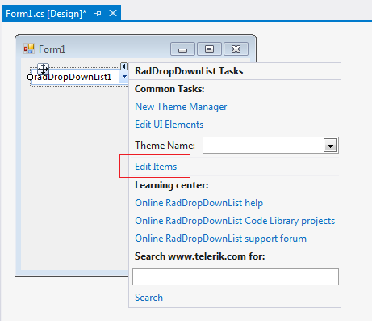
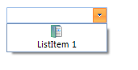
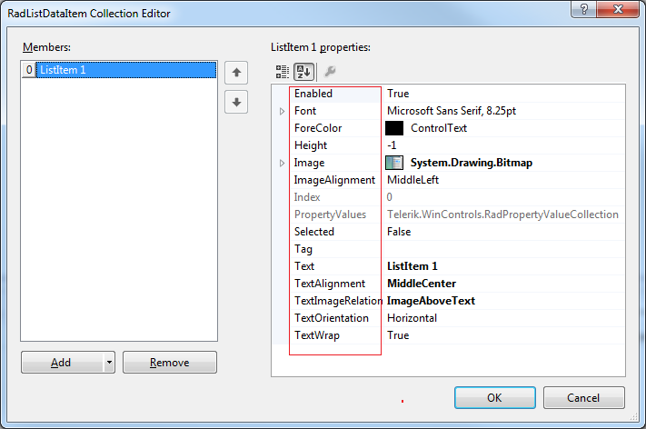
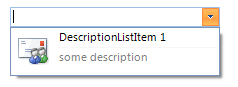

# Design time

This article demonstrates how to populate __RadDropDownList__ with data at design time.
        The *RadListDataItem Collection Editor *allows you to do that.
      

Figure 1. RadListDataItem Collection Editor

## 

You can access it through the *Smart tag >> Edit Items* option:

Figure 2. Smart tag options

Another possibility to open the editor is via the __Items__ collection in the
        *Properties* Visual Studio section:

Figure 3.  Visual Studio Properties window

You can add two item types:

* __RadListDataItem__ – it represents a logical data item which can display specific text and image. 
              You can customize its look through the Properties section on the right side of the item in the *RadListDataItem Collection Editor*.
            Figure 4.  Sample RadListDataItemBelow you can find the properties associated with the __RadListDataItem__:Figure 5.  RadListDataItem's properties

* __DescriptionTextListDataItem__ – similar to the __RadListDataItem__. In addition, 
              it displays some description below the item’s text.
            Figure 6.  Sample DescriptionTextListDataItemYou have two additional properties: __DescriptionFont__ and __DescriptionText__ which 
            specifies the font and the text associated with the item’s description.Figure 7.  DescriptionTextListDataItem's properties
