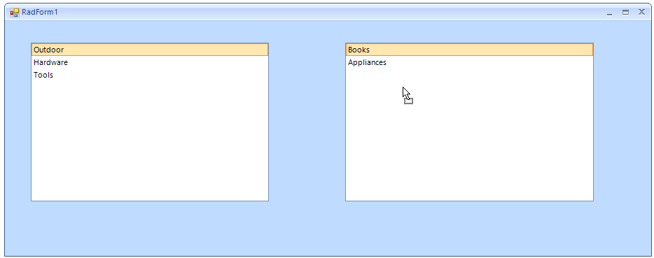

# Drag and Drop in Bound Mode


This article demonstrates how you can implement drag and drop operation between two bound __RadListControl__ controls. This example is using the [ole drag and drop](https://msdn.microsoft.com/en-us/library/96826a87.aspx)

Figure 1. The final result.



## 

The drag and drop functionality is achieved with the help of four events:

* __MouseDown, MouseMove:__ The MouseDown event is used for saving the position of the clicked element. It will be used later for getting the element under the mouse. The MouseMove event can be used to start the drag and drop operation. It is started with the __DoDragDrop__ method only if the left mouse button is used and a valid item is clicked.
            

>note The __IsRealDrag__ method returns true only if the mouse have moved certain amount of pixels (determined by the operating system).
>

#### MouseDown and MouseMove 

{{source=..\SamplesCS\DropDownListControl\ListControl\DragAndDrop.cs region=MouseDownMove}} 
{{source=..\SamplesVB\DropDownListControl\ListControl\DragAndDrop.vb region=MouseDownMove}} 

````C#
        
private Point mouseDownPosition;
    
void radListControl1_MouseDown(object sender, MouseEventArgs e)
{
    this.mouseDownPosition = e.Location;
}
    
void radListControl1_MouseMove(object sender, MouseEventArgs e)
{
    if (e.Button != MouseButtons.Left)
    {
        return;
    }
    
    RadListControl listControl = sender as RadListControl;
    RadListVisualItem draggedItem = listControl.ElementTree.GetElementAtPoint(this.mouseDownPosition) as RadListVisualItem;
    if (draggedItem != null&& IsRealDrag(mouseDownPosition, e.Location))
    {
        (sender as RadListControl).DoDragDrop(draggedItem.Data, DragDropEffects.Move);
    }
}
private static bool IsRealDrag(Point mousePosition, Point initialMousePosition)
{
    return (Math.Abs(mousePosition.X - initialMousePosition.X) >= SystemInformation.DragSize.Width) ||
        (Math.Abs(mousePosition.Y - initialMousePosition.Y) >= SystemInformation.DragSize.Height);
}

````
````VB.NET
Private mouseDownPosition As Point
Private Sub radListControl1_MouseDown(ByVal sender As Object, ByVal e As MouseEventArgs)
    Me.mouseDownPosition = e.Location
End Sub
Private Sub radListControl1_MouseMove(ByVal sender As Object, ByVal e As MouseEventArgs)
    If e.Button <> MouseButtons.Left Then
        Return
    End If
    Dim listControl As RadListControl = TryCast(sender, RadListControl)
    Dim draggedItem As RadListVisualItem = TryCast(listControl.ElementTree.GetElementAtPoint(Me.mouseDownPosition), RadListVisualItem)
    If draggedItem IsNot Nothing AndAlso IsRealDrag(mouseDownPosition, e.Location) Then
        TryCast(sender, RadListControl).DoDragDrop(draggedItem.Data, DragDropEffects.Move)
    End If
End Sub
Private Shared Function IsRealDrag(ByVal mousePosition As Point, ByVal initialMousePosition As Point) As Boolean
    Return (Math.Abs(mousePosition.X - initialMousePosition.X) >= SystemInformation.DragSize.Width) OrElse (Math.Abs(mousePosition.Y - initialMousePosition.Y) >= SystemInformation.DragSize.Height)
End Function

````

{{endregion}} 
 
* __DragEnter:__ This event will fire when the mouse is hovering over a control that allows the dropping. Here you can use it to disable the drop operation within the same control.

#### The DragEnter event handler 

{{source=..\SamplesCS\DropDownListControl\ListControl\DragAndDrop.cs region=DragEnter}} 
{{source=..\SamplesVB\DropDownListControl\ListControl\DragAndDrop.vb region=DragEnter}} 

````C#
void radListControl1_DragEnter(object sender, DragEventArgs e)
{
    RadListControl listControl = sender as RadListControl;
    RadListDataItem draggedItem = e.Data.GetData(typeof(RadListDataItem)) as RadListDataItem;
    
    if (draggedItem.OwnerControl == listControl)
    {
        e.Effect = DragDropEffects.None;
    }
    else
    {
        e.Effect = DragDropEffects.Move;
    }
}

````
````VB.NET
Private Sub radListControl1_DragEnter(ByVal sender As Object, ByVal e As DragEventArgs)
    Dim listControl As RadListControl = TryCast(sender, RadListControl)
    Dim draggedItem As RadListDataItem = TryCast(e.Data.GetData(GetType(RadListDataItem)), RadListDataItem)
    If draggedItem.OwnerControl Is listControl Then
        e.Effect = DragDropEffects.None
    Else
        e.Effect = DragDropEffects.Move
    End If
End Sub

````

{{endregion}} 
 
* __DragDrop:__ This is the most important event. In it you have access to both, the dragged element and the control where the item is dropped. This allows you to handle the drop operation appropriately according to your specific requirements. In this case the both controls are bound, and this allows you to just add/remove items from/to their data source (the changes will be immediately reflected by the controls).

#### The DragDrop event handler 

{{source=..\SamplesCS\DropDownListControl\ListControl\DragAndDrop.cs region=DragDrop}} 
{{source=..\SamplesVB\DropDownListControl\ListControl\DragAndDrop.vb region=DragDrop}} 

````C#
void radListControl2_DragDrop(object sender, DragEventArgs e)
{
    RadListControl listControl = sender as RadListControl;
    RadListDataItem draggedItem = e.Data.GetData(typeof(RadListDataItem)) as RadListDataItem;
    
    MyCustomObject dragedData = draggedItem.DataBoundItem as MyCustomObject;
    
    if (myList1.Contains(dragedData))
    {
        myList1.Remove(dragedData);
        myList.Add(dragedData);
    }
    else
    {
        myList.Remove(dragedData);
        myList1.Add(dragedData);
    }
}

````
````VB.NET
Private Sub radListControl2_DragDrop(ByVal sender As Object, ByVal e As DragEventArgs)
    Dim listControl As RadListControl = TryCast(sender, RadListControl)
    Dim draggedItem As RadListDataItem = TryCast(e.Data.GetData(GetType(RadListDataItem)), RadListDataItem)
    Dim dragedData As CustomObject = TryCast(draggedItem.DataBoundItem, CustomObject)
    If myList1.Contains(dragedData) Then
        myList1.Remove(dragedData)
        myList.Add(dragedData)
    Else
        myList.Remove(dragedData)
        myList1.Add(dragedData)
    End If
End Sub

````

{{endregion}} 
 

Additionally you should set the __AllowDrop__ property of both controls. With this example you can move from the first __RadListView__ to the second and vice versa. Along with this the following snippet shows how you can bind the controls and subscribe to the events. The same events are used for both controls. 

#### Controls initialization 

{{source=..\SamplesCS\DropDownListControl\ListControl\DragAndDrop.cs region=Initialize}} 
{{source=..\SamplesVB\DropDownListControl\ListControl\DragAndDrop.vb region=Initialize}} 

````C#
        
BindingList<MyCustomObject> myList;
BindingList<MyCustomObject> myList1;
        
public DragAndDrop()
{
    InitializeComponent();
    
    myList = new BindingList<MyCustomObject>();
    myList1 = new BindingList<MyCustomObject>();
    
    myList.Add(new MyCustomObject(1, "Outdoor"));
    myList.Add(new MyCustomObject(8, "Hardware"));
    myList.Add(new MyCustomObject(3, "Tools"));
    myList1.Add(new MyCustomObject(6, "Books"));
    myList1.Add(new MyCustomObject(2, "Appliances"));
    
    radListControl1.DataSource = myList;
    radListControl1.DisplayMember = "Category";
    radListControl1.ValueMember = "ID";
    radListControl1.AllowDrop = true;
    
    radListControl2.DataSource = myList1;
    radListControl2.DisplayMember = "Category";
    radListControl2.ValueMember = "ID";
    radListControl2.AllowDrop = true;
    
    radListControl1.MouseDown += radListControl1_MouseDown;
    radListControl1.MouseMove += radListControl1_MouseMove;
    radListControl1.DragEnter += radListControl1_DragEnter;
    radListControl1.DragDrop += radListControl2_DragDrop;
    
    radListControl2.MouseDown += radListControl1_MouseDown;
    radListControl2.MouseMove += radListControl1_MouseMove;
    radListControl2.DragEnter += radListControl1_DragEnter;
    radListControl2.DragDrop += radListControl2_DragDrop;
}

````
````VB.NET
Private myList As BindingList(Of CustomObject)
Private myList1 As BindingList(Of CustomObject)
Public Sub New()
    InitializeComponent()
    myList = New BindingList(Of CustomObject)()
    myList1 = New BindingList(Of CustomObject)()
    myList.Add(New CustomObject(1, "Outdoor"))
    myList.Add(New CustomObject(8, "Hardware"))
    myList.Add(New CustomObject(3, "Tools"))
    myList1.Add(New CustomObject(6, "Books"))
    myList1.Add(New CustomObject(2, "Appliances"))
    radListControl1.DataSource = myList
    radListControl1.DisplayMember = "Category"
    radListControl1.ValueMember = "ID"
    radListControl1.AllowDrop = True
    radListControl2.DataSource = myList1
    radListControl2.DisplayMember = "Category"
    radListControl2.ValueMember = "ID"
    radListControl2.AllowDrop = True
    AddHandler radListControl1.MouseDown, AddressOf radListControl1_MouseDown
    AddHandler radListControl1.MouseMove, AddressOf radListControl1_MouseMove
    AddHandler radListControl1.DragEnter, AddressOf radListControl1_DragEnter
    AddHandler radListControl1.DragDrop, AddressOf radListControl2_DragDrop
    AddHandler radListControl2.MouseDown, AddressOf radListControl1_MouseDown
    AddHandler radListControl2.MouseMove, AddressOf radListControl1_MouseMove
    AddHandler radListControl2.DragEnter, AddressOf radListControl1_DragEnter
    AddHandler radListControl2.DragDrop, AddressOf radListControl2_DragDrop
End Sub

````

{{endregion}} 
 

To complete the example you can use the following sample class.

#### Sample business object for the example 

{{source=..\SamplesCS\DropDownListControl\ListControl\DragAndDrop.cs region=CustomObject}} 
{{source=..\SamplesVB\DropDownListControl\ListControl\DragAndDrop.vb region=CustomObject}} 

````C#
        
public class MyCustomObject
{
    public int ID { get; set; }
    
    public string Category { get; set; }
    public MyCustomObject(int iD, string category)
    {
        this.ID = iD;
        this.Category = category;
    }
}

````
````VB.NET
Public Class CustomObject
    Public Property ID() As Integer
    Public Property Category() As String
    Public Sub New(ByVal iD As Integer, ByVal category As String)
        Me.ID = iD
        Me.Category = category
    End Sub
End Class

````

{{endregion}} 


