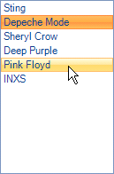

# ListControl

## 

RadListControl is the an alternative to the Microsoft ListBox control.
        

Due to the innovative and specially designed architecture of RadListControl, this control allows for superior data binding speed and a visual (GUI) representation that allows for a responsive control even when working with huge data sets.
        

The logical items that RadListControl creates internally are of type RadListDataItem. RadListDataItem is very lightweight since it has a much shorter inheritance chain. This provides the ability to create thousands of RadListDataItems in a matter of milliseconds. RadListDataItem is also a fundamental point of extensibility allowing creation of objects (inheritors of RadListDataItem) which in turn allow the user to logically represent their data as accurately as possible, for example by adding properties to the RadListDataItem inheritor that are specific to a certain type of data. Another important fact is that the logical items are no longer being displayed directly, RadListDataItem inherits only from RadObject which makes it incompatible with the RadElement tree structure that RadControl provides an entry point to. In order to visually format the data stored in a particular RadListDataItem instance  RadListControl creates a separate visual item which is of type RadListVisualItem.
        

RadListVisualItem is the class that is used to visually represent the RadListDataItems in RadListControl. There is a virtualization mechanism that creates only a few visual items, just enough to fill the area that RadListControl occupies on a form and to allow scrolling. For example if a RadListControl instance is 100 pixels tall and the list item height has been set to be 20, RadListControl will create only 5 visual items. But how can 5 items visually represent possibly thousands of logical RadListDataItems? The virtualization mechanism does this by simply mapping the visual items to the logical items taking into account the scroll bar value. For example if you scroll down by one item, all visual items will be mapped to one below the previous logical item that they were mapped to initially. In essence, the logical items shift under the visual items and the visual items update accordingly. This means that updating the UI is a constant operation and is instantaneous in the majority of use cases. RadListVisualItem is the second major point of extensibility. RadListControl allows creating custom visual items, just like the logical items, which allows the user to visually represent their custom data as close as possible.
        

The rest of the help articles in this section describe in more detail the logical items, the visual items, how to extend them and the other features that RadListControl provides out of the box.
        
