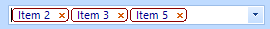
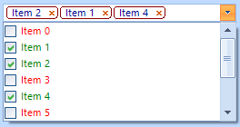

# Customization

Customizing __RadCheckedDropDownList__ is easy and can be separated in two parts:
      

## Customizing the editable area

In order to customize the editable area you must subscribe to the __TextBlockFormatting__ and modify the properties of the __TokenizedTextBlockElement__:
        

#### __[C#] Subscribe to TextBlockFormatting__

{{region TextBlockFormattingSubscribe}}
	            this.radCheckedDropDownList1.TextBlockFormatting += radCheckedDropDownList1_TextBlockFormatting;
	{{endregion}}

#### __[VB.NET] Subscribe to TextBlockFormatting__

{{region TextBlockFormattingSubscribe}}
	        AddHandler Me.RadCheckedDropDownList1.TextBlockFormatting, AddressOf radCheckedDropDownList1_TextBlockFormatting
	        '#End Region
	
	        '#Region "VisualListItemFormattingSubscribe"
	        AddHandler Me.RadCheckedDropDownList1.VisualListItemFormatting, AddressOf radCheckedDropDownList1_VisualListItemFormatting
	        '#End Region
	    End Sub
	
	    '#Region "TextBlockFormattingHandler"
	    Private Sub radCheckedDropDownList1_TextBlockFormatting(sender As Object, e As TextBlockFormattingEventArgs)
	        Dim token As TokenizedTextBlockElement = TryCast(e.TextBlock, TokenizedTextBlockElement)
	        If token IsNot Nothing Then
	            token.ForeColor = Color.DarkBlue
	            token.DrawFill = False
	            token.BorderColor = Color.DarkRed
	            token.BorderWidth = 1.3F
	        End If
	    End Sub
	    '#End Region
	
	    '#Region "VisualListItemFormattingHandler"
	    Private Sub radCheckedDropDownList1_VisualListItemFormatting(sender As Object, args As VisualItemFormattingEventArgs)
	        Dim itemChecked As Boolean = DirectCast(args.VisualItem.Data, RadCheckedListDataItem).Checked
	        If itemChecked Then
	            args.VisualItem.ForeColor = Color.Green
	        Else
	            args.VisualItem.ForeColor = Color.Red
	        End If
	    End Sub
	    '#End Region
	End Class

#### __[C#] Modify properties__

{{region TextBlockFormattingHandler}}
	        void radCheckedDropDownList1_TextBlockFormatting(object sender, TextBlockFormattingEventArgs e)
	        {
	            TokenizedTextBlockElement token = e.TextBlock as TokenizedTextBlockElement;
	            if (token != null)
	            {
	                token.ForeColor = Color.DarkBlue;
	                token.DrawFill = false;
	                token.BorderColor = Color.DarkRed;
	                token.BorderWidth = 1.3f;
	            }
	        }
	{{endregion}}

#### __[VB.NET] Modify properties__

{{region TextBlockFormattingHandler}}
	    Private Sub radCheckedDropDownList1_TextBlockFormatting(sender As Object, e As TextBlockFormattingEventArgs)
	        Dim token As TokenizedTextBlockElement = TryCast(e.TextBlock, TokenizedTextBlockElement)
	        If token IsNot Nothing Then
	            token.ForeColor = Color.DarkBlue
	            token.DrawFill = False
	            token.BorderColor = Color.DarkRed
	            token.BorderWidth = 1.3F
	        End If
	    End Sub
	    '#End Region
	
	    '#Region "VisualListItemFormattingHandler"
	    Private Sub radCheckedDropDownList1_VisualListItemFormatting(sender As Object, args As VisualItemFormattingEventArgs)
	        Dim itemChecked As Boolean = DirectCast(args.VisualItem.Data, RadCheckedListDataItem).Checked
	        If itemChecked Then
	            args.VisualItem.ForeColor = Color.Green
	        Else
	            args.VisualItem.ForeColor = Color.Red
	        End If
	    End Sub
	    '#End Region
	End Class

## Customizing the drop down items

Customizing the drop down items is similar. Subscribe to the __VisualListItemFormatting__:
        

#### __[C#] Subscribe to VisualListItemFormatting__

{{region VisualListItemFormattingSubscribe}}
	            this.radCheckedDropDownList1.VisualListItemFormatting += radCheckedDropDownList1_VisualListItemFormatting;
	{{endregion}}

#### __[VB.NET] Subscribe to VisualListItemFormatting__

{{region VisualListItemFormattingSubscribe}}
	        AddHandler Me.RadCheckedDropDownList1.VisualListItemFormatting, AddressOf radCheckedDropDownList1_VisualListItemFormatting
	        '#End Region
	    End Sub
	
	    '#Region "TextBlockFormattingHandler"
	    Private Sub radCheckedDropDownList1_TextBlockFormatting(sender As Object, e As TextBlockFormattingEventArgs)
	        Dim token As TokenizedTextBlockElement = TryCast(e.TextBlock, TokenizedTextBlockElement)
	        If token IsNot Nothing Then
	            token.ForeColor = Color.DarkBlue
	            token.DrawFill = False
	            token.BorderColor = Color.DarkRed
	            token.BorderWidth = 1.3F
	        End If
	    End Sub
	    '#End Region
	
	    '#Region "VisualListItemFormattingHandler"
	    Private Sub radCheckedDropDownList1_VisualListItemFormatting(sender As Object, args As VisualItemFormattingEventArgs)
	        Dim itemChecked As Boolean = DirectCast(args.VisualItem.Data, RadCheckedListDataItem).Checked
	        If itemChecked Then
	            args.VisualItem.ForeColor = Color.Green
	        Else
	            args.VisualItem.ForeColor = Color.Red
	        End If
	    End Sub
	    '#End Region
	End Class

#### __[C#] Modify properties__

{{region VisualListItemFormattingHandler}}
	        void radCheckedDropDownList1_VisualListItemFormatting(object sender, VisualItemFormattingEventArgs args)
	        {
	            bool itemChecked = ((RadCheckedListDataItem)args.VisualItem.Data).Checked;
	            if (itemChecked)
	            {
	                args.VisualItem.ForeColor = Color.Green;
	            }
	            else
	            {
	                args.VisualItem.ForeColor = Color.Red;
	            }
	        }
	{{endregion}}

#### __[VB.NET] Modify properties__

{{region VisualListItemFormattingHandler}}
	    Private Sub radCheckedDropDownList1_VisualListItemFormatting(sender As Object, args As VisualItemFormattingEventArgs)
	        Dim itemChecked As Boolean = DirectCast(args.VisualItem.Data, RadCheckedListDataItem).Checked
	        If itemChecked Then
	            args.VisualItem.ForeColor = Color.Green
	        Else
	            args.VisualItem.ForeColor = Color.Red
	        End If
	    End Sub
	    '#End Region
	End Class

