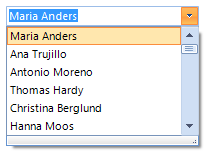
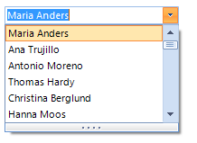
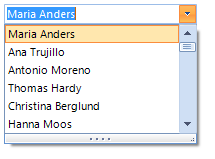
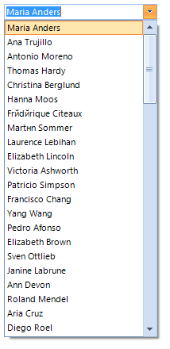
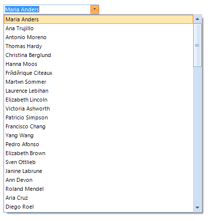
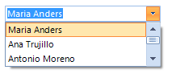

# DropDown Resizing

## DropDownSizingMode

__RadDropDownList__ supports different sizing modes, based on the __DropDownSizingMode__ property of the control.
      

The __SizingMode__ enumeration has the following members:
        

* __None__: no sizing is allowed.
            
>caption Figure 1: SizingMode.None


#### SizingMode.None 

{{source=..\SamplesCS\DropDownListControl\DropDownList\DropDownListItemSizing.cs region=None}} 
{{source=..\SamplesVB\DropDownListControl\DropDownList\DropDownListItemSizing.vb region=None}} 

````C#
this.radDropDownList1.DropDownSizingMode = SizingMode.None;

````
````VB.NET
Me.radDropDownList1.DropDownSizingMode = SizingMode.None

````

{{endregion}} 
 
* __RightBottom__: allows sizing in horizontal direction.
            
>caption Figure 2: SizingMode.RightBottom



#### SizingMode.RightBottom 

{{source=..\SamplesCS\DropDownListControl\DropDownList\DropDownListItemSizing.cs region=RightBottom}} 
{{source=..\SamplesVB\DropDownListControl\DropDownList\DropDownListItemSizing.vb region=RightBottom}} 

````C#
this.radDropDownList1.DropDownSizingMode = SizingMode.RightBottom;

````
````VB.NET
Me.radDropDownList1.DropDownSizingMode = SizingMode.RightBottom

````

{{endregion}} 
 

* __UpDown__: allows sizing in vertical direction.
            
>caption Figure 3: SizingMode.UpDown



#### SizingMode.UpDown 

{{source=..\SamplesCS\DropDownListControl\DropDownList\DropDownListItemSizing.cs region=UpDown}} 
{{source=..\SamplesVB\DropDownListControl\DropDownList\DropDownListItemSizing.vb region=UpDown}} 

````C#
this.radDropDownList1.DropDownSizingMode = SizingMode.UpDown;

````
````VB.NET
Me.radDropDownList1.DropDownSizingMode = SizingMode.UpDown

````

{{endregion}} 
 

* __UpDownAndRightBottom__: allows sizing in both directions.
            
>caption Figure 4: SizingMode.UpDownAndRightBottom



#### SizingMode.UpDownAndRightBottom 

{{source=..\SamplesCS\DropDownListControl\DropDownList\DropDownListItemSizing.cs region=UpDownAndRightBottom}} 
{{source=..\SamplesVB\DropDownListControl\DropDownList\DropDownListItemSizing.vb region=UpDownAndRightBottom}} 

````C#
this.radDropDownList1.DropDownSizingMode = SizingMode.UpDownAndRightBottom;

````
````VB.NET
Me.radDropDownList1.DropDownSizingMode = SizingMode.UpDownAndRightBottom

````

{{endregion}} 
 

## Fixed size

You can specify a fixed height or width of the drop-down by setting the __DropDownHeight__ and __DropDownWidth__ properties.
        
>caption Figure 5: DropDownHeight



#### DropDownHeight 

{{source=..\SamplesCS\DropDownListControl\DropDownList\DropDownListItemSizing.cs region=DropDownHeight}} 
{{source=..\SamplesVB\DropDownListControl\DropDownList\DropDownListItemSizing.vb region=DropDownHeight}} 

````C#
this.radDropDownList1.DropDownListElement.DropDownHeight = 400;

````
````VB.NET
Me.radDropDownList1.DropDownListElement.DropDownHeight = 400

````

{{endregion}} 
 
>caption Figure 6: DropDownWidth


#### DropDownWidth 

{{source=..\SamplesCS\DropDownListControl\DropDownList\DropDownListItemSizing.cs region=DropDownWidth}} 
{{source=..\SamplesVB\DropDownListControl\DropDownList\DropDownListItemSizing.vb region=DropDownWidth}} 

````C#
this.radDropDownList1.DropDownListElement.DropDownWidth = 400;

````
````VB.NET
Me.radDropDownList1.DropDownListElement.DropDownWidth = 400

````

{{endregion}} 
 

You can set the __DropDownMinSize__ property in order to specify the exact minimum height and width for the drop-down.
        
>caption Figure 7: DropDownMinSize



#### DropDownMinSize 

{{source=..\SamplesCS\DropDownListControl\DropDownList\DropDownListItemSizing.cs region=DropDownMinSize}} 
{{source=..\SamplesVB\DropDownListControl\DropDownList\DropDownListItemSizing.vb region=DropDownMinSize}} 

````C#
this.radDropDownList1.DropDownMinSize = new Size(400, 400);

````
````VB.NET
Me.radDropDownList1.DropDownMinSize = New Size(400, 400)

````

{{endregion}} 


## Displayed items

By default, __RadDropDownList__ displays 6 items in the pop-up. In case you need to change this number you can set the __DefaultItemsCountInDropDown__ property:
      
>caption Figure 8: DefaultItemsCountInDropDown



#### DefaultItemsCountInDropDown 

{{source=..\SamplesCS\DropDownListControl\DropDownList\DropDownListItemSizing.cs region=DefaultItemsCountInDropDown}} 
{{source=..\SamplesVB\DropDownListControl\DropDownList\DropDownListItemSizing.vb region=DefaultItemsCountInDropDown}} 

````C#
this.radDropDownList1.DropDownListElement.DefaultItemsCountInDropDown = 3;

````
````VB.NET
Me.radDropDownList1.DropDownListElement.DefaultItemsCountInDropDown = 3

````

{{endregion}} 


