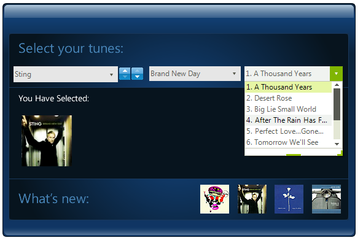

# DropDownList

__RadDropDownList__ is an enhanced alternative to the standard Windows Forms combo box control. __RadDropDownList__ can be bound to data sources. __RadDropDownList__ allows you to replace its major components giving you control over its visual and data behavior. Users can now exercise control over the scrolling logic, the items layout and even the low level data binding logic by providing their own data layer.

# See Also

* [Getting Started]()
