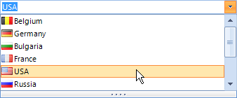
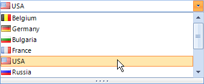
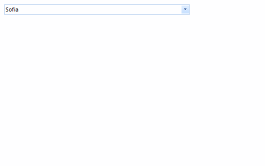

# DropDownStyle
 
## 

The __RadDropDownList.DropDownStyle__ property determines if the text area at the top of the control can be edited. A setting of *DropDown* (the default) allows editing and the *DropDownList* setting shows the text area as read-only.
         
|
>caption Fig.1 DropDown

|
>caption Fig.2 DropDownList

|

#### Setting DropDownStyle 

{{source=..\SamplesCS\DropDownListControl\DropDownList\DropDownList1.cs region=dropDownStyle}} 
{{source=..\SamplesVB\DropDownListControl\DropDownList\DropDownList1.vb region=dropDownStyle}} 

````C#
            
this.radDropDownList1.DropDownStyle = Telerik.WinControls.RadDropDownStyle.DropDown;

````
````VB.NET
Me.radDropDownList1.DropDownStyle = Telerik.WinControls.RadDropDownStyle.DropDown

````

{{endregion}}  

When __RadDropDownList__ is set to *RadDropDownStyle.DropDownList* one can control if an image will be displayed in the editor:         

#### Image in Editor 

{{source=..\SamplesCS\DropDownListControl\DropDownList\DropDownList1.cs region=ImageInEditor}} 
{{source=..\SamplesVB\DropDownListControl\DropDownList\DropDownList1.vb region=ImageInEditor}} 

````C#
this.radDropDownList1.DropDownStyle = Telerik.WinControls.RadDropDownStyle.DropDownList;
this.radDropDownList1.ShowImageInEditorArea = false;

````
````VB.NET
Me.radDropDownList1.DropDownStyle = Telerik.WinControls.RadDropDownStyle.DropDownList
Me.radDropDownList1.ShowImageInEditorArea = False

````

{{endregion}} 
 

## User Defined Values

This section describes how user defined values can be added to the data source populating the items in __RadDropDownList__. For the purpose we are going to bind the control to a BindingList instance and add the newly created item if the Enter key has been pressed.
        
>caption Fig.3 Adding User Defined Values



#### Initial Set Up 

{{source=..\SamplesCS\DropDownListControl\DropDownList\DropDownListUserDefinedValues.cs region=InitialSetUp}} 
{{source=..\SamplesVB\DropDownListControl\DropDownList\DropDownListUserDefinedValues.vb region=InitialSetUp}} 

````C#
private BindingList<string> data;
public DropDownListUserDefinedValues()
{
    InitializeComponent();
    this.data = new BindingList<string>();
    this.data.Add("Sofia");
    this.data.Add("New York");
    this.data.Add("Delhi");
    this.data.Add("Tokyo");
    this.data.Add("Berlin");
    this.data.Add("Moscow");
    this.data.Add("Beijing");
    this.data.Add("Bern");
    this.data.Add("Paris");
    this.data.Add("London");
    this.radDropDownList1.DataSource = this.data;
    this.radDropDownList1.KeyUp += radDropDownList1_KeyUp;
}

````
````VB.NET
Private data As BindingList(Of String)
Public Sub New()
    InitializeComponent()
    Me.data = New BindingList(Of String)()
    Me.data.Add("Sofia")
    Me.data.Add("New York")
    Me.data.Add("Delhi")
    Me.data.Add("Tokyo")
    Me.data.Add("Berlin")
    Me.data.Add("Moscow")
    Me.data.Add("Beijing")
    Me.data.Add("Bern")
    Me.data.Add("Paris")
    Me.data.Add("London")
    Me.RadDropDownList1.DataSource = Me.data
    AddHandler Me.RadDropDownList1.KeyUp, AddressOf RadDropDownList1_KeyUp
End Sub

````

{{endregion}} 
 

Now we need to handle the event, perform the required checks and update our data source.

#### Initial Set Up 

{{source=..\SamplesCS\DropDownListControl\DropDownList\DropDownListUserDefinedValues.cs region=HandleEvent}} 
{{source=..\SamplesVB\DropDownListControl\DropDownList\DropDownListUserDefinedValues.vb region=HandleEvent}} 

````C#
private void radDropDownList1_KeyUp(object sender, KeyEventArgs e)
{
    string result = this.radDropDownList1.DropDownListElement.Text;
    if (e.KeyCode == Keys.Enter && !this.data.Contains(result))
    {
        this.data.Insert(0, result);
    }
}

````
````VB.NET
Private Sub RadDropDownList1_KeyUp(sender As Object, e As KeyEventArgs)
    Dim result As String = Me.RadDropDownList1.DropDownListElement.Text
    If e.KeyCode = Keys.Enter AndAlso Not Me.data.Contains(result) Then
        Me.data.Insert(0, result)
    End If
End Sub

````

{{endregion}} 


