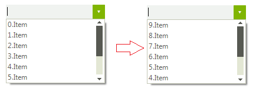

# Sorting
 
## SortStyle

__RadDropDownList__ supports sorting of its pop-up items. You can control how the items in the __RadDropDownList__ are sorted by specifying the __SortStyle__ property.

* __Ascending__: indicates ascending sorting.
            

* __Descending__: indicates descending sorting.
            

* __None__: indicates no sorting. Items appear in the order of inserting.
            
>caption Figure 1: SortStyle.Descending


#### SortStyle 

{{source=..\SamplesCS\DropDownListControl\DropDownList\DropDownListSorting.cs region=SortStyle}} 
{{source=..\SamplesVB\DropDownListControl\DropDownList\DropDownListSorting.vb region=SortStyle}} 

````C#
            
this.radDropDownList1.SortStyle = Telerik.WinControls.Enumerations.SortStyle.Descending;

````
````VB.NET
Me.RadDropDownList1.SortStyle = Telerik.WinControls.Enumerations.SortStyle.Descending

````

{{endregion}} 
 

## Customizing sort order

When the __SortStyle__ property is set to *Ascending* or *Descending* you can manipulate how the items are ordered by specifying the __ItemsSortComparer__ property. You should create a class that implements the __IComparer<RadListDataItem>__ interface. The following example demonstrates how to order the items considering the RadListDataItem.__Value__ property instead of the RadListDataItem.__Text__ property:
        
>caption Figure 2: Custom sort order



#### Custom comparer 

{{source=..\SamplesCS\DropDownListControl\DropDownList\DropDownListSorting.cs region=CustomComparer}} 
{{source=..\SamplesVB\DropDownListControl\DropDownList\DropDownListSorting.vb region=CustomComparer}} 

````C#
        
public DropDownListSorting()
{
    InitializeComponent();
    
    for (int i = 0; i < 10; i++)
    {
        RadListDataItem item = new RadListDataItem();
        item.Value = 10 - i;
        item.Text = i + ".Item";
        this.radDropDownList1.Items.Add(item);
    }
    this.radDropDownList1.SortStyle = Telerik.WinControls.Enumerations.SortStyle.Ascending;
    this.radDropDownList1.ItemsSortComparer = new CustomComparer();
}
        
public class CustomComparer : IComparer<RadListDataItem>
{
    public int Compare(RadListDataItem x, RadListDataItem y)
    {
        int xId = 0;
        int yId = 0;
        if (int.TryParse(x.Value.ToString(), out xId) && int.TryParse(y.Value.ToString(), out yId))
        {
            return xId.CompareTo(yId);
        }
        return x.Value.ToString().CompareTo(y.Value.ToString());
    }
}

````
````VB.NET
Public Sub New()
    InitializeComponent()
    For i As Integer = 0 To 9
        Dim item As New RadListDataItem()
        item.Value = 10 - i
        item.Text = i & ".Item"
        Me.RadDropDownList1.Items.Add(item)
    Next
    Me.RadDropDownList1.SortStyle = Telerik.WinControls.Enumerations.SortStyle.Ascending
    Me.RadDropDownList1.ItemsSortComparer = New CustomComparer()
End Sub
    
Public Class CustomComparer
Implements IComparer(Of RadListDataItem)
    Public Function [Compare](x As RadListDataItem, y As RadListDataItem) As Integer Implements IComparer(Of RadListDataItem).[Compare]
        Dim xId As Integer = 0
        Dim yId As Integer = 0
        If Integer.TryParse(x.Value.ToString(), xId) AndAlso Integer.TryParse(y.Value.ToString(), yId) Then
            Return xId.CompareTo(yId)
        End If
        Return x.Value.ToString().CompareTo(y.Value.ToString())
    End Function
End Class

````

{{endregion}} 


