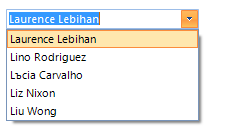

# Filtering
 
## 

__RadDropDownList__ supports filtering of its items. In order to apply a filter, you should set the __Filter__ property of __RadDropDownList__ to a predicate that will be called for every data item in order to determine if the item will be visible.

#### Filter 

{{source=..\SamplesCS\DropDownListControl\DropDownList\DropDownList1.cs region=Filter}} 
{{source=..\SamplesVB\DropDownListControl\DropDownList\DropDownList1.vb region=Filter}} 

````C#
            
this.radDropDownList1.Filter = FilterItem;

````
````VB.NET
Me.radDropDownList1.Filter = AddressOf FilterItem
'#End Region
'#Region "FilteringExpression"
Me.radDropDownList1.FilterExpression = "Country LIKE 'Argentina'"
'#End Region
End Sub
'#Region "FilteringPredicate"
Private Function FilterItem(item As RadListDataItem) As Boolean
If item.Text.StartsWith("L") Then
    Return True
End If
        
Return False
End Function
'#End Region
'#region handlingSelectedIndexChanged
Private Sub radDropDownList1_SelectedIndexChanged(ByVal sender As Object, ByVal e As Telerik.WinControls.UI.Data.PositionChangedEventArgs)
If Me.radDropDownList1.SelectedIndex > -1 Then
    radLabelElement1.Text = Me.radDropDownList1.SelectedItem.Text
    Me.radImageButtonElement1.Image = Me.radDropDownList1.SelectedItem.Image
End If
End Sub

````        

{{endregion}} 


#### Filtering predicate 

{{source=..\SamplesCS\DropDownListControl\DropDownList\DropDownList1.cs region=FilteringPredicate}} 
{{source=..\SamplesVB\DropDownListControl\DropDownList\DropDownList1.vb region=FilteringPredicate}} 

````C#
    
private bool FilterItem(RadListDataItem item)
{
    if (item.Text.StartsWith("L"))
    {
        return true;
    }
    return false;
}

````
````VB.NET
Private Function FilterItem(item As RadListDataItem) As Boolean
    If item.Text.StartsWith("L") Then
        Return True
    End If
    
    Return False
End Function
'#End Region
'#region handlingSelectedIndexChanged
Private Sub radDropDownList1_SelectedIndexChanged(ByVal sender As Object, ByVal e As Telerik.WinControls.UI.Data.PositionChangedEventArgs)
    If Me.radDropDownList1.SelectedIndex > -1 Then
        radLabelElement1.Text = Me.radDropDownList1.SelectedItem.Text
        Me.radImageButtonElement1.Image = Me.radDropDownList1.SelectedItem.Image
    End If
End Sub

```` 
{{endregion}} 
 

If you apply the above filter to a __RadDropDownList__ that is bound to the Northwind.__Customers__ table you will obtain the following result:
        
>caption Fig.1 Filter



Another option to filter the items is to specify the __FilterExpression__ property.

#### FilteringExpression 

{{source=..\SamplesCS\DropDownListControl\DropDownList\DropDownList1.cs region=FilteringExpression}} 
{{source=..\SamplesVB\DropDownListControl\DropDownList\DropDownList1.vb region=FilteringExpression}} 

````C#
this.radDropDownList1.FilterExpression = "Country LIKE 'Argentina'";

````
````VB.NET
Me.radDropDownList1.FilterExpression = "Country LIKE 'Argentina'"
'#End Region
End Sub
'#Region "FilteringPredicate"
Private Function FilterItem(item As RadListDataItem) As Boolean
If item.Text.StartsWith("L") Then
    Return True
End If
        
Return False
End Function
'#End Region
'#region handlingSelectedIndexChanged
Private Sub radDropDownList1_SelectedIndexChanged(ByVal sender As Object, ByVal e As Telerik.WinControls.UI.Data.PositionChangedEventArgs)
If Me.radDropDownList1.SelectedIndex > -1 Then
    radLabelElement1.Text = Me.radDropDownList1.SelectedItem.Text
    Me.radImageButtonElement1.Image = Me.radDropDownList1.SelectedItem.Image
End If
End Sub

````

{{endregion}} 
 
>caption Fig.2 FilteringExpression


>note The __IsFilterActive__ property gets a value indicating whether there is a Filter or FilterExpression set.
>

