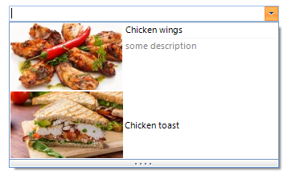

# Adding items programmatically

__RadDropDownList__ supports adding items at run time, which means that you can manually populate it with data. The following example demonstrates how to add two different items to the RadDropDownList.__Items__  collection. 

## 

You can use one of the following item types: 

* __RadListDataItem__ – it represents a logical data item which can display specific text and image.             
              

* __DescriptionTextListDataItem__ – similar to the __RadListDataItem__. In addition, it displays some description below the item’s text.


>caption Figure 1: Sample RadListDataItem and DescriptionTextListDataItem



#### Add items programmatically 

{{source=..\SamplesCS\DropDownListControl\DropDownList\DropDownList1.cs region=AddItemsProgrammatically}} 
{{source=..\SamplesVB\DropDownListControl\DropDownList\DropDownList1.vb region=AddItemsProgrammatically}} 

````C#
            
DescriptionTextListDataItem descriptionItem = new DescriptionTextListDataItem();
descriptionItem.Text = "Chicken wings";
descriptionItem.Image = Properties.Resources.chicken_wings;
descriptionItem.DescriptionText = "some description";
this.radDropDownList1.Items.Add(descriptionItem);
            
RadListDataItem dataItem = new RadListDataItem();
dataItem.Text = "Chicken toast";
dataItem.Image = Properties.Resources.chicken_toast;
this.radDropDownList1.Items.Add(dataItem);

````
````VB.NET
Dim descriptionItem As New DescriptionTextListDataItem()
descriptionItem.Text = "Chicken wings"
descriptionItem.Image = My.Resources.chicken_wings
descriptionItem.DescriptionText = "some description"
Me.radDropDownList1.Items.Add(descriptionItem)
Dim dataItem As New RadListDataItem()
dataItem.Text = "Chicken toast"
dataItem.Image = My.Resources.chicken_toast
Me.radDropDownList1.Items.Add(dataItem)

````

{{endregion}} 

# See Also

* [Design Time]()
* [Data Binding]()

