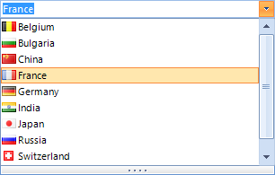

# Right-To-Left Support
 
__RadDropDownList__ fully supports right-to-left (RTL) language locales. You can enable/disable the right-to-left support using __RightToLeft__ enumeration, which has the following members:

## 

* __Yes__: Content is aligned from right to left.
            

* __No__: Content is aligned from left to right.
            

* __Inherit__: Direction will be determined by the parent control.
            

>caption Fig.1 RightToLeft.Yes

|
>caption Fig.2 RightToLeft.No

|

#### Assigning RightToLeft 

{{source=..\SamplesCS\DropDownListControl\DropDownList\DropDownListRightToLeft.cs region=SetRightToLeft}} 
{{source=..\SamplesVB\DropDownListControl\DropDownList\DropDownListRightToLeft.vb region=SetRightToLeft}} 

````C#
this.radDropDownList1.RightToLeft = RightToLeft.Yes;

````
````VB.NET
Me.radDropDownList1.RightToLeft = RightToLeft.Yes

````

{{endregion}} 


