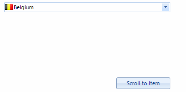
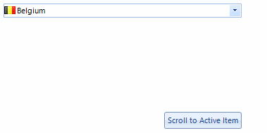

# Scrolling
 
If the __RadListDataItems__ cannot fit in the popup a vertical scroll bar appears so that they can be scrolled and later selected. By default the value of the __EnableMouseWheel__ is set to true enabling scrolling through the items by using the mouse wheel.
      

## KineticScrolling

This feature ensures that the control is ready for modern touch-screen applications. It can be attached by simply setting the __EnableKineticScrolling__ to *true*.
        
>caption Fig.1 Enable Kinetic Scrolling


#### Enabling Kinetic Scrolling 

{{source=..\SamplesCS\DropDownListControl\DropDownList\DropDownListScrolling.cs region=KineticScrolling}} 
{{source=..\SamplesVB\DropDownListControl\DropDownList\DropDownListScrolling.vb region=KineticScrolling}} 

````C#
this.radDropDownList1.EnableKineticScrolling = true;

````
````VB.NET
Me.RadDropDownList1.EnableKineticScrolling = True

````

{{endregion}} 

## Programmatically Scrolling

__RadDropDownList__ provides out of the box functionality for programmatically scrolling its content. The available methods are: 
        

* __ScrollToItem__: Scrolls to a specific item.
            

* __ScrollToActiveItem__: Scrolls to the active item if it is not null and if it is not fully visible.
            
>caption Fig.2 Scroll to Item



#### Scroll to Item 

{{source=..\SamplesCS\DropDownListControl\DropDownList\DropDownListScrolling.cs region=ScrollToItem}} 
{{source=..\SamplesVB\DropDownListControl\DropDownList\DropDownListScrolling.vb region=ScrollToItem}} 

````C#
this.radDropDownList1.DropDownListElement.ListElement.ScrollToItem(this.radDropDownList1.Items.Last());

````
````VB.NET
Me.RadDropDownList1.DropDownListElement.ListElement.ScrollToItem(Me.RadDropDownList1.Items.Last())

````

{{endregion}} 
 

>caption Fig.2 Scroll to Active Item



#### Scroll to Active Item 

{{source=..\SamplesCS\DropDownListControl\DropDownList\DropDownListScrolling.cs region=ScrollToActiveItem}} 
{{source=..\SamplesVB\DropDownListControl\DropDownList\DropDownListScrolling.vb region=ScrollToActiveItem}} 

````C#
this.radDropDownList1.DropDownListElement.ListElement.ScrollToActiveItem();

````
````VB.NET
Me.RadDropDownList1.DropDownListElement.ListElement.ScrollToActiveItem()

````

{{endregion}} 
 

## Scrolling Modes

The __ListElement__ contained in the popup of __RadDropDownList__ supports three types of __ScrollModes__:
        

* __Discrete__: Defines scrolling by only one item at a time.
            

* __Smooth__: Sets scrolling by pixel, meaning that an item can be partially visible.
            

* __Deferred__: Does not cause GUI updates until the user finishes the scrolling operation.
            
>caption Fig.4 Discrete Scrolling


#### Discrete Scrolling 

{{source=..\SamplesCS\DropDownListControl\DropDownList\DropDownListScrolling.cs region=DiscreteScrolling}} 
{{source=..\SamplesVB\DropDownListControl\DropDownList\DropDownListScrolling.vb region=DiscreteScrolling}} 

````C#
this.radDropDownList1.DropDownListElement.ListElement.ScrollMode = ItemScrollerScrollModes.Discrete;

````
````VB.NET
Me.RadDropDownList1.DropDownListElement.ListElement.ScrollMode = ItemScrollerScrollModes.Discrete

````

{{endregion}} 


>caption Fig.5 Smooth Scrolling


#### Smooth Scrolling 

{{source=..\SamplesCS\DropDownListControl\DropDownList\DropDownListScrolling.cs region=SmoothScrolling}} 
{{source=..\SamplesVB\DropDownListControl\DropDownList\DropDownListScrolling.vb region=SmoothScrolling}} 

````C#
this.radDropDownList1.DropDownListElement.ListElement.ScrollMode = ItemScrollerScrollModes.Smooth;

````
````VB.NET
Me.RadDropDownList1.DropDownListElement.ListElement.ScrollMode = ItemScrollerScrollModes.Smooth

````

{{endregion}} 
 
>caption Fig.6 Deferred Scrolling


#### Deferred Scrolling 

{{source=..\SamplesCS\DropDownListControl\DropDownList\DropDownListScrolling.cs region=DeferredScrolling}} 
{{source=..\SamplesVB\DropDownListControl\DropDownList\DropDownListScrolling.vb region=DeferredScrolling}} 

````C#
this.radDropDownList1.DropDownListElement.ListElement.ScrollMode = ItemScrollerScrollModes.Deferred;

````
````VB.NET
Me.RadDropDownList1.DropDownListElement.ListElement.ScrollMode = ItemScrollerScrollModes.Deferred

````

{{endregion}} 


